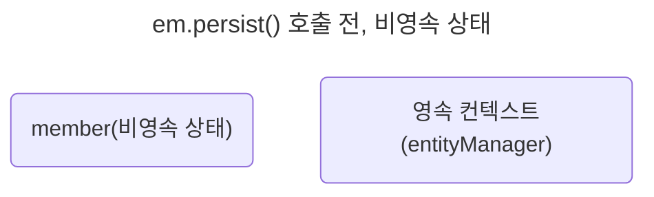
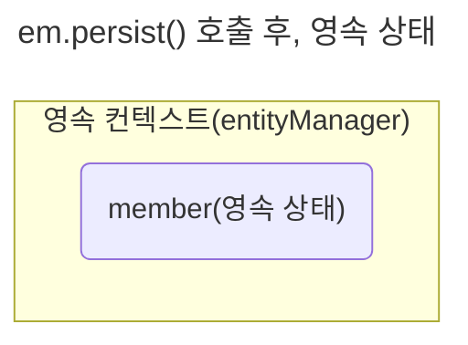

> 엔티티를 영구 저장하는 환경

엔티티 매니저로 엔티티를 저장하거나 조회하면 엔티티 매니저는 영속성 컨텍스트에 엔티티를 보관하고 관리한다.

`em.persist(member);`

persist() 메소드는 엔티티 매니저를 사용해서 회원 엔티티를 영속성 컨텍스트에 저장한다. 영속성 컨텍스트는 논리적인 개념ㄴ에 가깝고 눈에 보이지도 않는다. 영속성 컨텍스트는 엔티티 매니저를 생성할 때 하나 만들어진다. 그리고 엔티티 매니저를 통해서 영속성 컨텍스트에 접근할 수 있고, 영속성 컨텍스트를 관리할 수 있다.

## 엔티티의 생명주기
엔티티에는 4가지 상태가 존재한다.

- 비영속(new/transient) : 영속성 컨텍스트와 전혀 관계가 없는 새로운 상태
- 영속(managed) : 영속성 컨텍스트에 관리되는 상태
- 준영속(detached) : 영속성 컨텍스트에 저장되었다가 분리된 상태
- 삭제(removed) : 삭제된 상태

### 비영속
엔티티 객체를 생성했다. 순수한 객체 상태이며 아직 저장하지 않았다. 따라서 영속성 컨텍스트나 데이터베이스와는 전혀 관련이 없다. 이것을 비영속 상태라 한다.

```java
Member member = new Member();
member.setId("member1");
member.setUsername("회원1");
```



### 영속
엔티티 매니저를 통해서 엔티티를 영속성 컨텍스트에 저장했다. 이렇게 영속성 컨텍스트가 관리하는 엔티티를 영속 상태라 한다. 이제 회원 엔티티는 비영속 상태에서 영속 상태가 되었다. 결국 영속 상태라는 것은 영속성 컨텍스트에 의해 관리된다는 뜻이다.

사실 이때는 아직 DB에 멤버 엔티티가 저장되지 않았다. DB에 저장되는 순간은 커밋이 실행되는 시점이다.

```java
Member member = new Member();
member.setId("member1");
member.setUsername("회원1");

EntityManager em = emf.createEntityManager();
em.getTransaction().begin();
em.persist(member); // 객체를 저장한 상태 (영속)
```



### 준영속
영속성 컨텍스트가 관리하던 영속 상태의 엔티티를 영속성 컨텍스트가 관리하지 않으면 준영속 상태가 된다. 특정 엔티티를 준영속 상태로 만들려면 `em.detach()`를 호출하면 된다. `em.close()`를 호출해서 영속성 컨텍스트를 닫거나 `em.clear()`를 호출해서 영속성 컨텍스트를 초기화해도 영속성 컨텍스트가 관리하던 영속 상태의 엔티티는 준영속 상태가 된다.

### 삭제
엔티티를 영속성 컨텍스트와 데이터베이스에서 삭제한다.

```java
em.remove(member);
```