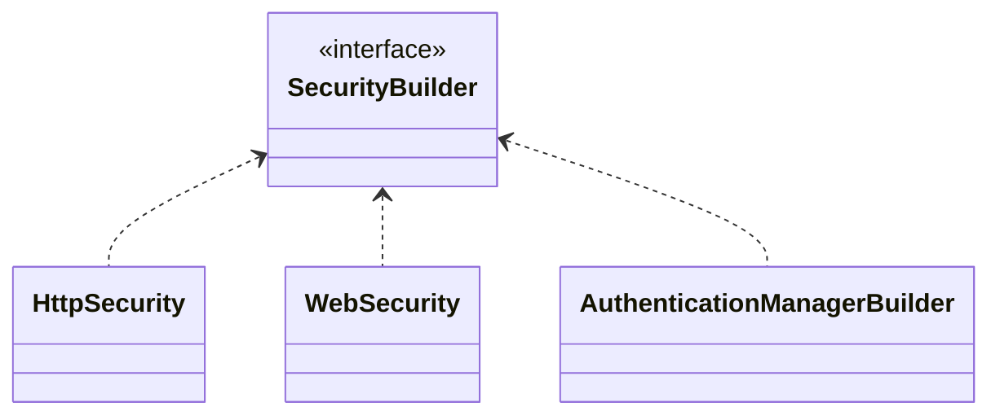

- SecurityBuilder : 웹 보안을 구성하는 빈 객체와 설정 클래스들을 생성하는 역할을 한다.
	- WebSecurity
	- HttpSecurity
- SecurityConfigurer : Http 요청과 관련된 보안처리를 담당하는 필터들을 생성하고 여러 초기화 설정에 관여한다.

SecurityBuilder는 SecurityConfigurer를 참조하고 있으며 인증 및 인가 초기화 작업은 SecurityConfigurer에 의해 진행된다.



```mermaid

```