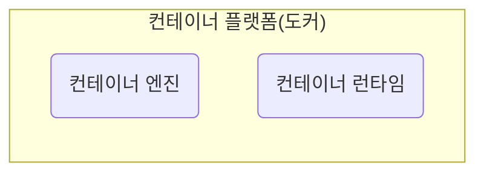
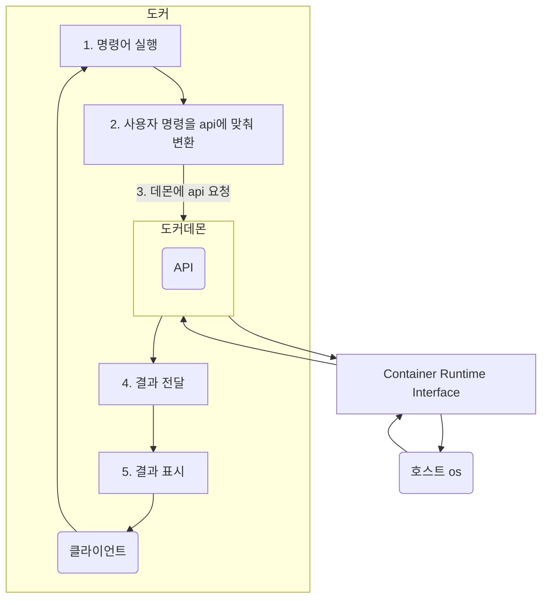

도커는 컨테이너 가상화 기술을 사용하기 위한 도구이다. 도커를 사용하면 커널의 컨테이너 가상화 기술을 쉽게 사용할 수 있다. 도커와 같은 컨테이너 가상화 도구를 컨테이너 플랫폼이라고 부른다. 이 컨테이너 플랫폼은 컨테이너 엔진과 컨테이너 런타임으로 구성되어있다.

컨테이너 엔진은 말 그대로 사용자의 요청을 받아서 컨테이너를 관리하는 역할을 맡는다. 컨테이너 런타임은 직접 커널과 통신하면서 실제로 격리된 공간을 만드는 역할을 수행한다. 도커는 `runc`라는 컨테이너 런타임을 사용한다. 이 컨테이너 런타임은 OCI라는 곳에서 규정한 컨테이너 런타임 인터페이스, CRI 표준을 구현했기 때문에 무조건 `runc`사용해야 하진 않는다. 하지만 `runc`는 도커가 지원하는 기본 컨테이너 런타임이다.

컨테이너 플랫폼에는 Podman이나 Containerd 같은 다른 소프트웨어들도 있다. 컨테이너 가상화를 사용할 때 어떤 컨테이너 플랫폼을 사용할지 또는 어떤 컨테이너 런타임을 사용할지는 자유롭게 선택할 수 있다. 그 중 도커는 점유율이 가장 높은 컨테이너 플랫폼이다. 가장 빨리 시작되었기 때문에 레퍼런스도 많고 문서도 잘 정리된 편이다.

## 구조
