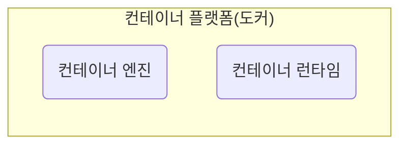
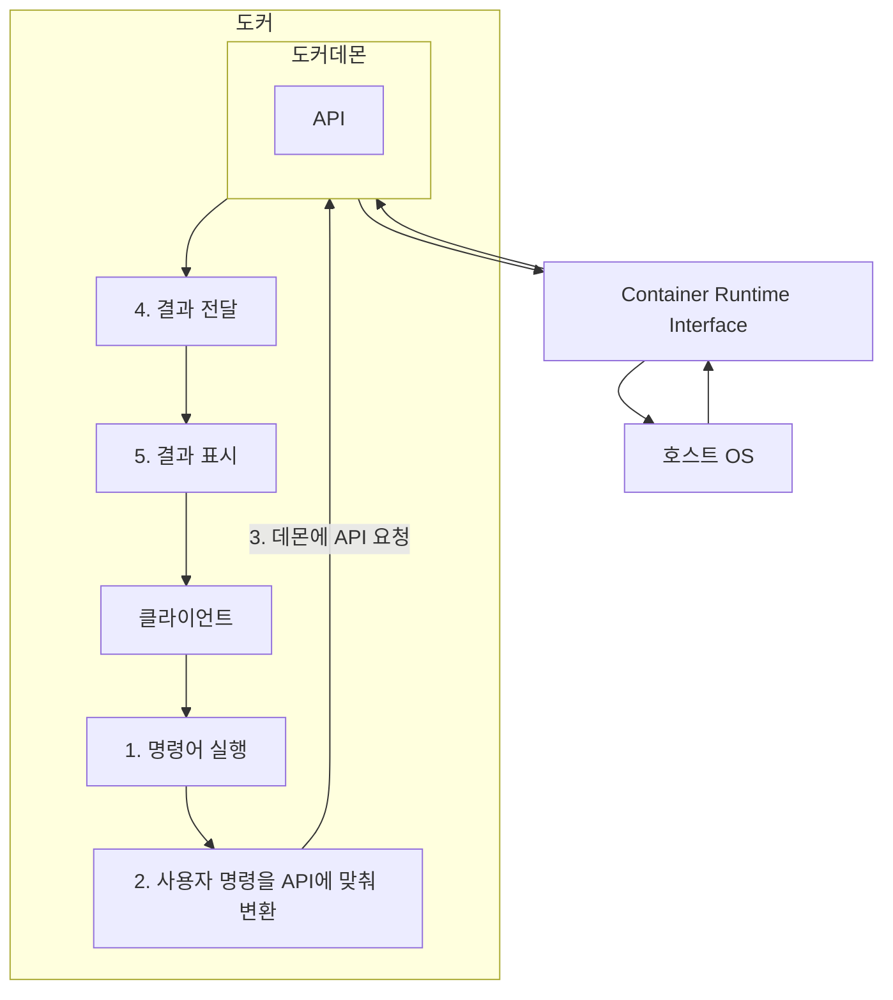

도커는 컨테이너 가상화 기술을 사용하기 위한 도구이다. 도커를 사용하면 커널의 컨테이너 가상화 기술을 쉽게 사용할 수 있다. 도커와 같은 컨테이너 가상화 도구를 컨테이너 플랫폼이라고 부른다. 이 컨테이너 플랫폼은 컨테이너 엔진과 컨테이너 런타임으로 구성되어있다.

컨테이너 엔진은 말 그대로 사용자의 요청을 받아서 컨테이너를 관리하는 역할을 맡는다. 컨테이너 런타임은 직접 커널과 통신하면서 실제로 격리된 공간을 만드는 역할을 수행한다. 도커는 `runc`라는 컨테이너 런타임을 사용한다. 이 컨테이너 런타임은 OCI라는 곳에서 규정한 컨테이너 런타임 인터페이스, CRI 표준을 구현했기 때문에 무조건 `runc`사용해야 하진 않는다. 하지만 `runc`는 도커가 지원하는 기본 컨테이너 런타임이다.

컨테이너 플랫폼에는 Podman이나 Containerd 같은 다른 소프트웨어들도 있다. 컨테이너 가상화를 사용할 때 어떤 컨테이너 플랫폼을 사용할지 또는 어떤 컨테이너 런타임을 사용할지는 자유롭게 선택할 수 있다. 그 중 도커는 점유율이 가장 높은 컨테이너 플랫폼이다. 가장 빨리 시작되었기 때문에 레퍼런스도 많고 문서도 잘 정리된 편이다.

## 구조

도커에는 사용자의 명령을 전달해주는 클라이언트와 실제로 컨테이너를 관리해주는 도커데몬이라는 서버가 존재한다. 클라이언트는 사용자의 명령을 도커데몬에게 전달한다. 도커데몬은 컨테이너를 관리하는 기능을 제공하고 도커D라고도 불린다.

보통 데몬이라고 이름이 붙은 소프트웨어는 서버에서 지속적으로 실행이 되는 소프트웨어를 의미한다. 도커데몬도 호스트 os에서 지속적으로 실행되면서 클라이언트의 요청에 따라서 컨테이너를 관리한다. 

그리고 도커데몬은 클라이언트가 이런 기능을 사용할 수 있도록 api를 제공한다. 컨테이너를 생성하려면 컨테이너 생성 api 요청을 보내야 하고, 삭제하려면 삭제 api 양식에 맞게 요청을 보내야 작업이 실행된다. 

그런데 사용자가 api 명세에 맞도록 요청을 보내거나 응답을 읽기에는 복잡해서 직접 사용하기에는 번거롭다. 작업 하나하나마다 api를 파악하고 전달하려면 시간이 오래 걸린다. 그래서 도커에서는 커맨드 라인 도구인 Docker CLI가 클라이언트 툴로 제공된다. 

이 CLI는 클라이언트가 명령어를 입력하면 이 명령어를 서버의 api 양식에 맞게 만들어서 대신 전달한다. 이 CLI를 통해 사용자는 도커 apu와 쉽게 통신할 수 있다.

