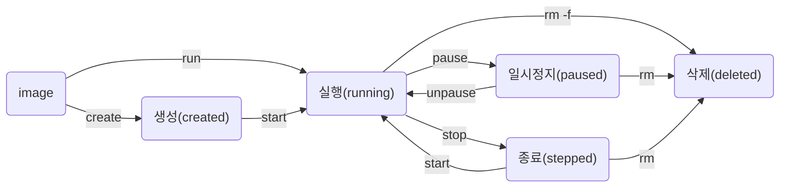

```mermaid
flowchart LR
	i("image")
	c("생성(created)")
	r("실행(running)")
	p("일시정지(paused)")
	s("종료(stepped)")
	d("삭제(deleted)")

i -->|create| c
i --> |run| r
c --> |start| r

r --> |stop| s
s --> |start| r

r --> |pause| p
p --> |unpause| r

r --> |rm -f| d
p --> |rm| d
s --> |rm| d
```