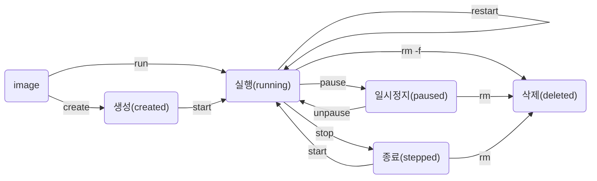

컨테이너는 이미지에서부터 시작한다. 이미지는 애플리케이션을 실행할 수 있는 모든 환경이 준비되어 있는 압축 파일이다. 

첫 번째로 컨테이너가 가질 수 있는 상태는 Created, 생성 단계다. `docker create` 명령을 사용하면 이미지를 컨테이너로 만들 수 있다. 생성 단계에서는 컨테이너를 실행하기 위한 격리된 공간이 만들어지는 상태이다. 그래서 네트워크나 스토리지, 환경변수 같은 모든 리소스가 격리된 공간인 컨테이너로 분리된 상태인 것이다. 하지만 생성 단계에서는 내부에서 프로세스를 실제로 실행하지 않기 때문에 호스트 os의 CPU와 메모리를 사용하지 않는다.

생성 단계에서 `docker start` 명령을 사용하면 컨테이너의 메타데이터의 cmd 값을 사용해서 컨테이너를 러닝 상태로 만들 수 있다. 실행 상태가 되었다는 것은 컨테이너 내에서 정상적으로 프로세스가 실행 중이라는 것을 의미한다. 그리고 이 프로세스가 실제로 CPU와 메모리를 사용한다. 

`docker run` 명령은 `docker create`와 `docker start` 가 하나로 합쳐진 명령이다. 그래서 `docker run` 명령을 사용하면 컨테이너를 만드는 동시에 바로 실행할 수 있다. 

그리고 이 실행 상태에서 `docker restart` 명령을 하면  프로세스를 재시작할 수 있다. 실행 중인 프로세스에 종료나 재시작 신호를 보내면 10초 뒤에 이 신호가 동작한다. 따라서 10초 뒤에 프로세스가 재시작하게 된다. 

그리고 이 컨테이너에서 실행 중인 프로세스를 일시 정지하거나 종료할 수도 있다.  paused 상태에서는 컨테이너에서 실행 중인 모든 프로세스가 일시 중지된 상태다. 일시 중지한다는 것은 현재의 상태를 모두 메모리에 저장해 둔다는 것이다. 그래서 일시 정지 상태에서는 CPU는 사용하지 않고 메모리만 사용한다. 이 상태에서 unpause 명령을 사용하면