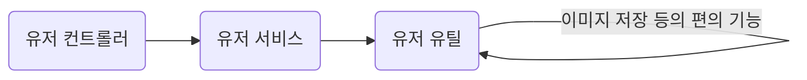
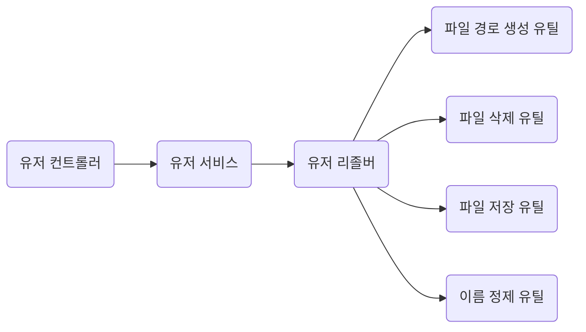

유저의 프로필 사진과 배경 사진을 업로드 하는 부분이 신경이 많이 쓰였다. 나 뿐만 아니라 처음 코드를 보는 사람도 해당 코드가 어떤 동작을 하는지 평문을 읽듯이 봐도 이해가도록 변수명을 변경했다.

## 기존 이미지 저장 클래스

```java
@Component
public class UserUtil { // UserUtil 이라는 너무나 범용적인 클래스 이름

	@Value("${file.upload-dir}")
	private String uploadDir;

	public User buildUserWith(UserSignUpRequest userSignUpRequest, PasswordEncoder passwordEncoder) {
		return User.builder()
				.username(userSignUpRequest.username())
				.nickname(userSignUpRequest.nickname())
				.password(passwordEncoder.encode(userSignUpRequest.password()))
				.userRole(USER)
				.build();
	}

	public String saveImage(MultipartFile image, User user, UserImageType userImageType) {
		if (!Objects.isNull(userImageType.getImagePathOf(user))) {
		// saveImage 에서 유저가 이미지를 갖고 있는지 확인하는 부분
			deleteImage(userImageType.getImagePathOf(user));
		}

		String basePath = uploadDir + user.getUsername() + "/photos";
		String fileName = userImageType.getFileName();
		Path filePath = Paths.get(basePath, fileName);

		try {
			Files.createDirectories(filePath.getParent());
			Files.write(filePath, image.getBytes());
		} catch (IOException e) {
			throw new RuntimeException("프로필 사진 변경에 실패했습니다.", e);
		}
		return filePath.toString();
	}

	private void deleteImage(String imagePath) {
	// private 메서드의 존재
		Path path = Paths.get(imagePath);
		try {
			Files.deleteIfExists(path);
		} catch (IOException e) {
			throw new RuntimeException("이미지 삭제에 실패했습니다.", e); // 귀찮듯이 던지는 RuntimeException
		}
	}
}
```

위 클래스에서 신경쓰이는 점을 나열해보자면,,,

- UserUtil 이라는 너무나 범용적인 클래스 이름
- private 메서드의 존재
- 귀찮듯이 던지는 RuntimeException
- saveImage 에서 유저가 이미지를 갖고 있는지 확인하는 부분

이 부분들을 개선해봤다. 개선 된 내용을 보기 전에 현재 이 코드의 구조를 그려보자면 아래와 같다.



## 개선 후 이미지 저장 클래스
```java
@Component
@RequiredArgsConstructor
public class UserImageResolver {

	private final FilePathUtil filePathUtil; // 로컬에 파일을 저장할 때 파일 위치를 생성하는 유틸
	private final FileDeleteUtil fileDeleteUtil; // 로컬 파일을 삭제할 때 사용하는 유틸
	private final FileSaveUtil fileSaveUtil; // 로컬에 파일을 저장하는 유틸
	private final SanitizeUtil sanitizeUtil; // 경로 침투 대비용 파일 이름 정제 유틸

	public String replaceImage(MultipartFile image, User user, UserImageCategory userImageCategory) {
		if(user.hasImageOf(userImageCategory)) {
			// 기존에 이미 이미지가 있다면 파일 삭제 후 저장
			fileDeleteUtil.delete(user.getImagePathOf(userImageCategory));
		}
		String cleanedFileName = sanitizeUtil.sanitizeFileName(image.getOriginalFilename());
		String basePath = filePathUtil.resolveUserImagePath(user, cleanedFileName, userImageCategory);
		return fileSaveUtil.save(basePath, image);
	}
}
```

Util 클래스들을 생성하여 한 클래스에 모여있었던 다양한 동작을 구분하여 사용하도록 했다.

개선 전 UserUtil 이라는 모호한 이름에서 UserImageResolver 라는 명확한 이름으로 변경되었다. 그리고 하나의 메서드만 갖도록 간소화 되었다. 이를 위해 기존에 갖고 있던 메서드들을 나눠 4개의 유틸 클래스가 새로 생겼다.

클래스 구분도 좋지만 무엇보다 마음에 드는 부분은 좀 더 평문처럼 변경된 코드 내용 자체이다.

| 변경 전 | 변경 후 |
|--- | --- |
|`if (!Objects.isNull(userImageType.getImagePathOf(user)))`| `if(user.hasImageOf(userImageCategory))`|
|만약 오브젝트가 null이 아니라면(유저 이미지 타입으로 이미지 경로를 유저에게서 가져온 결과가)|만약 유저가 이미지를 갖고 있다면(유저 이미지 종류)|

기존의 코드는 의미 파악이 쉽지 않았다. 하지만 개선 후에는 확실이 어떤 동작을 하려는지 의도가 팍팍 전해지는 구조가 되었다. 엔티티에 메서드를 넣냐 넣지 않느냐는 논란이 많은 주제다. 하지만 개인적으로는 객체지향적으로 구조를 가져가는게 맞다고 생각한다. 따라서 엔티티에 메서드가 많은건 딱히 문제가 아니라고 결정했다.

마지막으로 개선 후 구조를 그려보면 아래와 같다.



리졸버는 특정 도메인에 종속된 편의 기능을 의미한다. 유틸은 글로벌로 사용할 수 있는 편의 기능을 의미한다. 

도메인 서비스는 요청 처리를 위해 요청에 맞는 리졸버를 호출한다. 
호출 된 리졸버는 알맞은 동작을 선택하여 유틸 클래스에 동작을 위임한다. 
유틸 클래스에서 공통 작업을 하고 난 후 리졸버에 응답한다.
응답을 받은 리졸버는 서비스에 해당 응답을 전달한다.

## 예외처리는 어떻게 개선됐는가?
```java
@Component
public class FileSaveUtil {

	public String save(String targetPath, MultipartFile file) {
		Path filePath = Paths.get(targetPath);
		try {
			Files.createDirectories(filePath.getParent());
			Files.write(filePath, file.getBytes());
		} catch (IOException e) {
			throw new FileSaveFailException(); // RuntimeException을 던지던것을 개선
		}

		return filePath.toString();
	}
}
```

기존에는 RuntimeException을 던졌지만 이제는 동작에 맞는 예외를 던지도록 개선되었다. 

```java
public class FileSaveFailException extends MySettlementException {

	private static final String MESSAGE = "파일 저장에 실패했습니다.";

	public FileSaveFailException() {
		super(MESSAGE);
	}

	@Override
	public HttpStatus getStatusCode() {
		return HttpStatus.INTERNAL_SERVER_ERROR;
	}
}
```

파일 저장 실패 클래스는 미리 선언된 예외 메시지를 갖고 있어서 다른 처리를 할 필요가 없다. 호출만 하면 된다. 

MySettlementException 이라는 프로젝트 공통 예외를 상속받고 있기 때문에 ControllerAdvice에서 공용으로 처리하기 편리하다.

## Util 클래스를 왜 Bean으로 관리함?
static 메서드 등을 고려하긴 했으나 빈으로 관리하도록 결정했다. 차후 테스트코드 작성시(테스트 커버리지가 몇이나 되냐는 질문은 받지 않겠다) mock 활용을 위해서는 빈으로 관리하는게 낫다고 판단했기 때문이다.