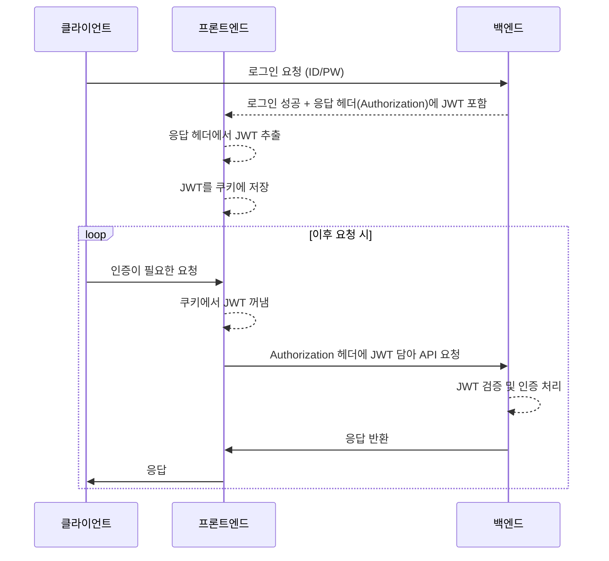
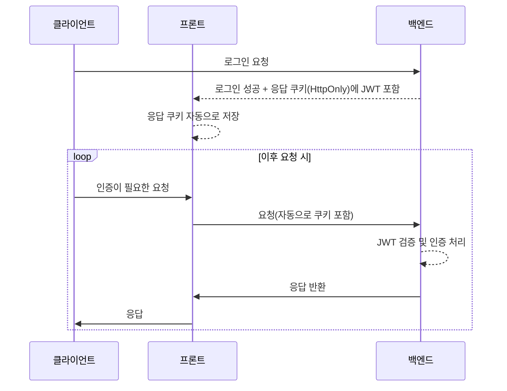

개선 전에는 유저가 로그인을 하면 백엔드는 헤더에 jwt 정보를 담아 응답하였다. 프론트에서는 헤더의 값을 읽어와 쿠키를 생성, 해당 정보를 보관했다.

이렇게 하면 문제가 발생하는데

- 프론트와 백엔드의 jwt 유효 시간에 차이가 발생
- 클라이언트가 토큰에 접근 가능 -> 보안 취약

크게 두 가지 단점이 있다.

위 단점을 개선하고자 백엔드에서 httpOnly 설정된 쿠키에 jwt를 담아 응답하기로 결정했다.

이를 위해서는 기존 프론트 로직에 많은 변경이 필요하다... ☹️ 아래는 어떻게 변했는지를 설명한다.

## JWT 저장 방식 변경 (백엔드)
### 변경 전
```java
@Override  
protected void successfulAuthentication(HttpServletRequest request, HttpServletResponse response, FilterChain chain, Authentication authResult) throws IOException, ServletException {  
    UserDetails userDetails = (UserDetails) authResult.getPrincipal();  
    String role = userDetails.getAuthorities().stream().map(GrantedAuthority::getAuthority).findFirst().orElseThrow(NoUserFoundException::new);  
    String token = jwtUtil.createJwt(userDetails.getUsername(), role, new Date());  
    response.addHeader(jwtUtil.getJwtHeader(), jwtUtil.getJwtBearer() + token);  
}
```

jwtUtil 에서 생성한 jwt를 header에 담아 반환

### 변경 후
```java
@Override  
protected void successfulAuthentication(HttpServletRequest request, HttpServletResponse response, FilterChain chain, Authentication authResult) throws IOException, ServletException {  
    UserDetails userDetails = (UserDetails) authResult.getPrincipal();  
    String role = userDetails.getAuthorities().stream().map(GrantedAuthority::getAuthority).findFirst().orElseThrow(NoUserFoundException::new);  
    String token = jwtUtil.createJwt(userDetails.getUsername(), role, new Date());  
  
    ResponseCookie jwtCookie = ResponseCookie.from("access-token", token)  
            .httpOnly(true)
            .sameSite("Lax")  
            .path("/")  
            .maxAge(Duration.ofHours(3))  
            .build();  
	// 쿠키에 담아 반환한다
  
    response.setHeader(HttpHeaders.SET_COOKIE, jwtCookie.toString());  
}
```

jwtUtil에서 생성한 jwt를 쿠키에 담아 반환

## 요청에서 JWT 추출 방식 변경
### 변경 전
```java
// JwtUtil.class
public String resolveToken(HttpServletRequest request) {  
    String authHeader = request.getHeader(jwtProperties.HEADER());  
    return authHeader != null && authHeader.startsWith(jwtProperties.BEARER()) ?  
          authHeader.substring(jwtProperties.BEARER().length())  
          : null;  
}
```

요청 헤더에서 필요한 부분을 추출한다.

### 변경 후
```java
// JwtUtil.java
public String resolveToken(HttpServletRequest request) {  
    if(request.getCookies() == null) {  
       log.info("No cookies found in request");  
       return null;  
    }  
  
    for (Cookie cookie : request.getCookies()) {  
       if("access-token".equals(cookie.getName())) {  
          return cookie.getValue();  
       }  
    }  
    return null;  
}
```

쿠키를 순회하며 jwt 부분을 추출한다.

## CORS 설정 변경(백엔드)
### 변경 전
```java
@Configuration  
public class CorsConfig implements WebMvcConfigurer {  

    @Override
    public void addCorsMappings(CorsRegistry registry) {       
	    registry.addMapping("/**")             
			    .allowedOriginPatterns("http://localhost:5173")      
			    .allowedMethods("*")             
			    .exposedHeaders("Authorization", "Content-Type")
			    // 노출시킬 헤더명을 명시 했었다
	            .allowCredentials(true);    
	 }
 }
```

exposedHeaders 옵션은 **브라우저가 JavaScript에서 접근 가능한 응답 헤더를 명시적으로 지정**할 때 필요하다. Authorization 헤더는 CORS 정책에서 클라이언트에서 접근할 수 없는 헤더이므로, vue 프론트에서 `response.headers.get("Authorization")` 처럼 읽고자 한다면 `exposeHeaders()` 설정이 필요하다.

하지만 이제 JWT를 HttpOnly 쿠키로 전달하기로 했으므로 Authorization 헤더를 프론트에 노출해줄 필요가 없다. 따라서 해당 설정을 제거한다.

### 변경 후
```java
@Configuration  
public class CorsConfig implements WebMvcConfigurer {  
  
    @Override  
    public void addCorsMappings(CorsRegistry registry) {  
        registry.addMapping("/**")  
                .allowedOrigins("http://localhost:5173")  
                .allowedMethods("*")  
                .allowCredentials(true);  
    }  
}
```

#### `allowedOriginPatterns()` 와 `allowedOrigins()`의 차이는 뭔가요?

`allowedOriginPatterns()`는 와일드 카드를 포함한 도메인을 허용할 때 사용하는 메서드이다. 지금은 고정된 origin만 허용(localhost:5173)하므로 `allowedOrigins()`를 사용하도록 했다.

allowCredentials(true)는 **인증 정보를 포함한 요청**을 허용하는 설정으로, 쿠키 기반 인증에 필수다.
    
이 경우 allowedOrigins()는 반드시 **와일드카드(*)를 사용할 수 없다**. allowCredentials(true)가 설정되어 있으면 CORS 명세에 따라 **정확한 origin을 명시**해야 한다.
    
따라서 allowedOriginPatterns() 대신 allowedOrigins("http://localhost:5173")를 사용한다. 와일드카드가 필요 없는 고정 origin만 허용할 경우 더 명확하고 안전한 방법이다.


## 상태유지
헤더로 JWT를 통신할 때와 마찬가지로 쿠키로 JWT를 통신할 때도 상태유지가 중요한 포인트이다. 로그인을 성공한 이후 새로고침을 하면 로그인이 해제되는 현상을 똑같이 경험했다.

### 변경 전
서버에서 발급받은 jwt를 쿠키에 저장한 후 요청할 때마다 쿠키에 저장된 토큰을 헤더에  
넣기로 결정  
  
```ts  
// useAuthStore.ts  
import {defineStore} from "pinia";  
import {  
    setCookie,    
    getCookie,    
    deleteCookie
} from "@/utils/cookieUtil.ts";  
  
export const useAuthStore = defineStore("auth", {  
    state: () => ({        
	    token: getCookie("authToken"), // 쿠키에서 토큰을 초기화  
    }),    
    actions: {        
	    setToken(token: string) {            
		    this.token = token;            
		    setCookie("authToken", token, new Date()); 
		    // 쿠키에 3시간 저장  
        },        
        clearToken() {            
	        this.token = null;            
	        deleteCookie("authToken"); // 쿠키 삭제  
        },    
	},
});  
  
```

헤더로 받은 JWT를 쿠키로 저장하는 로직이 있다. 이 부분 때문에 백엔드와 프론트의 JWT 유효 시간이 다른 문제가 발생했다. 그래서 아래와 같이 변경했다. 변경 후에는 CookieUtil을 사용할 필요가 없기 때문에 제거했다.

### 변경 후
```ts
index.ts (라우터 설정 파일)
router.beforeEach(async (to, from, next) => {  
  const userStore = useUserStore()  
  if (!userStore.isLoggedIn) {  
    await userStore.init()  
  }  
  next()  
})
```

페이지 새로고침 시에도 로그인 상태가 유지되려면 프론트 앱이 시작될 때 서버로부터 유저 정보를 재조회해야한다. 페이지 이동이 일어나기 전에 매번 라우터 설정 파일에서 유저 정보를 확인한다. 만약 유저 정보가 없다면 서버에 유저 정보를 요청한 후 라우터 로직이 실행된다.

```ts
useUserStore.ts
import { defineStore } from 'pinia'  
import type User from '@/entities/user.ts'  
import axios from 'axios'  
import { BASE_URL } from '@/constants/server.ts'  
  
export const useUserStore = defineStore('user', {  
  state: () => ({  
    user: null as User | null,  
  }),  
  actions: {  
    setUser(user: User) {  
      this.user = user  
    },  
  
    clearUser() {  
      this.user = null  
    },  
  
    async init() {  
      try {  
        const res = await axios.get(`${BASE_URL}/v1/users/me`, {  
          withCredentials: true,  
        })  
        this.setUser(res.data)  
      } catch {  
        console.info('userStore error!')  
        this.clearUser()  
      }  
    },  
  },  
  getters: {  
    isLoggedIn: (state): boolean => state.user !== null,  
    username: (state): string => state.user?.username ?? '',  
    nickname: (state): string => state.user?.nickname ?? '',  
    desc: (state): string => state.user?.desc ?? '',  
    profileImageUrl: (state): string => state.user?.profileImageUrl ?? '',  
    backgroundImageUrl: (state): string => state.user?.backgroundImageUrl ?? '',  
  },  
})
```

백엔드에 요청한 유저 정보를 저장하는 pinia 파일이다. 백엔드에서 유저 정보를 넘기면 해당 정보들을 모두 여기에 저장하여 사용하게 된다.

## 로그인이 필요한 요청을 할 때 jwt를 포함하는 방법
### 변경 전

1. 클라이언트가 로그인을 요청한다.
2. 프론트는 로그인 정보를 백엔드에 전달한다.
3. 백엔드는 인증 후 헤더에 jwt를 포함하여 응답한다.
4. 프론트는 헤더에서 jwt를 추출, 쿠키에 해당 정보를 저장한다.
5. 클라이언트가 인증이 필요한 요청을 진행한다.
6. 프론트는 쿠키에 저장한 jwt를 추출, 요청 헤더에 포함하여 백엔드에 요청한다.
7. 백엔드는 jwt를 검증 후 응답한다.



axios 요청 설정에서도 아래와 같은 부분을 추가해야한다.
```ts  
try {  
    const token = document.cookie.split("=")[1];  
    const response = await axios.get(`${BASE_URL}/v1/users/getInfo`, {        
	    headers: {            
		    Authorization: token, // header에 jwt 정보를 포함해야한다, 누락시 에러!
		}    
	});    
	welcome.value = response.data;
} catch (error) {  
    welcome.value = "error has occured";
}  
```

딱 봐도 엄청난 비효율이 매번 진행되고 있다. 왜 매번 jwt 정보를 헤더에서 꺼내 쿠키에 저장해야하는것이고, 왜 매번 쿠키에서 jwt 정보를 꺼내 헤더에 넣어줘야 하는걸까?

따라서 아래와 같이 개선 되었다.
### 개선 후

```ts
const res = await axios.get(`${BASE_URL}/v1/users/me`, {  
  withCredentials: true,  
})
```

`withCredentials: true` 설정이 추가되면 자동으로 쿠키의 정보를 포함하여 요청이 만들어진다.

시퀀스 다이어그램을 그려본다면 아래와 같다.



## 마치며
이번 구조 변경을 통해 아래와 같은 개선이 이루어졌다.

1. 보안 강화
2. 프론트 로직 단순화

### 보안 강화
JWT를 HttpOnly 쿠키에 저장하면서 JS에서 접근할 수 없게 되었다. 토큰 탈취 위험이 제거되었다.
더이상 프론트에서 JWT를 관리하지 않으므로, 프론트-백엔드 간 JWT 유효시간 불일치 문제가 해소되었다.

### 프론트 로직 단순화
JWT를 수동으로 쿠키에 저장하거나 헤더에 삽입하는 로직이 제거되었다.
axios 요청이 안정적으로 변경되었다.