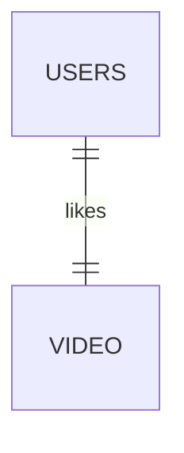
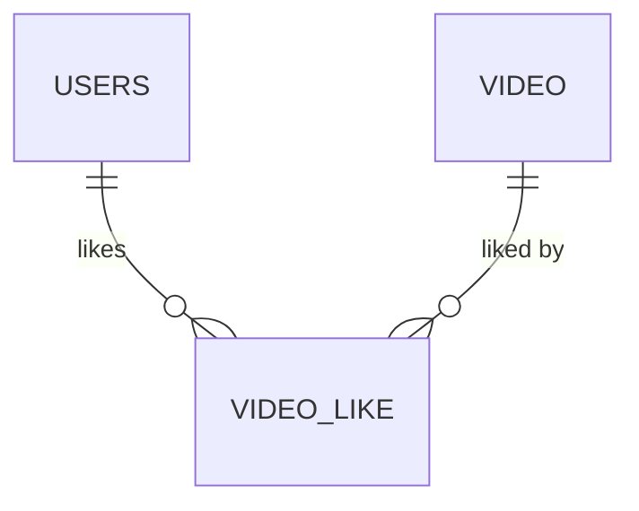

좋아요 기능을 완성했다. 이번 글은 리팩토링 관련 글은 아니다. 그렇지만 개발된 기능의 코드 구조를 설명하는 과정도 크게 보면 리팩토링이라고 (내 맘대로) 생각하기 때문에 작성한다.

## VideoLikeEntity
```java
@Entity  
@Table(name = "video_like", uniqueConstraints = @UniqueConstraint(columnNames = {"user_id", "video_id"}))  
@NoArgsConstructor(access = PROTECTED)  
public class VideoLike extends BaseEntity {  
  
    @Id  
    @GeneratedValue(strategy = GenerationType.IDENTITY)  
    private Long id;  
  
    @ManyToOne(fetch = LAZY)  
    private User user;  
  
    @ManyToOne(fetch = LAZY)  
    private Video video;  
  
    public VideoLike(User user, Video video) {  
        this.user = user;  
        this.video = video;  
    }  
}
```

여러명의 유저는 여러 개의 비디오에 좋아요 할 수 있다.

n : m, 다대다 관계이다. 



하지만 `@ManyToMany`는 유지관리 관점에서 사용하면 안 되는 기능이라고 판단해서 사용하지 않는다(심지어 `@xxxToMany` 관계도 이 프로젝트에서는 사용하지 않는다). 유저가 좋아요 표시한 비디오와, 비디오에 좋아요한 유저들, 즉 좋아요 테이블이 따로 필요하기 때문에 좋아요 테이블에 매핑되는 엔티티를 작성했다.

- 한 명의 유저는 여러 개의 비디오에 좋아요 할 수 있다(1 : N).
- 하나의 비디오는 여러 명의 유저에게서 좋아요 될 수 있다(1 : N).

1대 다, 다대 일 관계가 되었다.



### `@Table` 에너테이션 설정이 너무 복잡해요!
하나 하나 살펴보자. 

1. @Table
2. name
3. uniqueConstraints

#### **@Table**
엔티티와 매핑할 테이블을 지정한다. 생략 시 매핑한 엔티티 이름을 테이블 이름으로 인식한다. 아래 4가지 속성을 설정 가능하다.

- name
- catalog
- schema
- uniqueConstraints

#### **name**
매핑될 테이블의 이름을 지정한다. 기본값은 매핑한 엔티티 이름이다.

#### **uniqueConstraints**
DDL 생성 시 유니크 제약 조건을 생성한다. 특정 컬럼 조합에 대해 **유니크 제약 조건**(UNIQUE)을 설정한다. 여기서는 user_id, video_id 조합에 유일성 보장이 설정되었다. 즉, 동일한 유저가 같은 비디오에 대해 **중복 좋아요**를 할 수 없게 제한한다.

## VideoLikePermittedController

이전 글에서 인증이 필요한 api와 인증이 필요 없는 api로 구분하는 작업을 이야기했다. 좋아요 기능도 인증이 필요한 기능과 인증이 필요 없는 기능이 있으므로 구분했다.

### 인증 필요한 좋아요 기능
```java
@User  
@RestController  
@RequiredArgsConstructor  
@RequestMapping("/v1/videos")  
public class VideoLikePermittedController {  
  
    private final VideoLikeService videoLikeService;  
  
    @PostMapping("/{videoId}/like")  
    public ResponseEntity<Void> likeVideo(@PathVariable Long videoId, @AuthenticationPrincipal UserDetails userDetails) {  
        videoLikeService.like(videoId, userDetails);  
        return ResponseEntity.ok().build();  
    }  
  
    @DeleteMapping("/{videoId}/like")  
    public ResponseEntity<Void> unLikeVideo(@PathVariable Long videoId, @AuthenticationPrincipal UserDetails userDetails) {  
        videoLikeService.unlike(videoId, userDetails);  
        return ResponseEntity.ok().build();  
    }  
}
```

좋아요를 하지 않았다면 좋아요 기능, 좋아요를 했다면 좋아요 취소 기능을 사용한다. Like/unLike 기능은 인증이 필요한 기능이기 때문에 위 클래스에 소속된다.

### 인증이 필요하지 않은 좋아요 기능
```java
@RestController  
@RequiredArgsConstructor  
@RequestMapping("/v1/videos/public")  
public class VideoLikePublicController {  
  
    private final VideoLikeService videoLikeService;  
  
    @GetMapping("/{videoId}/like-count")  
    public ResponseEntity<Long> getLikeCount(@PathVariable Long videoId) {  
        return ResponseEntity.ok(videoLikeService.likeCount(videoId));  
    }  
}
```

비디오 시청 화면에서 해당하는 비디오의 좋아요 개수를 집계하기 위한 api이다. 좋아요 개수를 보는 동작은 인증이 필요 없으므로 public 컨트롤러에 소속된다.

## VideoLikeService

```java
@Service  
@Transactional(readOnly = true)  
@RequiredArgsConstructor  
public class VideoLikeService {  
  
    private final VideoLikeRepository videoLikeRepository;  
    private final UserRepository userRepository;  
    private final VideoRepository videoRepository;  
  
    @Transactional  
    public void like(Long videoId, UserDetails userDetails) {  
        User user = userRepository.findByUsername(userDetails.getUsername()).orElseThrow(NoUserFoundException::new);  
        Video video = videoRepository.findById(videoId).orElseThrow(NoVideoFoundException::new);  
  
        if(videoLikeRepository.existsByUserAndVideo(user, video)) {  
            throw new InvalidVideoLikeRequest();  
        }  
  
        videoLikeRepository.save(new VideoLike(user, video));  
    }  
  
    @Transactional  
    public void unlike(Long videoId, UserDetails userDetails) {  
        User user = userRepository.findByUsername(userDetails.getUsername()).orElseThrow(NoUserFoundException::new);  
        Video video = videoRepository.findById(videoId).orElseThrow(NoVideoFoundException::new);  
        VideoLike videoLike = videoLikeRepository.findByUserAndVideo(user, video).orElseThrow(InvalidVideoLikeRequest::new);  
        videoLikeRepository.delete(videoLike);  
    }  
  
    public Long likeCount(Long videoId) {  
        return videoLikeRepository.countByVideoId(videoId);  
    }  
}
```

`@Transactional(readOnly = true)` 설정은 버릇처럼 하기 때문에 신경쓰지 않아도 된다.

매 로직마다 유저와 비디오를 찾고, 좋아요 기능을 추가/삭제 하고 있다(매 로직마다 유저를 찾는 로직이 어떻게 변하는지에 관한 글도 작성 중에 있으므로 기대바람). 