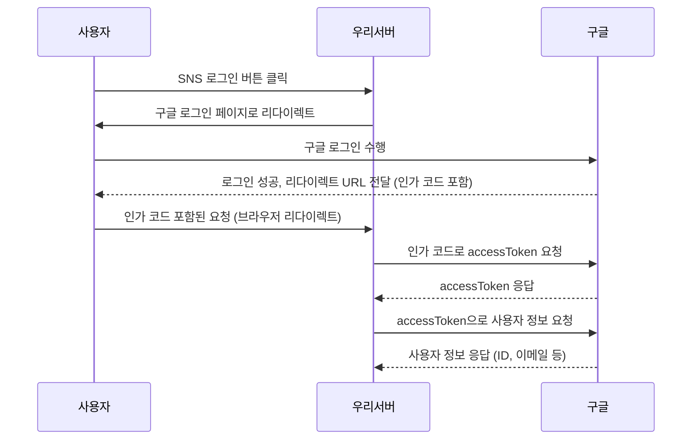
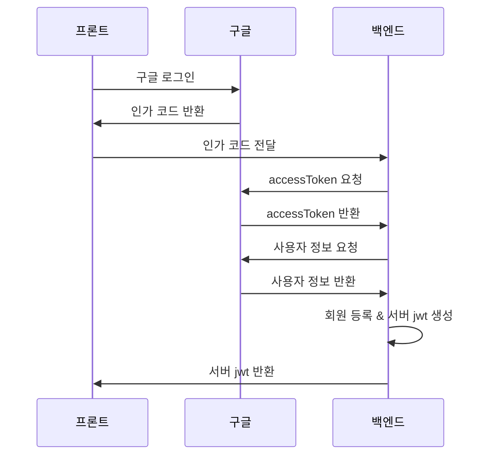
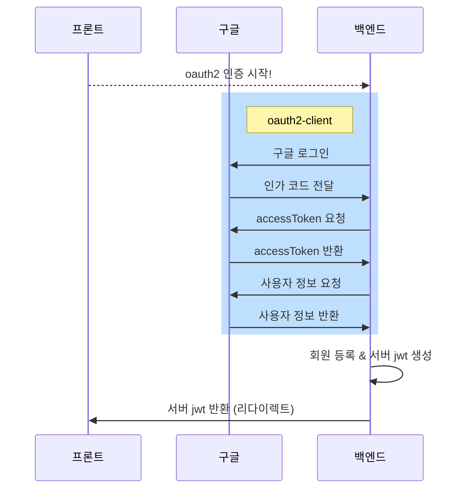

## 개괄 흐름

OAUTH2 로그인을 구현하려면 SNS서버(이하 구글)와 내가 제작한 서버(이하 우리 서버)가 필요하다. 사용자가 우리 서버에 로그인하기 위해서 필요한 정보들을 구글이 우리 서버에 보내줘야한다. 이를 위해서는 우리 서버가 accessToken을 사용해 구글 API에서 사용자 정보를 요청해야 한다. 이 값이 있어야 구글 API로 사용자 정보를 요청하고, 구글이 이에 응답한다. 

## 주요 요소

### 1. AccessToken
- 구글, 카카오 서버에 API 요청을 하기 위한 인증키
- AccessToken을 통해 로그인한 사용자의 정보(API)를 요청할 수 있다.
### 2. 인가 코드
- AccessToken을 발급받기 위한 키값
- 사용자가 구글 로그인을 요청하면 화면은 구글로 넘어간다 -> 구글이 제어권을 가진다.
- 사용자가 구글에 로그인을 하면 구글은 우리 서버로 리다이렉트 한다. -> 리다이렉트 = GET 요청!
- 리다이렉트는 response body에 데이터를 담을 수 없으며, URL에 사용자 정보를 직접 포함하면 유출 위험이 있다. 따라서 구글은 URL에 인가 코드를 포함해 우리 서버로 리다이렉트한다.
- 구글은 인가 코드를 URL에 담아 우리 서버로 리다이렉트한다.
- 받아온 인가코드를 받아서 우리 서버는 구글에 다시 accessToken을 요청한다.
- 구글은 우리 서버에 accessToken을 지급한다.
- 우리서버는 사용자 정보 요청을 accessToken과 함께 다시 구글로 보낸다.
- 드디어 구글은 사용자 정보를 응답해준다.

#### 인가코드가 유출되면 사용자 정보도 유출되는거 아님?
그렇지 않다. 인가 코드는 단독으로는 사용할 수 없다. 구글은 accessToken 발급 요청 시, 인가 코드와 함께 사전에 등록된 리디렉션 URI, 클라이언트 ID/시크릿 등의 정보를 검증한다. 이 과정에서 하나라도 맞지 않으면 토큰 발급이 거부된다. 따라서 인가코드의 유출은 치명적이지 않다.

### 3. SCOPE
- 자사 서비스에서 구글, 카카오 서버로부터 받아올 수 있는 이메일, 프로필 정보 등 사용자 정보의 범위
- 인가코드는 받을 때 부터 받고자 하는 사용자 정보의 범위(scope)를 지정하여 요청된다.

# 인가코드를 우리서버 어디서 받을까?
2가지 방법이 있다.
1. 인가 코드를 프론트에서 받고 백엔드에서 accessToken을 발급하는 방식
2. 인가 코드를 백엔드에서 받고 백엔드에서 accessToken을 발급하는 방식

## 인가코드를 프론트에서 받는 방법
> 프론트엔드에서 인가코드를 받고, 나머지 작업은 백엔드에서 처리하는 방식

프론트에서 구글 로그인이 진행되면 구글은 리다이렉트로 프론트에 인가 코드를 반환한다. 

프론트는 받은 인가 코드를 백엔드에 전달한다. 전달하는 동시에 이제 프론트는 백엔드의 응답을 기다린다.

이후의 과정은 구글과 백엔드의 통신이다. 즉, 인가 코드를 프론트에서 받아 백엔드로 전달하는 부분이 차이점이다.

이후의 과정은 아래의 그림과 같다.

## 인가코드를 백엔드에서 받는 방법
> oauth2-client 의존성을 통해 서버에서 인가코드, token발급, 사용자 요청 모두 처리하는 방식

프론트에서는 백엔드의 특정 주소로 이동하기만 한다. 해당 주소에 접근하면 바로 oauth2 로그인 과정이 시작된다. 프론트는 로그인 과정에 개입하지 않는다. 대부분의 과정은 oauth2-client 라이브러리가 도맡아 처리한다.

마지막 jwt 반환 과정에 백엔드에서 프론트로 리다이렉트가 발생한다. 리다이렉트는 get 요청이므로 body를 사용할 수 없다. 따라서 생성된 jwt 정보가 url에 담겨 전달된다.

## 선택지 비교
### 프론트에서 인가 코드 수신
장점)
- 사용자가 백엔드에서 jwt를 받을 때 안전하게 body를 통해 값을 받을 수 있음
- 직접 요청에 의한 결과값을 받는 방식 -> 직관적, 디버깅 유리

단점)
- 프론트에서 클라이언트 ID 값을 보관해야하는 보안 취약점

클라이언트 ID?
사전에 oauth2 약속을 할 때 구글이 우리 서버의 요청임을 식별하기 위해 지정해둔 정보

### 백엔드에서 인가 코드 수신
장점)
- spring의 의존성을 통해 모든 절차와 요청이 한번에 진행되어 코드 구현이 간단함
- 클라이언트 ID 등 서버측의 키값이 안전하게 보관됨

단점)
- 사용자에게 jwt를 반환할 때 redirect 방식을 사용하기 때문에 보안 취약
- 모든 절차가 라이브러리에 통합되어 코드 파악과 디버깅 난이도 상승
- 인가코드를 발급받을 때 등록된 redirect URI와 요청 당시의 URI가 일치하지 않으면 구글이 토큰 발급을 거부함 (멀티 서버 환경)