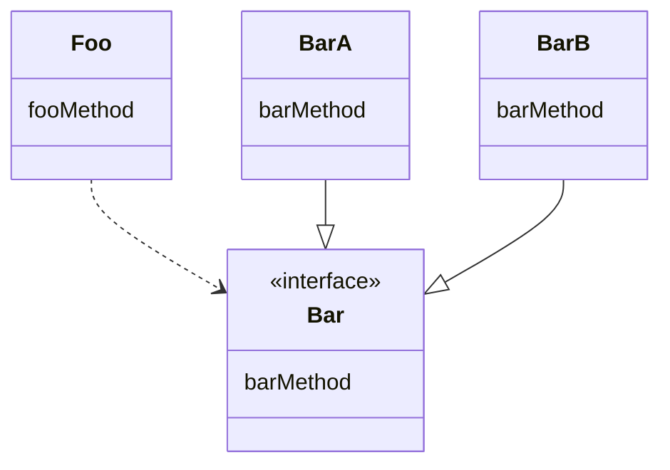
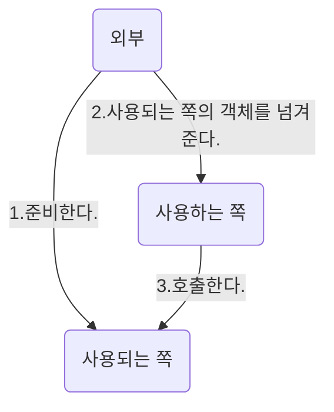

# Spring 6


## DI
`Dependency Injection`의 약자
DI로 하려는 일은 간단히 말해 프로그램의 부분적인 전환을 쉽게 만드는 것이다.



1. 프로덕션 환경에서 구동할 때\
	:Foo -> :BarA
2. 테스트 환경에서 구동할 때\
	:Foo -> :BarB

프로덕션 환경과 테스트 환경에서 사용하는 구현체가 다른 경우를 생각해보자. 개발자가 환경을 오가며 개발을 하고 있다. 이렇게 되면 실행하는 상황에 따라 매번 수정해야 하는 번거로움이 발생한다. 또한 구현체를 바꾸지 않는다면 치명적인 오류나 데이터 유출이 일어날 수 있다. 

이 문제를 해결하는 것이 바로 의존성 주입니다. DI에서는 필요한 구현체를 다른 곳에서 생성하고, 생성한 객체를 필요한 객체에게 전달한다.



1)에서 사용되는 객체를 준비하고 2)에서 사용하는 객체에 생성자의 인수 등을 사용해 전달한다. 사용하는 쪽은 3)에서 전달받은 객체의 메서드를 호출한다.

사용되는 객체의 의존하는지 생각해보면 사용하는 객체가 어떤 처리를 할 때 사용되는 객체의 메서드를 호출해야 하기 때문이다. 사용하는 객체 입장에서 사용되는 객체는 없어서는 안 되는 존재인 것이다. 그러므로 사용하는 객체는 사용되는 객체에 의존한다고 할 수 있다.

사용하는 객체에 의존 객체를 전달하는 것을 주입한다고 표현한다. 즉, 의존 객체를 외부에서 주입하므로 이를 DI라고 부르는 것이다.

## DI 컨테이너
DI에서 객체 생성을 '외부'에서 한다고 서술하였다. DI 컨테이너는 이 '외부'에서 하는 처리를 담당하는 스프링의 기능이다. DI 컨테이너를 이해하기 위해 사전에 알아둬야하는 용어들이 있다.

- Bean
	- DI 컨테이너가 관리하는 객체를 말한다. 
- Bean 정의
	- Bean을 정의하는 정보를 가리킨다. 관리할 객체의 구상 클래스는 무엇인지, 어느 의존 객체를 인젝션 할 것인지와 같은 정보를 말한다.
- Configuration
	- DI 컨테이너로 불러올 정보다. 설정 정보에는 Bean 정의도 포함된다. Bean 정의 외에도 DI 컨테이너의 특정 기능을 활성화, 비활성화할 수 있는 정보가 포함된다. 설정 정보를 작성해서 DI 컨테이너에서 불러오면 설정 정보에 따라 Bean 객체가 생성되며 의존 객체가 인젝션된다.
- Application Context
	- DI 컨테이너의 다른 이름이다. DI 컨테이너에 해당하는 객체가 `ApplicationContext` 인터페이스를 구현하므로 DI 컨테이너를 종종 '애플리케이션 컨텍스트'라고 부르기도 한다.

### Configuration 작성하기
DI 컨테이너에 불러올 설정 정보를 `~Config` 라 불리는 클래스에 작성한다. XML 파일에 작성하는 방법도 있지만 생략한다.

```java
@Configuration
public class FooConfig {

	// 설정 내용
}
```

### Bean 정의 작성하기
Bean 정의를 작성하는 방법은 3가지 있다.
- 스테레오타입 애너테이션
- @Bean 메서드
- `<bean>` 태그

#### 스테레오타입 애너테이션
Bean으로 관리하고 싶은 구상 클래스에 붙이는 애너테이션이다. DI 컨테이너는 스트레오타입 애너테이션이 붙은 구상 클래스를 감지해 자동으로 생성자를 호출하고 객체를 생성한다. 생성된 객체는 DI 컨테이너에서 괸리된다.
```java
@Service
public class FooService {

	// service logic
}
```

#### @Bean 메서드
Bean 메서드는 @Bean을 붙인 메서드를 말한다. Bean 메서드는 DI 컨테이너에 의해 자동으로 호출되고, 반환 값으로 반환한 객체가 Bean으로 관리된다.
```java
@Bean
public FooService fooService() {
	return new FooService();
}
```

#### `<bean>`태그 (XML 파일)
`<bean>`태그는 XML 파일에 작성한다. Bean으로 관리할 구상 클래스를 class 속성으로 지정하고, XML 파일을 DI 컨테이너로 불러온다. 지정된 구상 클래스의 생성자가 DI 컨테이너에 의해 호출되고, 생성된 객체는 Bean으로 괸리된다.
```xml
<bean class="com.example.foo.service.FooService"></bean>
```

어떤 방법을 사용해도 결과는 같으며 방법을 혼용해도 된다.

## 인젝션 방법
인젝션 방법은 크게 3가지이다.

1. 생성자 인젝션
2. Setter 인젝션
3. 필드 인젝션

어떤 방법을 사용해도 상관은 없지만 일반적으로는 생성자 인젝션을 권장한다. 필드에 final 한정자를 붙일 수 있기 때문이다. final 한정자가 붙은 필드는 자바에서 생성자 외의 다른 곳에서는 내용을 설정할 수 없도록 제한한다. 즉, 실수로 필드 내용을 변경하지 못하게 할 수 있다.

### 생성자 인젝션
생성자의 인수로 의존 객체를 전달받는 방법이다.

```java
@Service
public class ServiceImpl implements Service {

	private Repository repository;

	@Autowired
	public ServiceImpl(Repository repository) {
		this.repository = repository;
	}

	// 로직
}
```

참고로 생성자가 하나만 정의되어 있을 때는 @Autowired를 생략할 수 있다.

### Setter 인젝션
Setter 메서드의 인수로 의존 객체를 인젝션하는 방법이다.

```java
@Service
public class ServiceImpl implements Service {

	private Repository repository;

	@Autowired
	public void setRepository(Repository repository) {
		this.repository = repository;
	}

	// 로직
}
```

### 필드 인젝션
필드에 직접 인젝션하는 방법이다. 필드에 직접 @Autowired를 붙인다.

```java
@Service
public class ServiceImpl implements Service {

	@Autowired
	private Repository repository;

	// 로직

}
```


## 프로파일
프로파일은 설정(configuration)을 그룹화하는 DI 컨테이너의 기능이다. 프로덕션 환경용이나 스테이징 환경용 등으로 설정을 그룹화할 수 있다. 그룹화한 후에 해야 할 일은 DI 컨테이너를 생성할 때 활성화할 프로파일 이름을 지정하는 것이다. 이를 통해 애플리케이션을 실행할 때 사용할 설정을 전환할 수 있다.

### 사용법

설정을 그룹화할 때는 @Profile 을 사용한다. 이때 괄호 안에 프로파일 이름을 지정한다.

```java
@Repository
@Profile("production")
public class ProductionRepository implements Repository {
	// ...
}
```


```java
@Repository
@Profile("staging")
public class StagingRepository implements Repository {
	// ...
}
```

### 프로파일 지정하기
DI 컨테이너 생성 시 활성화할 프로파일을 지정하는 방법을 알아보자. 프로파일을 지정하는 방법은 여러 가지가 있지만 대표적으로는 시스템 프로퍼티 또는 환경 변수를 사용하는 방법이다.

1. 시스템 프로퍼티 사용
	java 커맨드를 실행할 때 -D 옵션으로 spring.profiles.active라는 이름의 프로퍼티를 지정한다.\
	`java -Dspring.profiles.active=프로파일이름`\
	프로파일 이름은 쉼표로 구분해 여러 개를 지정할 수도 있다. 
2. 운영체제 환경 변수 사용
	환경 변수 이름 SPRING_PROFILES_ACTIVE에 프로파일 이름을 지정한 후 java 커맨드로 애플리케이션을 실행한다. 

## JavaConfig
DI 컨테이너에 불러올 설정을 자바의 클래스에 작성하기 위한 스프링의 기능이다. 임의의 클래스에 @Configuration을 붙이면 JavaConfig 클래스로 인식된다.

```java
@Configuration
public class FooConfig {
	// ...
}
```

### 여러 개의 Config 클래스 불러오기
Config 클래스는 여러 파일로 나누어 작성할 수 있다. 작성한 여러 Config 클래스를 DI 컨테이너로 불러오는 방법은 다음과 같이 3가지이다.

- AnnotationConfigApplicationContext 클래스의 생성자 인수로 지정하기
- @Import로 가져오기
- 컴포넌트 스캔하기

#### AnnotationConfigApplicationContext 클래스의 생성자 인수로 지정하기
DI 컨테이너를 생성할 때 AnnotationConfigApplicationContext 클래스의 생성자 인수로 여러 개의 Config 클래스를 지정한다. AnnotationConfigApplicationContext 클래스의 생성자 인수는 가변 인수이므로 원하는 수의 Config 클래스를 지정할 수 있다.

```java
@Configuration
public class FooConfig {
	// ...
}
```

```java
@Configuration
public class BarConfig {
	// ...
}
```

```java
ApplicationContext context = new AnnotationConfigApplicationContext(FooConfig.class, BarConfig.class);
```

#### @Import로 가져오기
스프링에서 제공하는 @Import를 사용해서 한 Config 클래스에서 다른 Config 클래스를 가져올 수 있다.

```java
@Configuration
@Import(BarConfig.class)
public class FooConfig {
	// ...
}
```

```java
@Configuration
public class BarConfig {
	// ...
}
```

```java
ApplicationContext context = new AnnotationConfigApplicationContext(FooConfig.class);
```

FooConfig 클래스 위에 @Import 가 붙어있고, 괄호로 BarConfig 클래스를 지정하고 있다. AnnotationConfigApplicationContext 클래스의 생성자 인수로는 FooConfig 클래스만 지정되어 있지만 FooConfig 클래스가 BarConfig 클래스를 임포트하고 있으므로 결과적으로 FooConfig 클래스와 BarConfig 클래스를 불러오게 된다.

#### 컴포넌트 스캔하기
@Configuration은 사실 스테레오타입 애너테이션 중 하나다. @Service나 @Repository와 마찬가지로 컴포넌트 스캔을 하면 Config 클래스의 객체가 생성되고 Bean으로 관리된다. 이때 Config 클래스라는 것을 인식하여 작성된 설정 정보를 읽어들인다.

```java
package foo;

@Configuration
@ComponentScan
public class FooConfig {
	// ...
}
```

```java
package foo;

@Configuration
public class BarConfig {
	// ...
}
```

```java
ApplicationContext context = new AnnotationConfigApplicationContext(FooConfig.class);
```

FooConfig 클래스와 BarConfig 클래스는 모두 foo 패키지에 속하고, FooConfig 클래스 쪽에 @ComponentScan이 붙어있다. AnnotationConfigApplicationContext 클래스의 생성자 인수로 FooConfig 클래스를 지정하면 foo 패키지를 베이스 패키지로 하여 컴포넌트 스캔이 이루어진다. foo 패키지 아래에는 스테레오타입 애너테이션 중 하나인 @Configuration이 붙은 BarConfig 클래스가 있으므로 BarConfig 클래스도 불러온다. 결과적으로 FooConfig 클래스와 BarConfig 클래스를 모두 불러오게 되는 것이다.

## Config와 프로파일
Config 클래스 위에 @Profile을 붙이고 괄호 안에 프로파일 이름을 지정한다. 그러면 Config 클래스에 작성한 모든 설정이 지정한 프로파일로 묶이게 된다.

```java
@Profile("foo")
@Configuration
@ComponentScan
public class FooConfig {

	@Bean
	public FooService fooService() {
		// ...
	}
}
```

@ComponentScan 또는 @Bean의 fooService 메서드는 프로파일 foo가 활성화된 경우에만 사용된다.

또는 @Bean 메서드에 @Profile을 붙일 수도 있다. 그러면 @Bean 메서드만 지정한 프로파일에 속하는 형태가 된다.

```java
@Configuration
@ComponentScan
public class FooConfig {

	@Bean
	@Profile("foo")
	public FooService fooService() {
		// ...
	}
}
```

@ComponentScan은 어떤 프로파일에도 속하지 않기 때문에 항상 사용된다.

### 적절한 Bean 정의 방법
Bean을 정의하는 방법으로는 스테레오타입 애너테이션을 사용하는 것과 @Bean 을 사용하는 방법을 이야기했다. 방법은 달라도 DI 컨테이너에서 Bean 이 관리된다는 결과는 동일하다. 그렇다면 어떻게 구분해서 사용해야 할까?

|Bean 정의 방법 | 장점 | 단점|
|---|---|---|
|스테레오타입 애너테이션| 대량의 Bean 정의를 간결하게 할 수 있다. | 개발자가 작성한 클래스에만 사용 가능하다.|
|@Bean 메서드| 라이브러리가 제공하는 클래스에도 Bean 정의를 할 수 있다. | 대량의 Bean 정의는 힘들다.|

이러한 장단점을 바탕으로 어떤 상황에 어떤 Bean 정의 방법을 사용할지 알아보자. 가장 알기 쉽고 무난한 기준은 개발자가 만든 클래스를 Bean으로 정의할 때는 스테레오타입 애너테이션을 사용하고, 라이브러리의 클래스를 Bean 정의할 때는 @Bean 메서드를 사용하는 것이다. 개발자가 만드는 클래스는 대량으로 만들어지므로 대량의 Bean 정의에 최적화된 스테레오타입 애너테이션이 적합하다. 라이브러리의 클래스는 스테레오타입 애너테이션으로 Bean을 정의할 수 없으므로 @Bean 메서드로 Bean을 정의한다. 