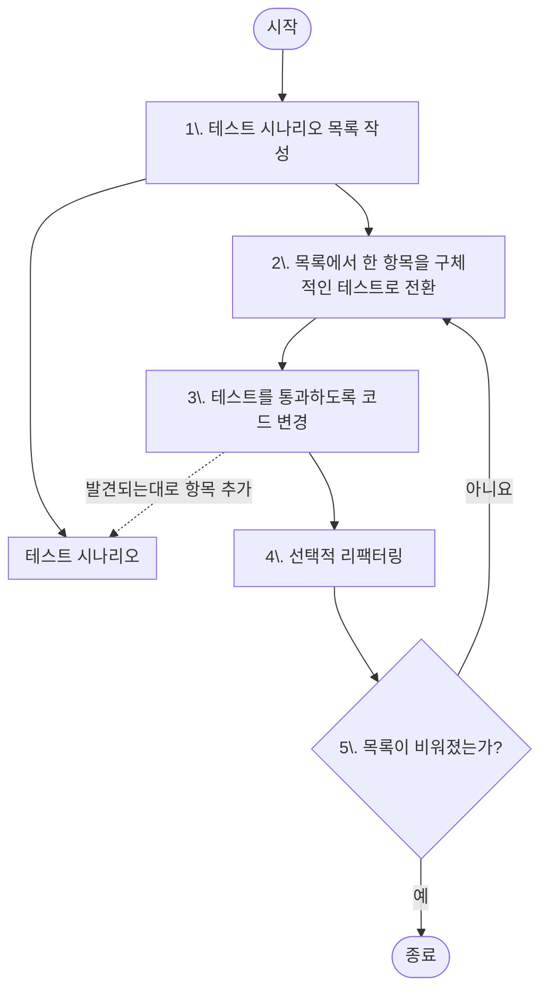
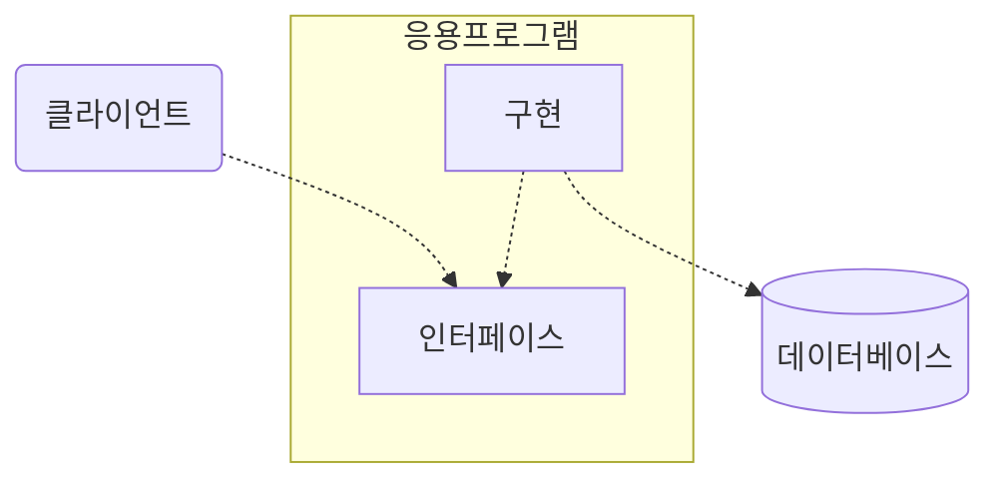
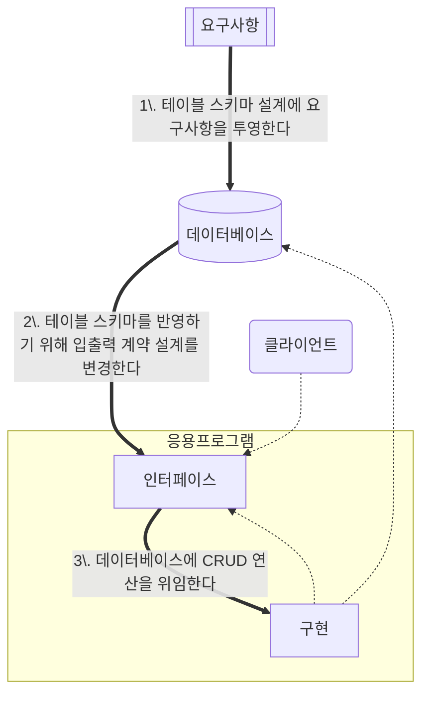
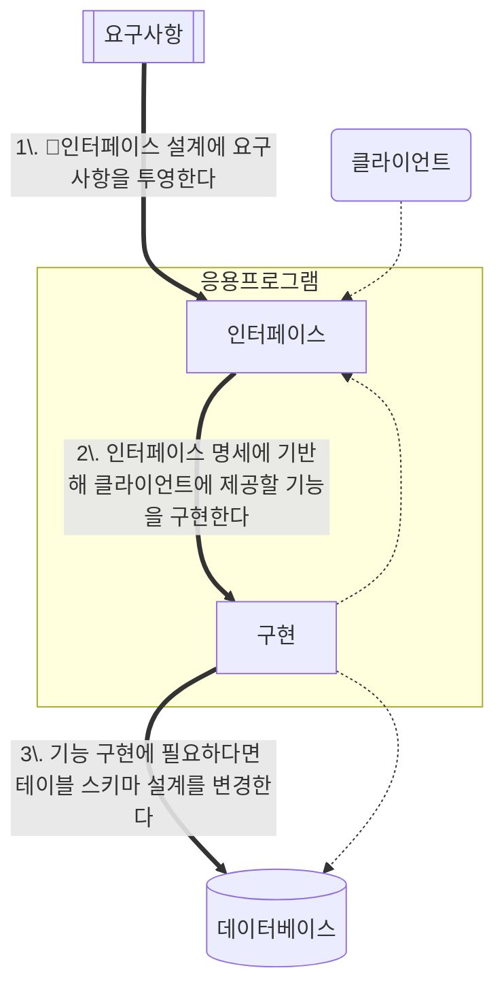
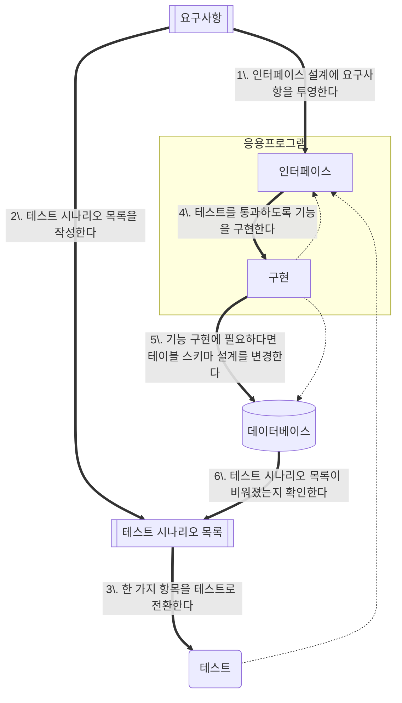

#테스트

## TDD 에서 테이블 설계하기

### 데이터베이스에서 시작하는 설계 흐름

일반적인 애플리케이션의 구조를 살펴보자.

이 상태에서 요구사항이 주어졌다면 아래와 같은 흐름으로 작업이 진행된다.

위 설계의 특징을 정리하면 아래와 같다.
- DB의 제약 조건을 통해 데이터의 일관성과 무결성을 유지하기 쉽다.
- DB 스키마는 모델과 코드에 비해 변경 비용이 크기 때문에 시스템 설계 유연성이 낮아진다.
- DB 스키마는 비즈니스 지식 표현력이 낮다.
- 작업 부하 분산이 어렵다.
- 응용프로그램의 역할을 클라이언트와 DB 연산의 연결 수단으로 바라본다.
- 인터페이스 설계가 DB 스키마에 논리적으로 의존한다.
- 기능 및 비기능 요구사항 난이도가 낮고 변경이 적을수록 유용하다.

### 인터페이스에서 설계하는 설계 주요흐름
이번에는 인터페이스에서부터 시작하는 설계의 흐름을 알아보자. 똑같은 애플리케이션 구조이다. 이번에도 마찬가지로 요구사항이 주어진다.

만약 DB 설계 변경 없이도 기능을 구현할 수 있다면 3단계는 진행하지 않아도 좋다! 

인터페이스에서 시작하는 설계의 특징을 정리하면 아래와 같다.
- 클라이언트에 제공되는 가치가 설계 결정 주도권을 갖는다.
- 비즈니스 지식이 시스템에 풍부한 어휘로 표현된다.
- 인터페이스 설계는 DB 스키마에 의존하지 않는다.
- 구현 기술을 다양하게 검토할 수 있다.

### TDD를 사용하는 설계 주요 흐름
마지막으로 TDD 설계 과정 흐름을 알아보자. 마찬가지로 요구사항이 주어진다.

(mermaid의 한계상 구조가 다르게 보이겠지만) 인터페이스에서 시작하는 설계 흐름과 유사한 부분이 많다. 이런 흐름에서 DB는 테스트 시나리오 구현을 위해 사용되는 도구이다. 그렇기 때문에 테스트 시나리오를 구현하는 과정에서 데이터베이스 설계가 필요하지 않다면 고려하지 않는다.

이런 이유로 DB에서 시작하는 설계를 주로 경험했다면 코드가 작성되고 있는데 테이블이 설계되지 않은 상황이 어색할 수 있다. 하지만 걱정할 필요 없다. 뭐라도 불안한 감정이 생긴다면 테스트 시나리오에 빠진 경우가 있나 검토만 하면 된다. 

TDD의 목적은 요구사항의 충족이다. 테스트 시나리오를 충분히 준비했다면 자연스럽게 목적을 달성할 수 있다. 만약 요구사항을 충족시키는데 DB가 전혀 필요하지 않다면 굳이 사용할 필요 없다. 