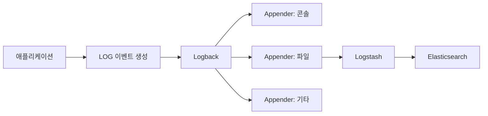

# 로그
## 주로 저장되는 로그 내용

1. 요청/응답 : 디버깅, 성능 분석
2. 오류 및 예외 : 장애 대응
3. 사용자 활동 : 감사, 사용 분석
4. 시스템 상태 : 모니터링
5. 데이터베이스 쿼리 : 성능 최적화
6. 보안 : 침해 대응
7. 배치 작업 : 모니터링
8. 디버깅 : 추적

## 로그 레벨

1. TRACE : 3일치 로그만 보관 (예시)
2. DEBUG : 3일치 로그만 보관 (예시)
3. INFO
4. WARN : 1분간 10회 이상 발생시 알람 + 일단위 리포트 (예시)
5. ERROR : 1회라도 발생시 알람
6. FATAL : 1회라도 발생시 알람

위와 같은 로직을 굳이 제작할 필요는 없다. 로깅 프레임워크에서 이미 제공하는 기능이기 때문이다.

## 로그 레벨 의미

### TRACE

세부적인 수준의 로그, 코드의 실행 경로 추적할 때 사용

###  DEBUG

디버깅 목적의 로그, 개발 중 코드의 상태나 흐름 파악을 위해 사용

###  INFO

시스템의 정상적인 운영 상태를 나타내는 정보성 로그, 중요한 이벤트나 상태 변화 기록

###  WARN

잠재적으로 문제가 될 수 있는 상황을 나타내지만, 시스템 운영에는 즉각적인 영향을 주지 않는 경우 사용

###  ERROR

치명적이지 않지만, 중요한 문제가 발생했음을 나타낸다. 복구가 필요하거나 실패한 작업을 추적해야 할 때 사용

###  FATAL

시스템 운영을 계속할 수 없을 정도로 심각한 오류가 발생했을 때 사용

# Logback
## xml
```xml
<configuration>  
    <property name="LOG_FILE" value="application.log" />  
  
<!--    콘솔 출력-->  
    <appender name="CONSOLE" class="ch.qos.logback.core.ConsoleAppender">  
        <encoder>  
            <pattern>%d{yyyy-MM-dd HH:mm:ss} %-5level [%thread] %logger{36} - %msg%n</pattern>  
        </encoder>  
    </appender>  
  
<!--    파일 출력-->  
    <appender name="FILE" class="ch.qos.logback.core.rolling.RollingFileAppender">  
        <file>${LOG_FILE}</file>  
        <rollingPolicy class="ch.qos.logback.core.rolling.TimeBasedRollingPolicy">  
            <fileNamePattern>application.%d{yyyy-MM-dd}.log</fileNamePattern>  
            <maxHistory>30</maxHistory>  
        </rollingPolicy>  
        <encoder>
            <pattern>%d{yyyy-MM-dd HH:mm:ss} %-5level [%thread] %logger{36} - %msg%n</pattern>  
        </encoder>  
    </appender>  
  
<!--    Logger 설정-->  
    <root level="info">  
        <appender-ref ref="CONSOLE" />  
        <appender-ref ref="FILE" />  
    </root>  
</configuration>
```

## appender
### 1. ConsoleAppender
```xml
<appender name="CONSOLE" class="ch.qos.logback.core.ConsoleAppender">
    <encoder>
        <pattern>%d{HH:mm:ss} %-5level %logger - %msg%n</pattern>
    </encoder>
</appender>
```

- 표준 출력(stdout)으로 로그 출력
- 로컬 개발, 컨테이너 로그 수집
- 파일 저장 없음

### 2. FileAppender
```xml
<appender name="FILE" class="ch.qos.logback.core.FileAppender">
    <file>/var/log/app/application.log</file>
    <append>true</append>
    <encoder>
        <pattern>%d %-5level %logger - %msg%n</pattern>
    </encoder>
</appender>
```

- 단일 파일 로그 기록
- 롤링 없음
- 지정된 파일에 계속 append
- 파일 무한 증가

### 3. RollingFileAppender
```xml
<appender name="FILE" class="ch.qos.logback.core.rolling.RollingFileAppender">
    <file>application.log</file>

    <rollingPolicy class="ch.qos.logback.core.rolling.TimeBasedRollingPolicy">
        <fileNamePattern>application.%d{yyyy-MM-dd}.log</fileNamePattern>
        <maxHistory>30</maxHistory>
    </rollingPolicy>

    <encoder>
        <pattern>%d{yyyy-MM-dd HH:mm:ss} %-5level %logger - %msg%n</pattern>
    </encoder>
</appender>
```

- 파일 롤링(날짜, 크기)
- 하루 단위로 로그 파일 분리
- 30일 초과 로그 자동 삭제
- 현재 로그는 application.log, 과거 로그는 날짜 포함 파일

## 로그 수집을 왜 해야하죠?



로그 시스템을 간략하게 그려보자면 위와같은 흐름으로 표현할 수 있다. 이 때 로그 내용을 보려면 SSH 등 접근 가능한 방법을 사용해서 로그 파일을 보게 된다. 그런데 만약 서비스가 로드밸런싱이나 이중화, 혹은 다중 인스턴스로 구성된 상태라면 어떨까? 규모가 작은 서버라도 수십 대의 서버에서 애플리케이션을 실행한다면 원하는 로그를 확인하기가 쉽지 않다.

따라서 각각의 서버에서 발생한 로그들을 중앙화된 저장소에 모아서 관리하는 방법이 필요하다. 이게 바로 로그 수집이 필요한 이유이고, 이에 많이 활용되는 저장소가 바로 `ElasticSearch`이다.