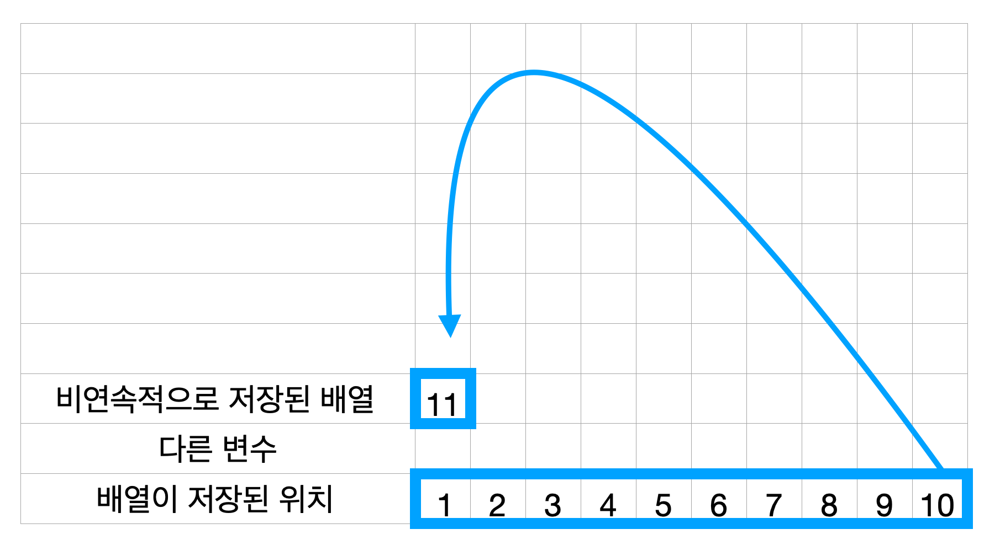
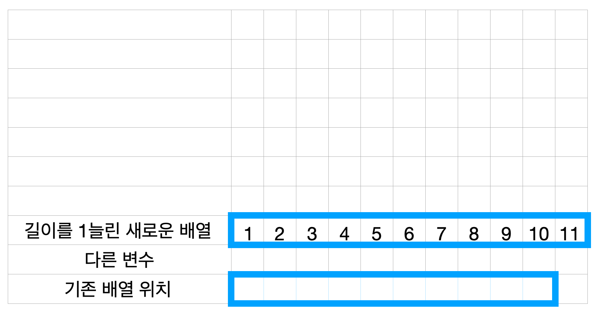

```cpp
std::vector<int> arr;
arr.push_back(10);
```

```java
List<Integer> arr = new ArrayList<>();
arr.add(1);
```

```python
arr = []
arr.append(1)
```


위 코드에서 원소를 더하는 연산은 정말 O(1)일까? 결론부터 말하자면 아니다.

> 원소 추가 연산의 정확한 시간 복잡도는 amortized O(1) 이다.

## 배열의 메모리 구조

설명을 위해 멀리 멀리 돌아가서 시작해보겠다. 프로세스가 사용하는 메모리를 살펴보자.


코드에서 배열을 선언한다면 메모리에는 위 그림과 같이 배열이 저장된다. 배열은 메모리상에 연속된 공간을
차지한다. 위 그림처럼 크기가 10인 배열이 있다면, 10개의 연속된 공간을 할당받고 사용한다.

배열에 1 ~ 10 까지 저장했고 이후 11을 넣고 싶다면? 여기서 두 가지 아이디어가 나온다.

### 두 가지 선택

1. 굳이 메모리상에 연속되게 저장해야하나? -> Linked List
2. 길이를 늘린다음 메모리에 새로 할당하지뭐 -> List

| Linked List                                                                | List                                                                       |
|----------------------------------------------------------------------------|----------------------------------------------------------------------------|
|  |  |

우리는 2번 아이디어를 따라 진행한다. 즉, 배열을 다시 메모리에 할당해야한다. 이번에는 11칸 배열을
선언하고 기존 값을 복사, 이후 11을 마지막에 저장한다. 만약 12를 넣고 싶다면? 12칸 배열을 선언하고
기존 값을 복사, 이후 12를 마지막에 저장한다. 10까지는 1번의 연산이었지만 11부터는 n + 1의
연산을 해야한다.

- 메모리에 새 배열을 할당하고
- 기존 원소들을 복사한 후,
- 새로운 원소를 추가

그러면 자연스럽게 다음과 같은 아이디어가 떠오른다.

> 배열 길이를 하나만 늘리지 말고 한번에 왕창 늘려놓자!

## 배열 크기 확장 과정

위 아이디어대로 배열 길이를 하나만 늘리지 말고 편의상 2배씩 늘려보자. 즉 초기값이 10인 배열이라면
배열이 꽉 찼을 때 20의 길이를 가지는 배열로 재할당을 하는 것이다. 즉, 재할당 할 때마다 길이는 20,
40, 80 이 된다.

1 ~ 10 :  원소 추가 연산

11 : 배열 선언 연산 + 복사 연산 + 11 추가 연산

12 ~ 20 : 원소 추가 연산

21 : 배열 선언 연산 + 복사 연산 + 21 추가 연산

22 ~ 40 : 원소 추가 연산

41 : 배열 선언 연산 + 복사 연산 + 41 추가 연산

42 ~ 80 : 원소 추가 연산

81 : 배열 선언 연산 + 복사 연산 + 81 추가 연산

규칙이 보이는가? 모든 경우에 일단 추가 연산이 진행된다. 배열이 꽉 차고 이후 배열을 2배 길이로 늘린
다음 선언, 복사하는 연산은 가끔 진행된다.

1 ~ 81 : 원소 추가 연산 -> O(1)

11, 21, 41, 81 : 배열 선언 연산, 복사 연산 -> O(N)

대충 결론이 보이기 시작한다. 정리하자면 대부분의 경우 상수 시간이 걸린다. 그런데 재수없으면 n의 시간이
걸린다. 그러니까 대충 상수시간이라고 하자! 라고 결론을 낼 수 있겠다. 그런데 정말 대충 결론을 내고나서
만족할 수 있는가? 디테일에 목숨을 거는 타입이라면 여기서 거품을 물고 따지기 시작할 것이다.

추가 연산의 평균적인 시간 복잡도를 보다 명확하게 이해하기 위해, 다시 한번 정리해보자.

1 ~ 81 : 원소 추가 연산 -> O(1)

11, 21, 41, 81 : 배열 선언 연산, 복사 연산 -> O(N)

너무 당연한 원소 추가 연산은 제외하고 배열 길이를 늘리는 케이스를 살펴보자. 11, 21, 41, 81
원소를 추가할 때 연산의 길이는 절대 N을 넘지 않는다. 각 확장 과정에서 배열의 크기는 기존의 2배가
되므로, 총 복사되는 원소 수는 대략 O(N)이다. 하지만 전체 연산을 여러 번 반복하면, 평균적으로 원소당
O(1)의 시간 복잡도를 가지게 된다.

## 결론

- 일반적으로는 O(1)의 시간이 소요된다.
- 그런데 재수없으면 O(N)의 시간이 소요된다.

O(1)도 아니고, O(N)도 아닌 애매한 상황에서 어떻게 결론이 나오냐면 대부분의 경우 O(1)이니까
일단은 O(1)이라고 하자! 그런데 단서를 곁들인,,,

그래서 `amortized O(1)`의 복잡도를 가지게 된다.

## 증명

초기값을 1로 가지고, 원소가 꽉 차면 길이를 2배로 늘리는 리스트라고 가정한다.

1. 배열 크기가 1일 때, 크기를 2로 늘리면서 1번 복사
2. 배열 크기가 2일 때, 크기를 4로 늘리면서 2번 복사
3. 배열 크기가 4일 때, 크기를 8로 늘리면서 4번 복사
4. ...
5. 배열 크기가 N/2일 때, 크기를 N으로 늘리면서 N/2번 복사

등비수열 합 공식에 따라 복사 연산의 비용을 계산해보면

$$ S = a\frac{r^m - 1}{r - 1} $$

- S : 수열의 합
- a : 첫째 항
- r : 공비
- m : 항의 개수

$$ 1 + 2 + 4 + ... + \frac{N}{2} = 1 * \frac{2^{log_2 N} - 1}{2 - 1} $$

아래와 같이 정리되고

$$1 + 2 + 4 + ... + \frac{N}{2} = N - 1$$

시간복잡도는 O(N - 1), 즉 O(N)이 된다.

### 왜 항의 개수가 $log_2 N$인가요?

| 단계  | 배열 크기 | 총 복사 횟수       |
|-----|-------|---------------|
| 0   | 1     | 0             |
| 1   | 2     | 1             |
| 2   | 4     | 2             |
| 3   | 8     | 4             |
| 4   | 16    | 8             |
| ... | ...   | ...           |
| $k$ | $2^k$ | $2^{(k - 1)}$ |

각 단계에서 배열의 크기는 2배씩 증가한다. 즉, K번째 단계에서 배열 크기는 $2^k$이다. 따라서 최대
크기가 N일 때, 다음 방적식을 만족하는 m 을 찾으면 된다.

$$2^m = N$$

양변에 밑이 2인 로그를 취하면 아래와 같다.

$$m = log_2 N$$

그래서 항의 개수는  $log_2 N$이다.

## 자바에서는 1.5배로 리스트를 키운다.

자바의`ArrayList`는 배열 크기를**1.5배씩 증가**시키도록 구현되어 있다.

```java
private Object[] grow(int minCapacity) {  
    int oldCapacity = elementData.length;  
    if (oldCapacity > 0 || elementData != DEFAULTCAPACITY_EMPTY_ELEMENTDATA) {  
        int newCapacity = ArraysSupport.newLength(oldCapacity,  
                minCapacity - oldCapacity, /* minimum growth */  
                oldCapacity >> 1           /* preferred growth */);  
        return elementData = Arrays.copyOf(elementData, newCapacity);  
    } else {  
        return elementData = new Object[Math.max(DEFAULT_CAPACITY, minCapacity)];  
    }  
}
```

여기서`oldCapacity >> 1`은`oldCapacity / 2`와 동일하다.  
즉,`기존 크기 + (기존 크기의 절반)`을 새 크기로 설정한다.

`ArraysSupport.newLength()`의 핵심 부분을 보면:

```java
public static int newLength(int oldLength, int minGrowth, int prefGrowth) {  
    // preconditions not checked because of inlining  
    // assert oldLength >= 0  
    // assert minGrowth > 0  
  
    int prefLength = oldLength + Math.max(minGrowth, prefGrowth); // might overflow  
    if (0 < prefLength && prefLength <= SOFT_MAX_ARRAY_LENGTH) {  
        return prefLength;  
    } else {  
        // put code cold in a separate method  
        return hugeLength(oldLength, minGrowth);  
    }  
}
```

즉,**기존 크기의 1.5배**로 크기를 증가시키는 것이`ArrayList`의 동작 방식이다.