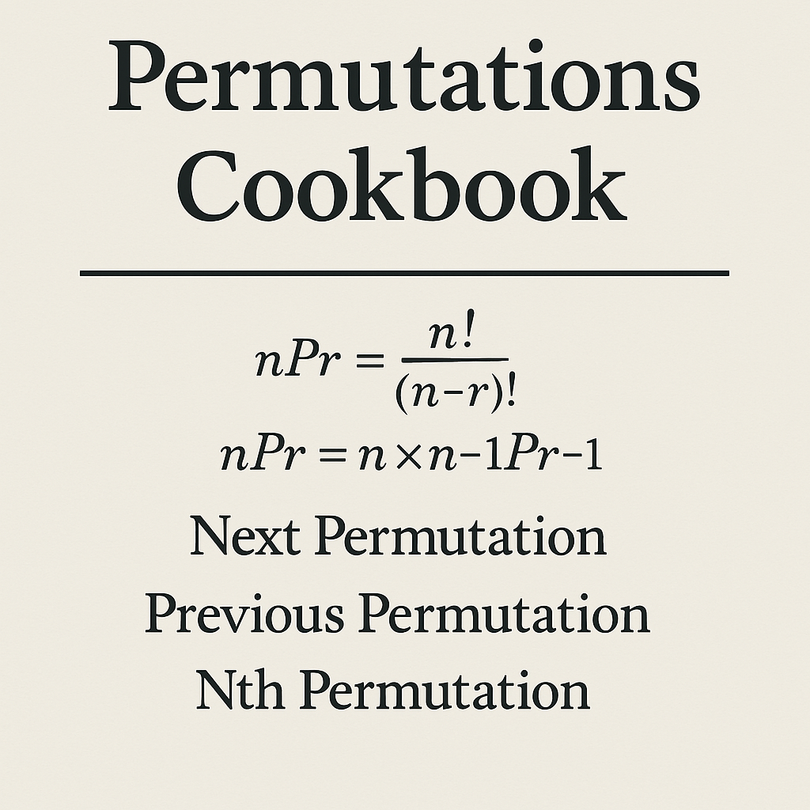

#cs 

# Permutations Cookbook



이 글에서는 순열의 정의와 수학적 공식부터 시작해, 직접 순열을 생성하는 기본 구현, 사전순으로 다음/이전 순열을 구하는 알고리즘, 특정 순서의 순열을 빠르게 찾아내거나 주어진 순열이 전체 중 몇 번째인지 계산하는 고급 기법까지 전반적으로 다룬다.

## 순열

시간 복잡도 : $O(N!)$

> 어떤 집합의 원소들을 특정한 순서대로 배열하는 것  

순서가 중요하므로 (1, 2) != (2, 1)  

> $$_nP_r = \frac{n!}{(n-r)!}$$  
  
> $$_nP_r = n \times _{n-1}P_{r-1}$$  
  
```java  
class Solution {

    private int field;
    // 전체 원소 수
    private int select;
    // 선택할 원소 수
    private boolean[] used;
    // 원소 사용 여부 체크
    private int[] permutated;
    // 현재 순열 저장
    private StringBuilder answer;
    // 결과 누적

    public String solution(int[] input) {
        init(input); // 초기화
        getPermutations(0); // 순열 생성
        return answer.toString(); // 생성된 순열 출력
    }

	private void init(int[] input) {
        this.field = input[0];
        this.select = input[1];
        this.used = new boolean[field + 1];
        this.permutated = new int[select];
        this.answer = new StringBuilder();
    }

    public void getPermutations(int cnt) {
        if (cnt == select) {
            answer.append(savePermutated()).append("\n");
            return;
        }

        for (int i = 1; i <= field; i++) {
            if (used[i]) continue;
            // 이미 사용된 숫자는 스킵

            used[i] = true; // 사용 체크
            permutated[cnt] = i; // 현재 자리 할당
            getPermutations(cnt + 1); // 다음 자리 재귀 호출
            used[i] = false; // 백트래킹
        }
    }

    private String savePermutated() {
        StringBuilder result = new StringBuilder();
        for (int i : permutated) {
            result.append(i).append(" ");
        }
        return result.toString();
    }
}

```  
  
## [다음 순열](https://www.acmicpc.net/problem/10972)

시간 복잡도 : $O(N)$
  
> 지금 순열에서 사전 순으로 다음 순열을 생성한다.  

`ex) [1, 2, 3] -> [1, 3, 2]`

1. 순열의 뒤에서부터 앞으로 가면서 처음으로 내림차순이 되는 지점(`i`)을 찾는다.
	- `ex) [5, 1, 2, 4, 3] 의 경우 i = 2, arr[i] = 2`
2. 만약 그런 `i`가 없다면(뒤에서부터 완전히 오름차순으로 정렬되어 있다면), 이미 마지막 순열이므로 `-1` 출력
3. 만약 그런 `i`가 있다면 다시 뒤에서부터 `arr[i]` 보다 큰 수 `j` 를 찾아 스왑한다.
	- `ex) [5, 1, 2, 4, 3] 의 경우 j = 4, arr[j] = 3`
	- `스왑 후 -> [5, 1, 3, 4, 2]`
4. `i` 부터 끝까지의 구간을 오름차순으로 정렬한다.
	- `ex) [5, 1, 3, 2, 4]`

```java  
class Solution {

	private int[] field;

	public String solution(int[] field) {
		init(field);
		return nextPermutate() ? getResult() : "-1";
	}

	private void init(int[] field) {
		this.field = field;
	}

	private boolean nextPermutate() {
		int i = field.length - 1;

		while(i > 0 && field[i - 1] >= field[i]) --i;
		// 1. 뒤에서부터 처음으로 감소하는 지점 찾기

		if(i == 0) return false;
		// 2. 마지막 순열이면 false 출력

		int j = field.length - 1;
		while(field[i - 1] >= field[j]) --j;
		// 3. i - 1 보다 큰 값 중 가장 마지막 값 찾기

		swap(i - 1, j);
		// 4. 스왑

		int k = field.length - 1;
		while(i < k) swap(i++, k--);
		// i 부터 끝까지 뒤집기

		return true;
	}

	private void swap(int i, int j) {
		int temp = field[i];
		field[i] = field[j];
		field[j] = temp;
	}

	private String getResult() {
		StringBuilder result = new StringBuilder();
		for (int i : field) {
			result.append(i).append(" ");
		}
		return result.toString().trim();
	}
}
```

## [이전 순열](https://www.acmicpc.net/problem/10973)

시간 복잡도 : $O(N)$
  
> 지금 순열에서 사전 순으로 이전 순열을 생성한다.  

`ex) [1, 3, 2] -> [1, 2, 3]`

1. 순열의 뒤에서부터 앞으로 가면서 처음으로 오름차순이 되는 지점(`i`)을 찾는다.
	- `ex) [5, 1, 2, 4, 3] 의 경우 i = 3, arr[i] = 4`
2. 만약 그런 `i`가 없다면(뒤에서부터 완전히 내림차순 정렬되어 있다면), 이미 처음 순열이므로 `-1` 출력
3. 만약 그런 `i`가 있다면 다시 뒤에서부터 `arr[i]` 보다 작은 수 `j` 를 찾아 스왑한다.
	- `ex) [5, 1, 2, 4, 3] 의 경우 j = 3, arr[j] = 4`
	- `스왑 후 -> [5, 1, 2, 3, 4]`
4. `i` 부터 끝까지의 구간을 오름차순으로 정렬한다.
	- `ex) [5, 1, 2, 3, 4]`

```java  
class Solution {

	private int[] field;
	
	public String solution(int[] field) {
		init(field);
		return prevPermutation() ? getPermutated() : "-1";
	}
	
	private void init(int[] field) {
		this.field = field;
	}

	// 이전 순열을 만드는 핵심 로직
	private boolean prevPermutation() {
		int i = field.length - 1;
		
		while(i > 0 && field[i - 1] <= field[i]) i--;
		// 1. 뒤에서부터 처음으로 오름차순이 깨지는 지점 찾기
		
		if(i == 0) return false;
		// 2. 완전히 오름차순이면 (이미 첫 번째 순열이면) false 반환
		
		int j = field.length - 1;
		while(field[i - 1] <= field[j]) j--;
		// 3. 뒤에서부터 field[i - 1]보다 작은 수를 찾아 스왑할 위치 j 결정
		
		swap(i - 1, j);
		// 4. i - 1과 j를 스왑
		
		int k = field.length - 1;
		while(i < k) swap(i++, k--);
		// 5. i부터 끝까지 뒤집어서 정렬(내림차순)
		
		return true;
		// 이전 순열 생성 완료
	}

	private void swap(int i, int j) {	
		int temp = field[i];
		field[i] = field[j];
		field[j] = temp;
	}

	private String getPermutated() {
		StringBuilder result = new StringBuilder();
		for(int f : field) result.append(f).append(" ");
		return result.toString();
	}
}
```

## [n번째 수열 구하기](https://www.acmicpc.net/problem/9742)

시간 복잡도 : $O(N^2)$

> 1부터 N까지 숫자로 만들 수 있는 모든 순열을 사전 순으로 정렬했을 때, K 번째에 해당하는 순열을 구하는 방법

사전 순 순열은 팩토리얼을 이용한 자리수 계산으로 직접 구할 수 있다.

N = 4, K = 9 라고 한다면
- 전체 수열 수 : $4!$ = 24
- 첫 자리에 올 수 있는 숫자 : [1, 2, 3, 4]
- 각 숫자가 첫 자리에 올 때마다 남는 경우의 수 : $3!$ = 6
- K = 9는 두 번째 그룹에 해당 (첫 자리는 2)

```java
class Solution {  
  
    public String solution(List<String> testCases) {  
       StringBuilder result = new StringBuilder();  
       for (String testCase : testCases) {  
          result.append(testCase).append(" = ").append(calc(testCase)).append("\n");  
       }  
       return result.toString();  
    }  
  
    private String calc(String testCase) {  
       String[] input = testCase.split(" ");  
       char[] field = input[0].toCharArray();  
       int n = Integer.parseInt(input[1]);  
       String permutation = getPermutationOf(field, n);  
       return permutation != null ? permutation : "No permutation";  
    }  

	// 사전순으로 정렬된 순열 중 n 번째 순열을 직접 계산
    private String getPermutationOf(char[] field, int n) {  
       List<Character> chars = new ArrayList<>();  
       for(char c : field) chars.add(c);
       // 문자들을 리스트로 변환
  
       int total = factorial(chars.size());
       // 전체 가능한 순열의 수 계산
       if(n > total) return null;
       // 범위 초과 시 null 반환
  
       n--;
       // 0-based index로 변환
  
       StringBuilder result = new StringBuilder();  
  
       while (!chars.isEmpty()) {
	       // 각 자리에 올 문자를 선택하며 순열 구성
          int size = chars.size();  
          int f = factorial(size - 1);
          // 현재 자리 이후에 남은 문자들로 만들 수 있는 순열의 개수
          // 그룹 크기
          int index = n / f;
          // 선택할 문자 인덱스
  
          result.append(chars.get(index));
          // 문자 추가
          chars.remove(index);
          // 선택한 문자는 제거
  
          n %= f;
          // 다음 자리에서 사용할 인덱스 갱신
       }  
       return result.toString();  
    }  
  
    private int factorial(int size) {  
       int result = 1;  
       for (int i = 1; i <= size; i++) {  
          result *= i;  
       }  
       return result;  
    }  
}
```

## [주어진 순열이 몇 번째 순열인지 계산하기](https://www.acmicpc.net/problem/1722)

시간 복잡도 : $O(N^2)$

- 각 자릿수마다 앞에 올 수 있는 더 작은 수의 개수를 계산
- 그 수보다 작은 값이 앞에 올 수 있는 경우의 수는 `(작은 개수) * (남은 자리  순열 수)`
- 모든 자리에 계산을 하고 이를 누적해서 더하면 순열의 순서가 구해짐

```java

class Solution {

	private int[] field;

	public int solution(int[] field) {
		init(field);
		return getPermutationIndex();
	}

	private void init(int[] field) {
		this.field = field;
	}

	private int getPermutationIndex() {
		List<Integer> nums = new ArrayList<>();

		for(int i = 1; i <= field.length; i++) nums.add(i);

		int index = 1; // 1-based index

		for(int i = 0; i < field.length; i++) {
			int cur = field[i];

			for(int num : nums) {
				// 현재 숫자보다 작은 수가 남은 리스트에 몇개 남았는지 확인
				if(num == cur) break;
				index += factorial(field.length - i - 1);
				// 그 숫자를 첫 자리에 둘 때 나오는 경우의 수 추가
			}
			nums.remove(Integer.valueOf(cur)); // 사용한 숫자 제거
		}

		return index;
	}

	private int factorial(int num) {
		int result = 1;
		for(int i = 1; i <= num; i++) {
		result *= i;
		}
		return result;
	}
}
```

## 결론

반드시 자바로 풀이해야 하는 경우가 아니라면 파이썬 `itertools.permutations` 를 사용하도록 하자....

### $_nP_r$
```python
from itertools import permutations

arr = [1, 2, 3]
r = 2

for p in permutations(arr, r):
    print(p)
# (1, 2), (1, 3), (2, 1), (2, 3), (3, 1), (3, 2)
```

### nextPermutation
```python
from itertools import permutations

arr = [1, 2, 3]
perm_list = list(permutations(sorted(arr)))

idx = perm_list.index(tuple(arr))
next_perm = perm_list[idx + 1] if idx + 1 < len(perm_list) else -1
print(next_perm)
# (1, 3, 2)
```

### k번째 순열
```python
from itertools import permutations

arr = [1, 2, 3, 4]
k = 9

perm_list = list(permutations(sorted(arr)))
print(perm_list[k - 1])  # 0-based index
# (2, 1, 3, 4)
```

### 주어진 순열이 몇번째 순열인지
```python
from itertools import permutations

arr = [2, 3, 1]
perm_list = list(permutations(sorted(arr)))

index = perm_list.index(tuple(arr)) + 1  # 1-based index
print(index)
# 5
```