## 로드밸런서 사용 기준 알아보기

1. 클라이언트 사이드 로드 밸런서
2. 서버 사이드 로드 밸런서
3. 인프라 레벨 로드 밸런서

# 1. 클라이언트 사이드 로드 밸런서

> 클라이언트가 직접 서비스 인스턴스 목록을 가지고 로드 밸런싱을 수행

ex) Spring Cloud LoadBalancer, Netflix Ribbon, gRPC Client

## 장점
- 레이턴시 낮음 : 중간 서버 없이 바로 호출 -> 빠른 응답 속도
- 스케일링 부담 분산 : 로드 밸런서 서버 없음 -> 부하 분산
- 서비스 디스커버리 통합 용이 -> 클라이언트가 Eureka 등을 직접 참조

## 단점
- 복잡도 전파 : 로드 밸런싱, 재시도, 장애 감지 로직을 각 클라이언트에 구현해야 함
- 일관성 부족 : 클라이언트마다 로직, 정책이 달라질 수 있음
- 서비스 변경 시 광범위한 영향 : 클라이언트가 많을수록 버전 변경 어려움

## Spring Cloud LoadBalancer

- `lb://service-name` 으로 직접 호출하는 방식
- 내부적으로 LoadBalancerClient를 통해 인스턴스를 선택
- Feign, WebClient, RestTemplate 등에 통합 가능

### 장점
- 가볍고 빠름 : 요청마다 중앙 게이트웨이를 거치지 않음
- MSA 내부 통신에 적합 : 서비스 간 직접 통신
- 설정이 간단함 : Eureka와 연동만 해도 동작

### 단점
- 클라이언트에 존재 : 모든 서비스에 로드밸런싱 전략이 포함되어야 함
- 정책 통일 어려움 : retry, timeout 등 설정을 모든 서비스에 개별적으로 적용해야함
- 보안/모니터링 어려움 : 모든 요청이 흩어져 있어 추적이 어려움

# 2. 서버 사이드 로드 밸런서

> 중앙 서버가 모든 요청을 받고, 적절한 인스턴스로 분기

ex) Spring Cloud Gateway, Nginx

## 장점
통합 제어 : 인증, 라우팅, 필터링, 트래픽 관리 가능
구성 단순화 : 크랄이언트는 오직 하나의 엔드포인트만 알면 됨
정책 일관성 보장 : 라우팅, 리트라이, 서킷브레이커 등 한 곳에서 통제

## 단점
- 단일 장애점 : 고가용성 구성 필요
- 성능 병목 : 모든 요청이 한 지점을 거침 -> 대역폭/CPU 소모 증가
- 운영 복잡도 증가 : 라우팅, 인증 등 설정과 모니터링 필요

## Spring Cloud Gateway

- API Gateway가 모든 요청을 받아서 내부 라우팅 및 로드밸런싱 수행
- 내부적으로 LoadBalancerClient 사용

### 장점
- 통합 진입 : 인증, 인가, 로깅, 모니터링, 트래픽 제어 등 중앙화 가능
- 보안 : 외부 노출 최소화 (내부 서비스는 내부에서만 접근)
- 필터 체인 사용 가능 : 요청/응답 가공, 헤더 조작 등 자유로움

### 단점
- 중앙 집중 : 모든 요청이 Gateway를 거치므로 병목 가능성
- 구성 필요 : 라우팅 설정, 필터 설정 등 관리 항목 증가
- 단일 장애점 : 고가용성 구성 필요

# 인프라 레벨 로드 밸런서

> 클라우드, 네트워크 계층에서 동작

ex) AWS ELB/ALB/NLB, MetalLB(K8s), Nginx

## 장점
- 고가용성: 클라우드 제공업체가 관리하는 이중화/자동 복구
- 클라우드 네이티브: 오토스케일링, 헬스체크 자동화
- 부가 기능: SSL 터미네이션, DDoS 방어, 지리적 분산

## 단점
- 유연성 부족: 애플리케이션 레벨 로직 구현 어려움
- 비용 발생: 트래픽량에 따른 과금
- 동적 서비스 디스커버리 한계

## Nginx

- Reverse Proxy로서 80/443 포트를 받아 내부 서비스로 라우팅
- 내부는 서비스 IP 또는 Gateway로 연결

### 장점
- 성능 우수 : C 기반 고성능 처리
- 풍부한 기능 : 로깅, SSL, 보안, 캐싱 등
- 프론트 단일 진입점으로 활용 가능

### 단점
- 서비스 디스커버리 연동 : Nginx는 정적 설정 기반 -> Eureka 등과 동적 연동 어려움
- 운영 복잡도 : Config reload, 헬스 체크, 스크립트 구성 필요
- 내부 로드밸런싱 기능 없음 : 클라이언트나 게이트웨이와 연계 필요

# 그래서?
여기까지 봤다면 이런 의문이 든다. "그래서 로드밸런싱은 어떻게 구현하라는거임?" 사실 3가지를 모두 조합해서 사용한다. 외부에서 요청이 들어온다면 Spring Cloud Gateway, 내부 서비스들 사이에서 통신이 필요하다면 Spring Cloud LoadBalancer를 사용한다. 일반적인 조합은 아래와 같다.

1. 패턴 1: Nginx/ALB → Gateway → 서비스들
2. 패턴 2: ALB → 여러 Gateway 인스턴스 → 서비스들
3. 패턴 3: K8s 환경 - Ingress → Service → Pod
4. Best Practice : ALB/Nginx → Spring Cloud Gateway (Routing + Auth) → 내부 서비스 (LoadBalancerClient)

```mermaid
graph TB
    %% 패턴 3: K8s 환경
    subgraph "패턴 3: K8s 환경 - Ingress → Service → Pod"
        Client3[외부 클라이언트] --> Ingress[Kubernetes Ingress<br/>인프라 레벨 LB]
        Ingress --> K8sService1[K8s Service<br/>ClusterIP/LoadBalancer]
        Ingress --> K8sService2[K8s Service<br/>ClusterIP/LoadBalancer]
        K8sService1 --> Pod1A[Pod A<br/>App Instance]
        K8sService1 --> Pod1B[Pod B<br/>App Instance]
        K8sService2 --> Pod2A[Pod C<br/>App Instance]
        K8sService2 --> Pod2B[Pod D<br/>App Instance]
    end

	%% 패턴 2: ALB → 여러 Gateway 인스턴스 → 서비스들
    subgraph "패턴 2: 외부 → ALB → 여러 Gateway 인스턴스 → 서비스들"
        Client2[외부 클라이언트] --> ALB2[AWS ALB<br/>인프라 레벨 LB]
        ALB2 --> GW2A[Gateway Instance A<br/>서버 사이드 LB]
        ALB2 --> GW2B[Gateway Instance B<br/>서버 사이드 LB]
        GW2A --> Service3A[Payment Service<br/>Instance A]
        GW2A --> Service3B[Payment Service<br/>Instance B]
        GW2B --> Service4A[Notification Service<br/>Instance A]
        GW2B --> Service4B[Notification Service<br/>Instance B]
    end

	%% 패턴 1: Nginx/ALB → Gateway → 서비스들
    subgraph "패턴 1: 외부 → Nginx/ALB → Spring Cloud Gateway → 내부 서비스들"
        Client1[외부 클라이언트] --> LB1[Nginx/ALB<br/>인프라 레벨 LB]
        LB1 --> GW1[Spring Cloud Gateway<br/>서버 사이드 LB]
        GW1 --> |클라이언트 사이드 LB| Service1A[User Service<br/>Instance A]
        GW1 --> |클라이언트 사이드 LB| Service1B[User Service<br/>Instance B]
        GW1 --> |클라이언트 사이드 LB| Service2A[Order Service<br/>Instance A]
        GW1 --> |클라이언트 사이드 LB| Service2B[Order Service<br/>Instance B]
    end
    
    %% 스타일링
    classDef client fill:#e1f5fe
    classDef infraLB fill:#fff3e0
    classDef serverLB fill:#f3e5f5
    classDef service fill:#e8f5e8
    classDef k8s fill:#fce4ec

    class Client1,Client2,Client3 client
    class LB1,ALB2,Ingress infraLB
    class GW1,GW2A,GW2B serverLB
    class Service1A,Service1B,Service2A,Service2B,Service3A,Service3B,Service4A,Service4B service
    class K8sService1,K8sService2,Pod1A,Pod1B,Pod2A,Pod2B k8s
```



# MQ(카프카, RabbitMQ)는 언제 사용하나요?
Spring Cloud LoadBalancer는 동적인 처리가 필요할 때 사용된다. 비동기로 처리한다면 뭘 사용할까? 이 경우가 카프카를 사용하기 좋은 경우이다. 간단하게 정리하자면 아래와 같다.

- 서비스1은 서비스2의 로직이 동기로 필요하다 -> spring cloud loadbalancer
- 서비스1은 서비스2의 로직이 비동기로 필요하다 -> 카프카

## 서비스1은 서비스2의 로직이 동기로 필요하다 -> spring cloud loadbalancer

- **상황**: 클라이언트가 서비스1에 요청을 보냈고, 서비스1이 서비스2의 데이터를 즉시 받아서 응답을 구성해야 함.
- **왜 Spring Cloud LoadBalancer?**: 동기 호출(REST API)은 즉각적인 응답이 필요하므로, Spring Cloud LoadBalancer가 서비스 디스커버리(Eureka)와 연동하여 서비스2의 인스턴스를 선택하고 HTTP 요청을 처리하기에 적합.
- **예시**:
    - 서비스1(User Service)이 서비스2(Order Service)에서 주문 데이터를 조회.
    - RestTemplate 또는 WebClient를 사용해 `lb://order-service`로 호출.
- **예시**
```java

@Service
public class UserService {

	@Autowired
	private RestTemplate restTemplate;

	public String getUserOrders(String userId) {
		// 서비스2(Order Service)를 동기 호출 (Eureka 기반)
		String orders = restTemplate.getForObject("lb://order-service/orders?userId=" + userId, String.class);
		return "User Orders: " + orders;
	}

	@Bean
	@LoadBalanced
	public RestTemplate restTemplate() {
		return new RestTemplate();
	}
}
```

## 서비스1은 서비스2의 로직이 비동기로 필요하다 -> 카프카

- **상황**: 클라이언트가 서비스1에 요청을 보냈지만, 서비스1이 서비스2의 로직을 비동기적으로 처리(예: 이벤트 발행)하고, 즉시 클라이언트에 응답을 반환하거나 나중에 결과를 처리.
- **왜 Kafka?**: 비동기 통신은 서비스 간 결합도를 낮추고, 이벤트 기반으로 대량의 데이터를 처리하거나 지연 처리가 가능하므로 Kafka가 적합.
- **예시**:
    - 서비스1(User Service)이 주문 생성 이벤트를 서비스2(Order Service)에 보내고, 클라이언트에 즉시 "주문 접수됨" 응답을 반환.
    - 서비스2는 Kafka 토픽에서 이벤트를 소비해 주문을 처리.
- **예시**
```java

@Service
public class UserService {

	@Autowired
	private KafkaTemplate<String, String> kafkaTemplate;

	public String createOrderAsync(String userId, String orderDetails) {
		// Kafka 토픽에 비동기 이벤트 발행
		kafkaTemplate.send("order-topic", userId, orderDetails);
		return "Order request accepted for user: " + userId; // 즉시 응답
	}
}
```

```java

@Service
public class OrderService {

	@KafkaListener(topics = "order-topic", groupId = "order-group")
	public void processOrder(String orderDetails) {
		// 비동기적으로 주문 처리
		// 주문 처리 로직
	}

}
```