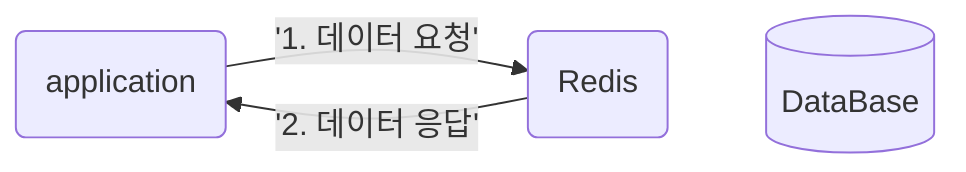
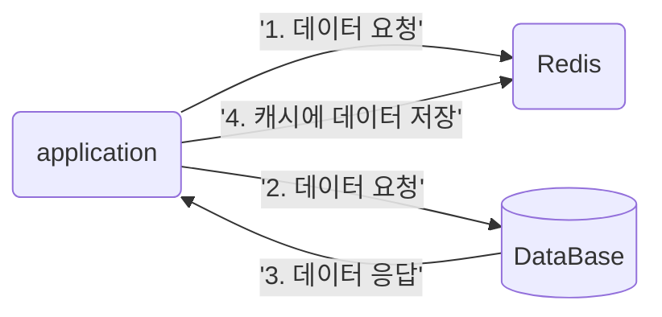
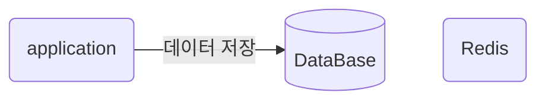

#레디스 

## Cache Aside (Look Aside, Lazy Loading)
데이터 조회시 주로 사용하는 전략

서비스를 처음으로 배포했다고 가정하고 이해해보자.
1. 처음 서비스를 배포했기 때문에 DB와 레디스에는 저장된 데이터가 없다.
2. 일부 사용자가 접근하여 게시글을 작성했고, 이 데이터를 저장한다. 이 데이터는 DB에 저장된다(레디스에는 저장되지 않는다).
3. 사용자가 데이터를 조회하려고 요청한다. 이 때, DB로부터 바로 데이터 조회를 하기 전에 레디스에 있는지 먼저 확인한다.
4. 레디스에 데이터가 없는 걸 확인한 뒤에 DB로부터 데이터를 조회해서 응답한다.
5. DB로부터 조회한 데이터를 응답한 뒤에 레디스에도 데이터를 저장한다.
6. 다시 한 번 사용자가 데이터를 조회하려고 요청한다.
7. 레디스에 조회하고자 하는 데이터가 있는 지 확인하고, 이번에는 데이터가 있으므로 레디스로부터 데이터를 바로 가져온다.

### 캐시에 데이터가 있을 경우


### 캐시에 데이터가 없을 경우(= cache miss)



## Write Around
데이터를 작성(저장, 수정, 삭제)할 때 사용하는 전략



이전과 달리 간단한 전략이다. 데이터를 저장할 때는 레디스에 저장하지 않고 데이터베이스에만 저장한다. 그러다 데이터를 조회할 때 레디스에 데이터가 없으면 DB로부터 데이터를 조회해와서 레디스에 저장하는 방식이다.

## Cache Around와 Write Around의 한계
### 1. 캐시된 데이터와 DB 데이터의 불일치
Cache Around와 Write Around 전략을 같이 사용했을 때는 **캐시된 데이터와 DB 데이터가 일치하지 않을 수 있다**는 단점이 있다. 다시 말해, **데이터 일관성을 보장할 수 없다**.

Write Around 전략으로 인해 데이터를 수정할 때 DB만 업데이트 되기 때문에 기존에 저장된 레디스의 데이터 값과 DB 데이터 값은 다를 수 있다.

### 2. 캐시에 저장할 수 있는 공간이 비교적 적다.
DB는 디스크에 저장해서 큰 용량을 저장하기 용이하다. 하지만 캐시는 메모리에 저장하기 때문에 DB에 비해 많은 양의 데이터를 저장할 수 없다.

## Cache Around와 Write Around의 한계 대비
### 1. 캐시된 데이터와 DB 데이터의 불일치
캐시와 DB의 데이터를 일치시키기 위해, 데이터를 수정할 때마다 동시에 업데이트 시키면 성능적으로 느려진다. 그렇다고 성능 향상을 위해 DB의 데이터만 업데이트 시키면 캐시와 DB의 데이터가 일치하지 않게 된다.

그러므로 이는 기회비용을 따져서 결정해야 한다. 따라서 아래와 같은 경우 캐시를 적용시키도록 하자.
- 자주 조회되는 데이터
- 잘 변하지 않는 데이터
- 실시간으로 정확히 일치하지 않아도 되는 데이터

위와같은 경우에는 캐싱을 적용하기 적합하다. 그러나! 장기간 데이터가 일치하지 않는 경우는 또 큰 문제가 된다. 따라서 TTL 설정을 사용해 주기적으로 DB와 캐시 데이터를 동기화 시켜야한다.

### 2. 캐시에 저장할 수 있는 공간이 비교적 적다.
TTL 기능을 활용하면 캐시의 공간을 효율적으로 사용하게 된다. 자주 사용하지 않는 데이터는 만료 시간에 의해 데이터가 삭제되기 때문이다.

## 스프링 예시
```java
@Service
@RequiredArgsConstructor
public class PostService {

    private final PostRepository postRepository;
    private final RedisTemplate<String, PostResponse> redisTemplate;
    private static final Duration TTL = Duration.ofMinutes(10);

    public PostResponse getPost(Long id) {
        String key = "posts:" + id;

        // 1. 캐시에서 조회
        PostResponse cached = redisTemplate.opsForValue().get(key);
        if (cached != null) {
            return cached;
        }

        // 2. 캐시에 없으면 DB 조회
        Post post = postRepository.findById(id)
                .orElseThrow(() -> new NoSuchElementException("Post not found"));

        PostResponse response = PostResponse.from(post);

        // 3. 캐시에 저장 (TTL 설정)
        redisTemplate.opsForValue().set(key, response, TTL);

        return response;
    }

    @Transactional
    public void updatePost(Long id, PostRequest request) {
        Post post = postRepository.findById(id)
                .orElseThrow(() -> new NoSuchElementException("Post not found"));

        post.update(request.getTitle(), request.getContent());

        // 4. 캐시 무효화 (일관성 확보)
        redisTemplate.delete("posts:" + id);
    }

    @Transactional
    public void deletePost(Long id) {
        postRepository.deleteById(id);
        redisTemplate.delete("posts:" + id);
    }

    @Transactional
    public void createPost(PostRequest request) {
        Post post = new Post(request.getTitle(), request.getContent());
        postRepository.save(post);
        // 레디스에는 저장하지 않음 (Write Around)
    }
}
```