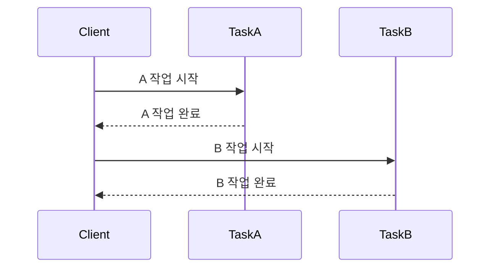
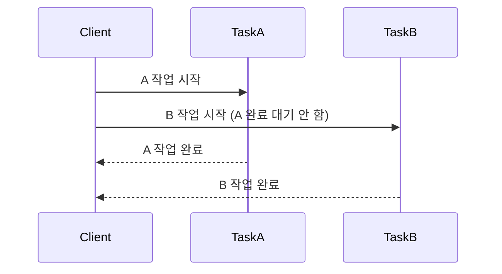
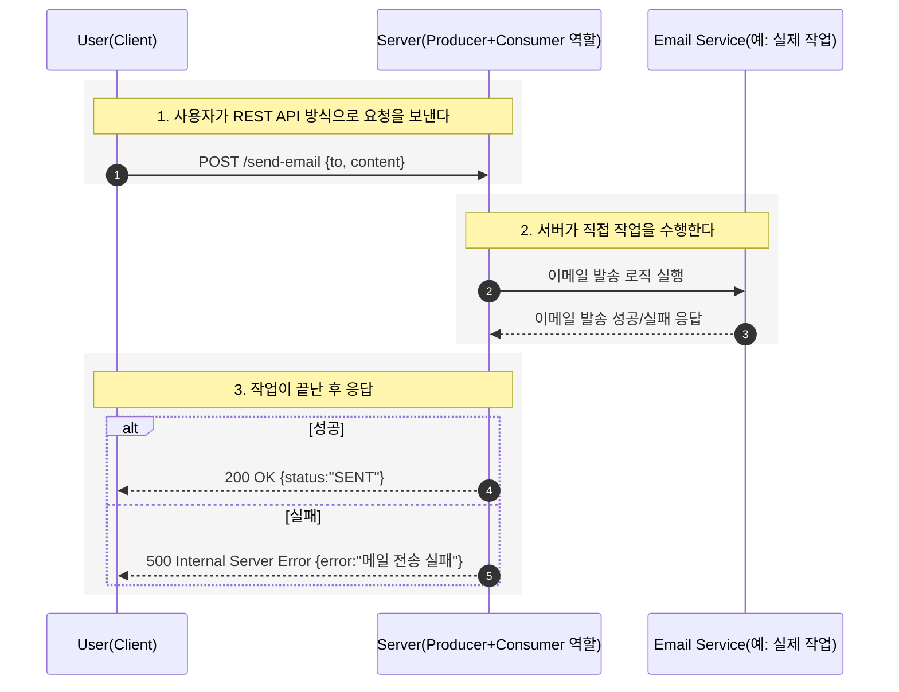
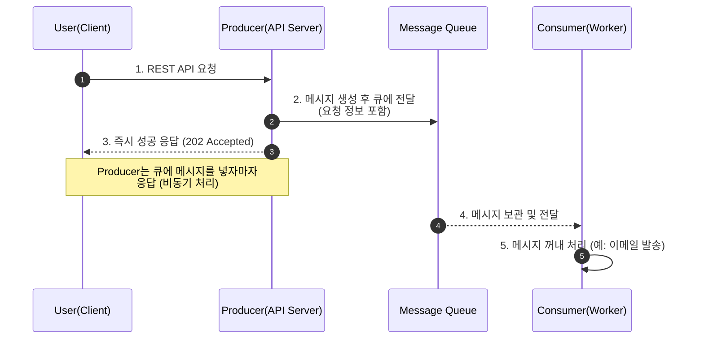
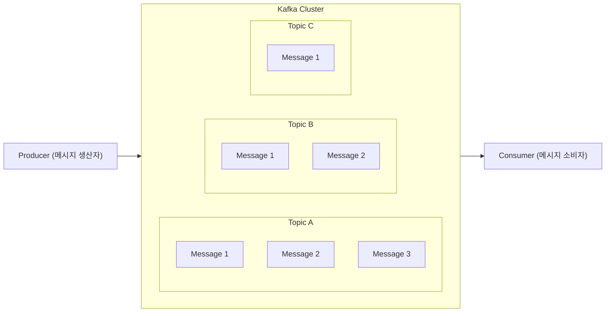

> Kafka는 대규모 데이터를 처리할 수 있는 `메시지 큐`이다.

## 메시지 큐
자료구조 큐에 데이터를 일시적으로 저장하는 임시 저장소를 의미한다. 메시지 큐를 사용하면 비동기적으로 데이터를 처리할 수 있어서 효율적이다.

### 동기적 처리 (순차 실행)

### 비동기적 처리 (병렬 실행)

## 그래도 이해가 안 돼요...😥
REST API 방식으로 다른 예시를 만들어보자!

REST API 방식은 요청을 보낸 뒤에 서버가 요청 작업을 전부 수행한 후 응답 반환.

하지만 메시지 큐를 활용한 통신 방식은 비동기적으로 작업을 처리하기 때문에 모든 작업이 다 처리되는 것과 상관 없이 응답을 받을 수 있다.

1. 사용자가 REST API 방식으로 요청을 보낸다.
2. 요청을 받은 서버는 메시지 큐에 전달할 메시지를 만들어 전달한다.
	- 메시지 안에는 처리해야 할 요청 정보가 들어있다.
	- 메시지 큐는 처리해야 할 메시지들을 보관하는 임시 저장소 역할을 한다.
	- 메시지를 만들어 메시지 큐로 전달하는 서버를 `Producer`라고 말한다.
3. `Producer` 서버는 메시지 큐에 메시지를 넣자마자 사용자에게 성공 응답을 한다.
4. 메시지 큐는 `Producer`로부터 받은 메시지를 보관한다.
5. `Consumer` 서버가 메시지 큐에 들어있는 메시지를 꺼내서 실제 작업을 수행한다.

## 기본 구성

카프카의 기본 구성을 간단하게 살펴보자.

- 프로듀서 : 카프카에 메시지(데이터)를 전달하는 주체
- 컨슈머 : 카프카의 메시지(데이터)를 처리하는 주체
- 토픽 : 카프카에 넣을 메시지의 종류를 구분하는 개념

프로듀서는 카프카로 메시지를 전달한다. 그러면 카프카는 메시지 큐에 토픽 별로 구분해 전달받은 메시지를 저장한다. 컨슈머는 카프카에 새로운 메시지가 생겼는지 체크하고, 새로운 메시지를 발견하면 그 메시지를 조회해서 처리한다.
