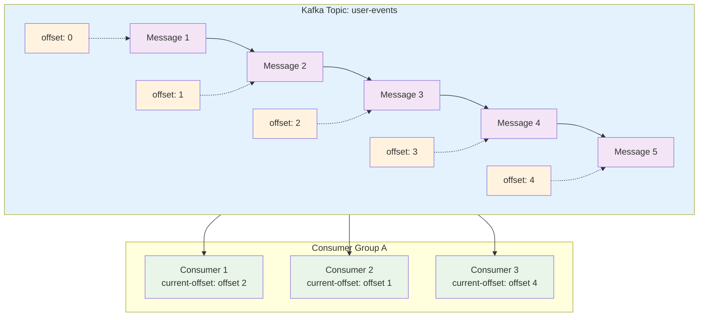

#카프카 

# 토픽 생성, 조회, 삭제
## 토픽 생성하기
```sh
# 카프카 디렉터리 안에서 명령어를 실행한다
cd kafka_xxx

# 토픽 생성
# bin/kafka-topics.sh --bootstrap-server <kakfa 주소> --create --topic <토픽명>
bin/kafka-topics.sh --bootstrap-server localhost:9092 --create --topic email.send
```

## 토픽 조회하기
```sh
# 토픽 전체 조회
# bin/kafka-topics.sh --bootstrap-server <kakfa 주소> --list 
bin/kafka-topics.sh --bootstrap-server localhost:9092 --list

# 특정 토픽 세부 정보 조회 
# bin/kafka-topics.sh --bootstrap-server <kakfa 주소> --describe --topic <토픽명> 
bin/kafka-topics.sh --bootstrap-server localhost:9092 --describe --topic email.send
```

## 토픽 삭제하기
```sh
# 토픽 삭제 
# bin/kafka-topics.sh --bootstrap-server <kafka 주소> --delete --topic <토픽명> 
bin/kafka-topics.sh --bootstrap-server localhost:9092 --delete --topic email.send 
# 잘 삭제됐는 지 확인하기 
bin/kafka-topics.sh --bootstrap-server localhost:9092 --list
```

----

# 메시지 삽입, 조회
## 특정 토픽에 메시지 넣기
메시지는 key-value 형식으로, 혹은 value만 넣을 수 있다. key를 생략하고 value만 넣어보자!
```sh
# email.send 라는 토픽에 메시지 넣기
bin/kafka-console-producer.sh --bootstrap-server localhost:9092 --topic email.send

# 위 명령어 입력 후 넣을 메시지 내용 입력하고 enter 누르기
hello1
hello2
hello3

# 입력을 완료했으면 ctr+c 로 입력 상태 종료
```

## 특정 토픽에서 메시지 조회하기
카프카는 메시지를 읽고 제거하는 방식이 아니다. 저장된 메시지를 읽기만 하고 제거하지 않는 방식으로 작동한다. 따라서 같은 메시지를 여러 번 읽을 수 있다.

```sh
# email.send 토픽에 있는 메시지 꺼내기
bin/kafka-console-consumer.sh --bootstrap-server localhost:9092 --topic email.send --from-beginning
```

`--from-beginning` : 토픽에 저장된 가장 처음 메시지부터 출력

만약 다른 mq 프로그램이었다면 위 명령어를 실행했을 때 메시지를 소비하여 큐가 비워졌을 것이다. 하지만 카프카는 메시지를 소비하더라도 제거하지 않는다. 따라서 한 번 더 명령어를 입력해도 저장된 메시지가 다시 출력된다.

----
# Consumer Group, Offset

시작전에
- 컨슈머 : 카프카의 메시지를 처리하는 주체
- 컨슈머 그룹 : 1개 이상의 컨슈머를 하나의 그룹으로 묶은 단위
- 오프셋 : 메시지의 순서를 나타내는 고유 번호 (0 부터 시작)



- 토픽에 저장된 메시지는 순서를 나타내는 고유 번호인 오프셋을 가진다.
- 오프셋 번호는 인덱스처럼 0부터 시작한다.
- 컨슈머 그룹은 1개 이상의 컨슈머를 가질 수 있다.
- 컨슈머 그룹은 어디까지 메시지를 읽었는지에 대한 정보(`current-offset`)를 알고 있다.
- current-offset : 다음에 읽을 메시지의 오프셋 번호를 의미한다.

## 컨슈머 그룹을 지정해서 메시지 읽기
```sh
# 컨슈머 그룹을 이용해 메시지 조회하기
bin/kafka-console-consumer.sh --bootstrap-server localhost:9092 --topic email.send --from-beginning --group email-send-group
```

- `--group email-send-group <group-name>` : 기존에 `<group-name>`이라는 컨슈머 그룹이 없었다면 `<group-name>` 에 해당하는 컨슈머 그룹을 생성한다. 그리고 이 컨슈머 그룹으로 메시지를 읽는다. 이때 몇번째 메시지까지 읽었는지를 오프셋 번호로 저장한다.
- `--from-beginning` : (`--group` 옵션과 함께 사용했을 경우에만) 컨슈머 그룹의 오프셋 기록이 없으면 첫 메시지부터 읽고, 만약 오프셋 기록이 있으면 그 이후 오프셋부터 메시지를 읽는다. 

## 컨슈머 그룹 확인하기
```sh
# 컨슈머 그룹 전체 조회
bin/kafka-consumer-groups.sh --bootstrap-server localhost:9092 --list
```

## 특정 컨슈머 그룹 세부 조회하기
```sh
# 컨슈머 그룹 세부 정보 조회하기
bin/kafka-consumer-groups.sh --bootstrap-server localhost:9092 --group email-send-group --describe
```

위 명령어를 입력하면 해당하는 컨슈머 그룹의 세부 정보가 출력된다. 이때 `current-offset` 항목에서 몇번째 메시지까지 읽었는지 확인이 가능하다.