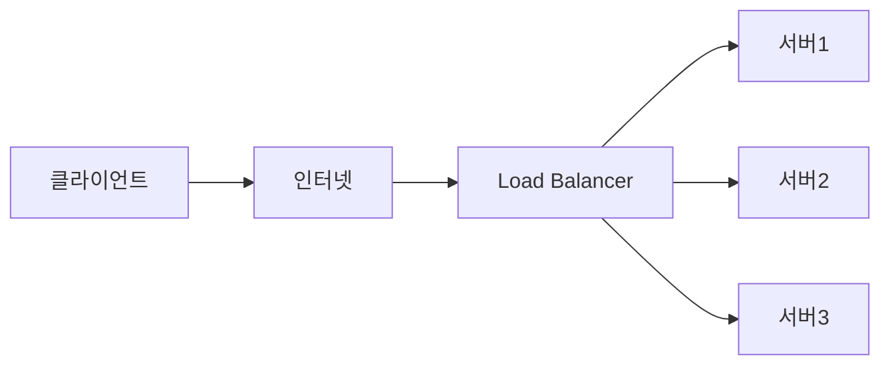

#logger

# 로그
## 주로 저장되는 로그 내용

1. 요청/응답 
	- 목적 : 사용자가 어떤 요청을 보냈고, 시스템이 어떻게 응답했는지 기록
	- 디버깅, 성능 분석
2. 오류 및 예외
	- 목적 : 시스템에서 발생한 오류와 예외 상황을 기록하여 디버깅에 활용
	-  장애 대응
3. 사용자 활동
	- 목적 : 사용자 행동 기록을 통한 서비스 이용 흐름 및 보안 감사 추적
	- 법적으로 남겨야 하는 로그들이 이에 해당
	- 감사, 사용 분석
4. 시스템 상태 : 모니터링
5. 데이터베이스 쿼리 : 성능 최적화
6. 보안 : 침해 대응
7. 배치 작업 : 모니터링
8. 디버깅 : 추적

## 로그 레벨

1. TRACE
	- 추적
	- 가장 상세한 정보를 남김
	- 코드가 한 줄 한 줄 어떻게 실행 되는지 경로를 추적함
	- 평소에는 상시로 켜두지 않음 (용량 문제)
	- 일시적으로 켜서 확인하고 다시 끄는 용도
	- 3일치 로그만 보관 (예시)
2. DEBUG
	- 디버그
	- 시스템의 작동 상태를 상세하게 기록함
	- 서비스 개발 과정에서 주요하게 확인해야 하는 값들이나 버그들을 기록함
	- 주로 개발 환경에서 코드를 테스트하고, 버그를 찾을 때 사용하고 운영환경에서는 보통 꺼두는 것이 일반적
3. INFO
	- 정보
	- 시스템이 예상대로 정상적으로 작동하고 있음을 알려줌
	- 운영 환경에서 가장 기본적으로 켜두는 레벨
	- 서버 시작, 사용자 로그인 완료, 배치 작업 완료와 같이 의미있는 주요 흐름을 기록함
	- 어떤 레벨로 로그를 찍어야할지 모르겠다면 INFO 레벨로 찍어도 무방
4. WARN
	- 경고
	- 당장 시스템이 멈추거나 에러가 난 것은 아니지만, 잠재적인 문제가 될 수 있는 상황
	- 데이터가 쌓일수록 외부 API 응답이 점점 지연되는 경우처럼 추후에 문제가 일어날 것 같은 부분을 미리 표시
	- 1분간 10회 이상 발생시 알람 + 일단위 리포트 (예시)
5. ERROR
	- 에러
	- 시스템의 특정 기능에 오류가 발생하여, 요청 작업을 정상적으로 처리하지 못하는 상황
	- DB 저장 중 예외 발생, 결제 API 호출 실패 등의 장애 상황
	- 1회라도 발생시 알람 (예시)
6. FATAL
	- 치명적 오류
	- 애플리케이션이나 시스템 전체가 다운되어 더 이상 서비스를 제공할 수 없는 상태
	- DB 서버 중단/장애, 메모리 부족으로 서버 강제 종료 등 심각한 오류 발생
	- 1회라도 발생시 알람 (예시)

## Slf4j

> Simple Logging Facade for Java

- Facade : 껍데기, 인터페이스
- 간단하게 로그를 찍어볼 수 있는 인터페이스이다.

### 예전에 로그 설정하던 방법
```java
import org.slf4j.Logger
import org.slf4j.LoggerFactory

public class TestClass {
	
	private static final Logger log = LoggerFactory.getLogger(TestClass.class)
}
```

### 롬복을 활용한 요즘 설정 방법
```java

@Slf4j
public class TestClass {
}
```

## 코드로 로그 레벨 이해하기

웨이팅 등록 서비스 예시를 통해서 로그 레벨을 이해해보자.

```java
@Slf4j
@Service
public class TestClass {

	private int currentWaitingCount = 0; // 현재 대기 번호
	private final Set<String> registeredPhones = new HashMap<>(); // 중복 등록 방지
	
	public String registerWaiting(String name, String phone) {
		String maskedPhone = maskPhoneNumber(phone);
		
		// 1. [INFO] : 일반적인 비즈니스 흐름 기록
		log.info("[웨이팅 요청] 이름 : {}, 연락처 : {}", name, maskedPhone);
		
		// 2. [ERROR] : 비즈니스 오류 (중복 등록 시도)
		if (registeredPhones.contains(phone)) {
			log.error("[웨이팅 실패] 중복 등록 시도 발생! 연락처 : {}", maskedPhone);
			throw new IllegalArgumentException("이미 대기 등록된 연락처입니다.");
		}
		
		// 3. [WARN] 시스템 경고 (대기열 마감 임박)
		if (currentWaitingCount >= 45) {
			log.warn("[웨이팅 경고] 대기열 마감 임박! 현재 대기 인원 : {}명", currentWaitingCount);
		}
		
		registeredPhones.add(phone);
		currentWaitingCount++;
		
		// 4. [INFO] 비즈니스 정상 처리 완료
		log.info("[웨이팅 완료] 대기번호 {}번 발급 완료 (고객명 : {})", currentWaitingCount, name);
		
		return name + "님, 대기번호 " + currentWaitingCount + "번이 발급되었습니다.";
	}
	
	private String maskPhoneNumver(String phone) {
		if (phone == null || phone.length() < 13) return "****";
		return phone.substring(0, 4) + "****" + phone.substring(8);
	}
}
```

## 로그 구성 요소

로그는 8개의 조각으로 나뉜다. 아래 로그 예시를 통해 살펴보자.

```text
2026-03-08 17:12:03.421+09:00  INFO 18324 --- [test-server] [nio-8080-exec-1] c.k.api.user.UserController              : Get user request. userId=42
2026-03-08 17:12:03.438+09:00  INFO 18324 --- [test-server] [nio-8080-exec-1] c.k.service.user.UserService             : Fetching user from database. userId=42
2026-03-08 17:12:03.462+09:00  INFO 18324 --- [test-server] [nio-8080-exec-1] c.k.repository.user.UserRepository       : User entity loaded. id=42
2026-03-08 17:12:03.471+09:00  INFO 18324 --- [test-server] [nio-8080-exec-1] c.k.api.user.UserController              : Response success. userId=42
```

### 1. 시간 (Timestamp)
```text
2026-03-08 17:12:03.421+09:00
2026-03-08 17:12:03.438+09:00
2026-03-08 17:12:03.462+09:00
2026-03-08 17:12:03.471+09:00
```

- 로그가 발생한 시간 (제일 중요한 정보 중 하나)
- +는 시간대(Timezone)를 의미한다. 여기서는 세계 표준시보다 9시간 빠르다는 뜻이다.

### 2. 로그 레벨 (Log Level)
```text
INFO
INFO
INFO
INFO
```

- 로그 레벨을 확인하여, 얼마나 중요도 있는 로그인지 파악

### 3. 프로세스 아이디 (PID)
```text
18324
18324
18324
18324
```

- 서버 하나에 여러 개의 프로그램이 띄워져 있을 때, PID로 구분할 수 있다.

### 4. 구분선 (Separator)
```text
---
---
---
---
```

- 시각적인 구분선
- 구분선 앞은 메타데이터
- 구분선 뒤는 애플리케이션 내부 정보

### 5. 애플리케이션 이름
```text
[test-server]
[test-server]
[test-server]
[test-server]
```

- 대괄호 안에 있는 이름이 애플리케이션의 이름
- 여러 서버의 로그가 한 곳에 모였을 때 이름을 보고 출처를 확인할 수 있음

### 6. 스레드 이름
```text
[nio-8080-exec-1]
[nio-8080-exec-1]
[nio-8080-exec-1]
[nio-8080-exec-1]
```

- 서버는 동시에 여러명의 요청을 처리하기 위해 스레드를 두고 작동
- 8080포트에서 들어온 요청을 처리하는 1번 스레드라는 뜻
- 어떤 요처을 처리하다가 에러가 났다면, 해당 스레드만 확인하면 됨

### 7. 클래스명
```text
c.k.api.user.UserController
c.k.service.user.UserService
c.k.repository.user.UserRepository
c.k.api.user.UserController
```

- 로그를 남긴 구체적인 위치

### 8. 로그 메시지
```text
: Get user request. userId=42
: Fetching user from database. userId=42
: User entity loaded. id=42
: Response success. userId=42
```

- 콜론 뒤에 이어지는 부분이 실제 메시지 본문

## 로그 관리 방법

 > 단순히 로그를 쌓기만 하는 것이 아니라, 모니터링 도구를 연동하여 관리한다.

1. Elasticsearch : 방대한 양의 텍스트 로그 데이터 속에서 원하는 에러 메시지나 특정 기록을 빠르게 검색할 수 있도록 저장하는 분산 검색 엔진
2. Kibana : 엘라스틱서치에 저장된 복잡한 로그 데이터를 편리하게 검색하고, 차트나 통계 화면으로 시각화하여 분석할 수 있게 돕는 웹 인터페이스
3. Prometheus : 시스템의 리소스 사용량, 에러 발생 횟수 등 상태를 파악할 수 있는 메트릭 및 로그 수집
4. Grafana : Prometheus가 수집한 데이터를 한눈에 파악할 수 있도록 다양한 그래프와 대시보드 형태로 시각화

## MdcLoggingFilter

### MDC 필터를 만드는 이유
- 웨이팅 API에서 100명의 손님이 동시에 웨이팅을 요청하면 어떨까?
- 여러 로그들이 섞이며 로그가 복잡해지고, 에러 발생시 찾기 어려워진다.
- 서버에 들어오는 모든 요청에 대해 대기번호 (Trace ID)를 붙여줄 수 있게 필터를 만들자!
- 이때 발급받은 대기번호를 담아두는 주머니가 바로 MDC(Mapped Diagnostic Context)이다.
- 각각의 요청(스레드)이 끝날 때까지 고유한 상태를 기억해 놓은 것이 특징이다.

### 필터 생성

```java
import jakarta.servlet.Filter;

@Component 
public class MdcLoggingFilter implements Filter { 

	@Override 
	public void init(FilterConfig filterConfig) throws ServletException { 
		Filter.super.init(filterConfig); 
	} 
	
	@Override 
	public void doFilter(ServletRequest request, ServletResponse response, FilterChain chain) throws IOException, ServletException { 
		// 1. 요청이 들어오면 고유한 8글자 Trace ID를 생성 
		String traceId = UUID.randomUUID().toString().substring(0, 8); 
		// 2. MDC라는 곳에 해당 아이디를 보관 
		MDC.put("traceId", traceId); 
	
		try { 
			// 3.Controller로 요청을 넘김. 
			chain.doFilter(request, response); 
		} finally { 
			// 요청 처리가 끝나면 반드시 비워줘야 함 
			// 톰캣은 재사용되기 때문에, 안 비우면 다음 사람 로그에 이전 사람 ID가 섞일 수 있음 
			MDC.clear(); 
		} 
	} 
	
	@Override 
	public void destroy() { 
		Filter.super.destroy(); 
	} 
}
```

### Logback 설정

MDC 필터 생성 후 로그백 설정을 추가로 진행해야한다.

```xml
<?xml version="1.0" encoding="UTF-8"?>
<configuration>
    <appender name="CONSOLE" class="ch.qos.logback.core.ConsoleAppender">
        <encoder>
            <pattern>%d{yyyy-MM-dd HH:mm:ss.SSS} %highlight(%-5level) %magenta([%X{traceId}]) %yellow([%thread]) %cyan(%logger{36}) : %msg%n</pattern>
        </encoder>
    </appender>

    <root level="INFO">
        <appender-ref ref="CONSOLE" />
    </root>
</configuration>
```


# 로그를 파일로 보관하는 방법 -> LOGBACK

## APPENDER
Logback에서는 로그를 배송하는 목적지(출력 위치)를 APPENDER가 결정한다.

1. ConsoleAppender
	- 개발자의 모니터에 로그를 출력함
	- 휘발성
2. FileAppender
	- 로그를 텍스트 파일(.log) 안에 기록
	- 삭제하지 않는 한 영구 보관
3. RollingFileAppender
	- FileAppender만 사용하면 1년 치 로그가 하나의 파일에 다 쌓여서 용량이 커짐
	- 매일 자정이 되면 어제 쓴 로그를 저장하고, 오늘 날짜가 적힌 새로운 로그를 만들어냄
	- 현업, 실무에서는 대부분 해당 Appender 사용

## Logback 설정 파일 구성
```xml
<?xml version="1.0" encoding="UTF-8"?>
<configuration>

    <!-- property : 자바의 변수 같은 것 -->
    <!-- 로그를 저장할 경로 -->
    <property name="LOG_DIR" value="./logs" />
    <property name="LOG_FILE_NAME" value="waiting-api-log" />

    <!-- 로그를 출력할 곳을 정하는것이 appender -->
    <appender name="CONSOLE" class="ch.qos.logback.core.ConsoleAppender">
        <encoder>
            <pattern>%d{yyyy-MM-dd HH:mm:ss} %highlight(%-5level) [%X{traceId}] %cyan(%logger{36}) : %msg%n</pattern>
        </encoder>
    </appender>

    <appender name="FILE" class="ch.qos.logback.core.rolling.RollingFileAppender">
        <file>${LOG_DIR}/${LOG_FILE_NAME}.log</file>

        <encoder>
            <pattern>%d{yyyy-MM-dd HH:mm:ss} %-5level [%X{traceId}] %logger{36} : %msg%n</pattern>
        </encoder>

        <rollingPolicy class="ch.qos.logback.core.rolling.TimeBasedRollingPolicy">
<!--            <fileNamePattern>${LOG_DIR}/${LOG_FILE_NAME}-%d{yyyy-MM-dd}.log.gz</fileNamePattern>-->
<!--			이름이 MM-dd 기준으로 생성된다 즉, 날마다 로그파일을 새로 만든다! -->
<!--			gz는 압축 하겠다라는 의미이다 -->
<!--            <maxHistory>30</maxHistory>-->
<!--			로그를 최대 30일치만 남기고 31일째 로그부터는 알아서 지워줘!-->
            <fileNamePattern>${LOG_DIR}/${LOG_FILE_NAME}-%d{yyyy-MM-dd_HH-mm}.log.gz</fileNamePattern>
<!--            이름이 HH-mm 기준으로 생성된다 즉, 분마다 로그파일을 새로 만든다! --->            
            <maxHistory>3</maxHistory>
<!--            로그를 최대 3분치만 남기고 4분째 로그부터는 알아서 지워줘! --->
        </rollingPolicy>
    </appender>

    <root level="INFO">
        <appender-ref ref="CONSOLE" /> 
        <appender-ref ref="FILE" />    
    </root>

</configuration>
```

# ELK

## 서버가 여러 대일 때는 로그를 어떻게 찾을까?



- 서버가 3대라고 가정
- 고객 문의가 들어와 로그를 찾아야 한다고 하면 몇 번 서버를 탐색해야 할까?
- 에러를 찾기 위해 서버 1번부터 서버 3번까지 압축된 로그 파일을 하나하나 열어봐야한다.
- 귀찮으니 여러 서버에 흩어진 로그를 하나의 거대한 중앙 저장소로 모아두자!
- 이 기술을 ELK라고 부른다.

## ELK 스택이란

> 방대한 로그 데이터를 실시간으로 수집, 검색, 분석 및 시각화하는 오픈소스 플랫폼

- E(Elasticsearch) : 수많은 로그를 저장하고, 빠른 속도로 검색할 수 있게 지원
- L(Logstash) : 각 서버에서 로그를 수집, 변환하여 Elasticsearch로 전달하는 도구
- K(Kibana) : Elasticsearch에 쌓인 데이터를 시각화하여 그래프와 대시보드로 보여주는 분석 도구

## Logstash

> Logstash는 세 가지 단계(input, filter, output)를 통해 움직인다.

### 핵심 특징 및 기능
- input
	- `.log` 파일을 한 줄씩 실시간으로 읽어온다.
- filter
	- 로그를 그냥 통째로 텍스트로 넣지 않고 가공한다.
	- 시간, 로그레벨, Trace ID 등 정보에 라벨링을 해서 구분한다.
- output
	- Logstash의 최종 목적지인 Elasticsearch로 데이터를 보낸다.

### 설정 예시
`logstash.conf` 파일 예시를 살펴보자.
```conf
# 1. Input
input {
  file {
    # 도커 컨테이너 안에서 바라보는 로그 파일의 위치
    path => "/usr/share/logstash/logs/waiting-api-log.log"

    # 처음 켤 때 파일의 맨 처음부터 끝까지 싹 다 읽어오라는 뜻
    start_position => "beginning"

    # 파일이 끝났는지 확인하는 주기 (기본 1초에 한 번씩 감시)
    stat_interval => 1
  }
}

# 2. Filter
filter {
  # logstash grok 검색후 적용해보기
}

# 3. Output
output {
  # 목적지인 엘라스틱서치로 보냄
  elasticsearch {
    hosts => ["http://elasticsearch:9200"]
    # 엘라스틱서치에 저장될 인덱스 이름! 날짜별로 분류함
    index => "waiting-api-logs-%{+YYYY.MM.dd}"
  }

  # 잘 전송되고 있는지 도커 콘솔 화면에서도 확인하기 위해 추가
  stdout { codec => rubydebug }
}
```

## Elasticsearch를 로그 수집에 사용하는 이유

### 로그 파일 저장에 DB를 사용하면 안 되는 이유
- 로그는 하루에 수천만 건씩 쌓이는 텍스트 데이터이다.
- MySQL과 같은 관계형 DB는 이런 방대한 텍스트에서 특정 단어를 검색하는 게 매우 오래 걸린다.
- 따라서 Elasticsearch와 같은 검색 엔진을 사용하는 것이 더 적절한다.

### Elasticsearch가 적절한 이유
- Elasticsearch는 태생이 검색 엔진이다.
- 관계형 DB의 경우 특정단어를 찾기 위해 첫 번째 페이지부터 끝까지 넘기면서 해당 단어를 찾는다 -> 느림
- Elasticsearch의 경우 Index를 활용하여 데이터를 아주 빠르게 찾을 수 있다.
	- 데이터가 1억 건이어도 0.1초 만에 Index를 보고 찾아낸다.
	- 이 개념을 Inverted Index(역인덱스)라고 부른다.

## Kibana의 역할

> Elasticsearch에 쌓인 데이터를 시각화하여 그래프와 대시보드로 보여주는 분석 도구

Elasticsearch에 쿼리를 실행하고, 결과를 다양한 형태로 보여준다.

## ELK Docker Compose
```yml
services:
  elasticsearch:
    image: docker.elastic.co/elasticsearch/elasticsearch:9.1.0
    container_name: elasticsearch
    environment:
      - discovery.type=single-node
      - xpack.security.enabled=false
      - xpack.security.http.ssl.enabled=false
      - "ES_JAVA_OPTS=-Xms512m -Xmx512m"
    ports:
      - "9200:9200"
  logstash:
    image: docker.elastic.co/logstash/logstash:9.1.0
    container_name: logstash
    volumes:
      - ./logs:/usr/share/logstash/logs
      - ./logstash.conf:/usr/share/logstash/pipeline/logstash.conf
    ports:
      - "5044:5044"
    depends_on:
      - elasticsearch

  kibana:
    image: docker.elastic.co/kibana/kibana:9.1.0 # 무조건 ES, Logstash와 버전을 맞춰야 한다! (9.1.0)
    container_name: kibana
    ports:
      - "5601:5601" # 키바나 포트 번호
    environment:
      # 키바나가 데이터를 가져올 주소
      - ELASTICSEARCH_HOSTS=http://elasticsearch:9200
    depends_on:
      - elasticsearch
```