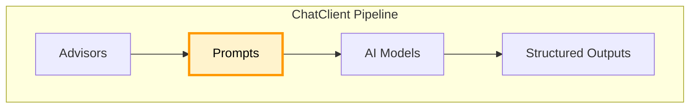

#springAI 

# SpringAI - Prompts

Spring AI의 Prompt 구조와 ChatOptions 설정, 그리고 다양한 프롬프트 엔지니어링 패턴을 정리한다.




## Prompts

### Prompt 객체 내부 구조
- `List<Message>` : 대화의 맥락을 구성하는 여러 종류의 메시지 묶음
- `ChatOptions` : 온도, 사용할 모델명과 같은 AI 실행 옵션

## ChatOptions

> AI가 답변을 생성할 때 얼마나 창의적일지, 얼마나 길게 말할지 등 응답의 특성을 제어할 수 있는 공통 옵션 설정

### Temperature
응답이 얼마나 창의적이고 무작위적으로 생성될지 결정한다.

- 0.0 ~ 0.3 (낮은 온도)
	- 매우 결정적이고 일관된 응답
	- 사실 기반 답변, 데이터 분류, 코드 생성에 적합
- 0.4 ~ 0.7 (중간 온도)
	- 균형 잡힌 응답
	- 일반적인 대화나 정보 제공용 챗봇에 많이 쓰는 표준 값
- 0.8 ~ 1.0 (높은 온도)
	- 창의적이고 다양한 응답
	- 스토리텔링, 소설 쓰기, 아이디어 브레인스토밍에 적합

### Output Length
모델이 한번에 생성할 수 있는 최대 토큰 수를 제한한다.

- 5 ~ 25
	- 한 두 단어, 짧은 구절, "긍정/부정"같은 분류 라벨
- 50 ~ 100
	- 하나의 문단이나 짧은 설명
- 1000+
	- 장문의 글, 소설 스토리, 복잡한 로직의 아키텍쳐 설명

### Sampling Controls
AI가 다음에 올 단어 후보군을 추려내는 필터링 기법

- **TOP-K**
	- 상위 K개 필터링
	- 다음 토큰을 선택할 때, 확률이 가장 높은 상위 K개의 토큰만으로만 후보군을 제한
	- 값이 클수록 다양한 단어가 섞여 다양성이 증가하고, 작을수록 늘 쓰던 단어만 써서 결정적인 답변 도출
	- OpenAI의 모델들은 Top-K 옵션 미제공
- **TOP-P**
	- 누적 확률 필터링
	- 후보 단어들을 확률 높은 순으로 줄 세운 뒤, 누적 확률이 P를 초과하기 전까지만 동적으로 단어 후보군을 선택
	- 상위 90%의 안전한 단어들 안에서만 고르게 하므로 문맥이 꼬이지 않으면서도 자연스러운 변화 가능
	- 일반적으로 0.8 ~ 0.95 사이의 값을 사용

## 프롬프트 엔지니어링 패턴

### 1. Zero-Shot Prompting

사전 정보나 예시 없이 AI에게 곧바로 질문을 던지는 방식

```java
@AiService
public interface QAService {
	
	@Prompt("이탈리아의 수도는?")
	String answer();
}
```

### 2. Few-Shot Prompting

1개 (Ont-Shot) 또는 여러 개의 정답 예시를 미리 보여주고 패턴을 학습시킨 뒤 질문을 던지는 방식

```java
@Prompt("""
Q: 2 + 2는? A: 4
Q: 3 + 5는? A: 8
Q: {{question}} A:
""")
String solve(@V("question") String question);
```

### 3. Role & System Prompting

시스템 프롬프트를 사용해 AI에게 페르소나를 부여하는 방식

```java
@Prompt(system = "너는 핵심만 말하는 10년차 외과 의사야")
String respondTO(String userQuestion);
```

### 4. Step-Back Prompting

AI가 대답하기 전에, 상황을 먼저 객관적으로 분석하고 성찰하도록 유도하는 방식

```java
@Prompt("""
답변하기 전에, 다음 상황을 주의 깊게 먼저 생각해 봐: {{situation}}
자, 이제 이 상황에서 가장 좋은 조언은 무엇일까?
""")
String analyze(@V("question") String situation);
```

### 5. Chain-of-Though, CoT

답만 뱉는게 아니라, 문제를 해결하는 과정을 단계별로 풀어서 설명하도록 지시하는 방식

```java
@Prompt("""
다음 문제를 단계별로 차근차근(step-by-step) 해결해 줘:
{{problem}}

정답:
""")
String solveStepwise(@V("problem") String problem);
```

### 6. Self-Consistency Prompt

CoT 프롬프트를 여러 번 반복해서 호출한 뒤, 가장 많이 나온(일관된) 답변을 최종 정답으로 채택하는 방식

### 7. Tree-of-Thoughts, ToT

하나의 문제에 대해 여러 가지 해결책을 먼저 제안하게 하고, 그중 가장 좋은 것을 스스로 선택해 평가하게 만드는 방식

```java
@Prompt("""
이 문제를 해결할 수 있는 3가지 다른 접근법을 제안해 봐:
{{challenge}}

그런 다음, 3가지 중 가장 좋은 방법을 하나 고르고 그 이유를 설명해 줘.
""")
String solveWithToT(@V("challenge") String challenge);
```

### 8. Automatic Prompt Engineering

내가 쓴 부실한 프롬프트를 AI에게 전달해서 "네가 더 완벽한 프롬프트로 다듬어봐"라고 시키는 방식

### 9. Code Prompting

사용자의 입력을 기반으로 코드를 생성하거나 분석하도록 요청하는 방식

```java
@Prompt("""
다음 요구사항을 수행하는 Java 함수를 작성해 줘:
{{description}}

Java Code:
""")
String generateCode(@V("description") String description);
```