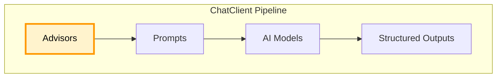

#springAI 

Spring AI의 Advisor는 AI 호출 전후에 공통 로직을 삽입하는 파이프라인 계층이다. 로깅, 메모리, 컨텍스트 보강을 통해 ChatClient 요청과 응답 흐름을 체계적으로 제어한다.

# SpringAI - Advisors

Spring AI의 `Advisor`는 AI 모델 호출 전후에 개입해 요청을 보강하고 응답을 후처리하는 계층이다. 로깅, 컨텍스트 추가, 검증 등 공통 로직을 파이프라인에서 처리한다.



## Advisors 프로세스

<p align="center">
  
</p>

1. 사용자가 입력한 질문을 Spring AI 내부에서 처리하고 다루기 쉬운 `ChatClientRequest` 객체로 변환
2. 등록된 Advisor들이 개입하여 요청 데이터를 검사하거나 변경
	- `SimpleLoggerAdvisor`는 이 단계에서 AI에게 어떤 질문을 보낼 예정인지 로그 출력
	- 다른 Advisor는 질문에 추가적인 컨텍스트나 시스템 프롬프트를 덧붙이는 작업을 진행
3. Advisor들을 거치며 최종적으로 완성된 요청이 실제 AI모델로 전송됨
4. 답변을 사용자에게 최종 반환하기 전에 Advisor들이 다시 개입
	- `SimpleLoggerAdvisor`는 이 단계에서 AI가 어떤 답변을 생성했는지, 토큰은 얼마나 사용했는지 등을 로그로 출력
	- 다른 Advisor들은 답변을 특정 포맷으로 파싱하거나 검증함
5. 모든 Advisor의 처리가 끝난 내부 응답 객체를 최종적으로 개발자가 받게 될 표준 `ChatResponse` 형태로 변환하여 반환하면서 전체 프로세스 종료

## SimpleLoggerAdvisor

- 로깅을 담당하는 어드바이저
- 프롬프트가 실제로 어떤 형태의 JSON으로 변환되어 AI에게 전달되는지, 그리고 AI가 대답을 생성하는 데 걸린 시간과 정확한 응답 데이터가 무엇인지를 디버깅 콘솔에 출력해줌

```java
@Configuration
public class ChatConfig {
	
	@Bean
	public SimpleLoggerAdvisor simpleLoggerAdvisor() {
		return SimpleLoggerAdvisor.builder().build();
	}
}
```

## ChatMemory

- 대화 기록을 저장해두는 객체
- 스프링에서는 기본적으로 메모리에 저장하는 `InMemoryChatMemory` 제공

```java
// ChatMemory 생성
@Bean
public ChatMemory chatMemory() {
	return MessageWindowChatMemory.builder().maxMessage(10).build();
}
```

```java
// ChatMemoryAdvisor 생성
@Bean
public MessageChatMemoryAdvisor messageChatMemoryAdvisor(ChatMemory chatMemory) {
	return MessageChatMemoryAdvisor.builder(chatMemory).build();
}
```

### Q. ChatMemory는 왜 사용하는 거예요?
API를 통해 백엔드 서버에서 AI를 직접 호출 할 때, LLM API는 무상태로 동작한다. 즉, 이전 대화 기록을 알지 못한다. 그래서 새로운 질문을 할 때마다 과거에 나누었던 대화 기록을 프롬프트에 덧붙여서 같이 보내야한다. 수동으로 덧붙이기는 불가능하기 때문에 Advisors를 통해 구현한다.