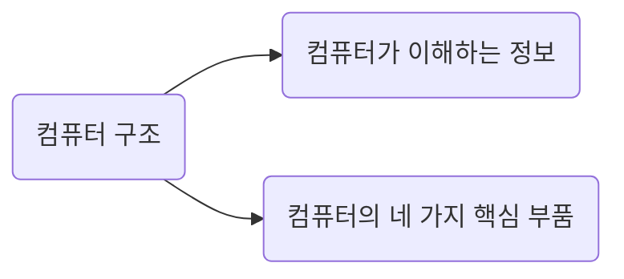
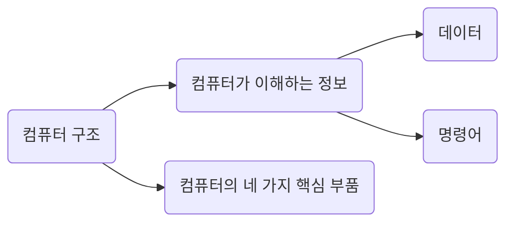

# 컴퓨터 구조의 큰 그림 - 1

앞서 개발자에게 컴퓨터 구조 지식이 필요한 이유를 알아봤다. 그렇다면 막연하게 '컴퓨터 구조 지식'이라고만 이야기하지 말고 구체적으로 어떤 것들을 알아야 할지 살펴보자.

우리가 알아야 할 컴퓨터 구조 지식은 크게 두 가지이다. 하나는 '컴퓨터가 이해하는 정보'이고, 또 하나는 '컴퓨터의 네 가지 핵심 부품'이다.

## 컴퓨터가 이해하는 정보

가장 먼저 컴퓨터가 무엇을 이해할 수 있는지부터 알아야 한다.

컴퓨터는 0과 1로 표현된 정보만을 이해한다. 그리고 이렇게 0과 1로 표현되는 정보에는 크게 두 종류가 있는데, 바로 데이터와 명령어이다.

명령어보다는 데이터라는 용어에 더 익숙할 것이다. 컴퓨터가 이해하는 숫자, 문자, 이미지, 동영상과 같은 정적인 정보를 가리켜 데이터라고 한다. 컴퓨터와 주고받는 정보나 컴퓨터에 저장된 정보를 가리킬 때 편하게 데이터라 통칭하기도 한다. 이 책에서 가장 먼저 학습할 내용은 컴퓨터가 이해하는 두 가지 정보 중 데이터이다. 0과 1만으로 숫자나 문자와 같은 데이터를 표현하는 방법은 02장에서 자세히 알아본다.

0과 1로 어떻게 다양한 데이터를 표현하는지 배운 다음에는 명령어를 학습한다. 만약 누군가가 "컴퓨터를 한마디로 정의해 보세요"라고 묻는다면 뭐라 답할 것인가? 여러 답변을 할 수 있겠지만, 필자는 "컴퓨터는 명령어를 처리하는 기계입니다"라고 답하겠다.

컴퓨터가 이해하는 정보에는 데이터와 명령어가 있다고 했지만, 이 둘 중 컴퓨터를 실질적으로 작동시키는 더 중요한 정보는 명령어이다. 데이터는 명령어 없이는 아무것도 할 수 없는 정보 덩어리일 뿐이지만, 명령어는 데이터를 움직이고 컴퓨터를 작동시키는 정보이기 때문이다.

예를 들어 보자. '1'과 '2'는 데이터이고, '더하라, 1과 2를'은 명령어이다. '안녕하세요'는 데이터이고, '화면에 출력하라, 안녕하세요를'은 명령어이다. 'cat.jpg'는 데이터이고, 'USB 메모리에 저장하라, cat.jpg를'은 명령어이다.

즉, 명령어는 컴퓨터를 작동시키는 정보이고, 데이터는 명령어를 위해 존재하는 일종의 재료이다. 이런 점에서 컴퓨터 프로그램은 '명령어들의 모음'으로 정의되기도 한다. 그래서 명령어는 컴퓨터 구조를 학습하는 데 있어 데이터보다 더 중요한 개념이라고 할 수 있다. 명령어가 어떻게 생겼는지, 그리고 다양한 데이터를 어떻게 활용하는지는 03장에서 자세히 알아본다.