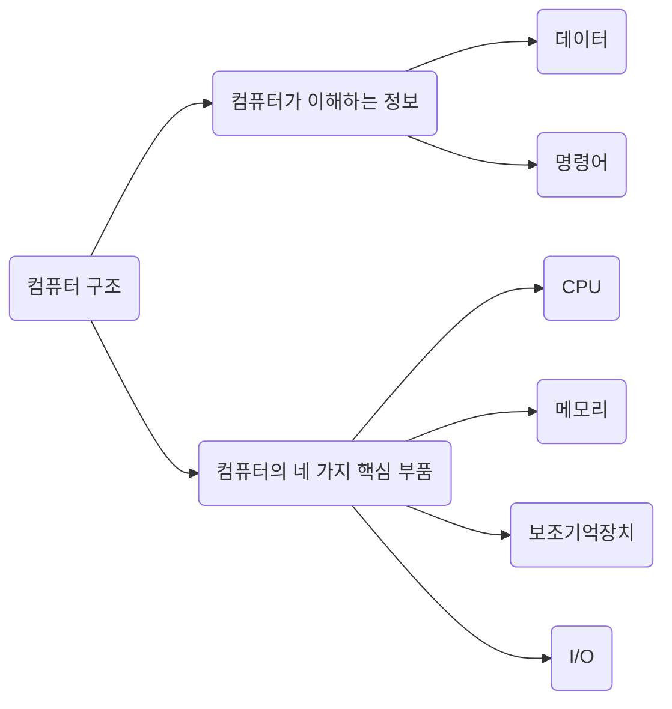

# 컴퓨터 구조의 큰 그림 - 2

## 컴퓨터의 4가지 핵심 부품

세상에는 다양한 종류의 컴퓨터가 있다. 아두이노, 라즈레비 파이와 같은 작은 컴퓨터부터 스마트폰, 노트북, 데스크톱, 서버 컴퓨터에 이르기까지 그 크기와 용도도 제각각이다.

하지만 외관과 용도를 막론하고 컴퓨터를 이루는 핵심 부품은 크게 다르지 않다. 컴퓨터의 핵심 부품은 중앙처리장치(CPU, Cetral Processing Unit), 주기억장치(Main Memory), 보조기억장치(Secondary Storage), 입출력장치(Input/Output (I/O) Device)이다. 이 네 가지 부품의 역할만 이해하고 있어도 컴퓨터의 작동 원리를 대부분 파악할 수 있다.

### 주기억 장치의 종류
주기억장치에는 크게 RAM과 ROM, 두 가지가 있다. 메모리라는 용어는 보통 RAM을 지칭한다. 컴퓨터의 작동 원리를 파악하기 위해 알아야 할 더 중요한 주기억장치는 RAM이다. 따라서 특별한 언급이 없는 한 이 책에서 다루는 주기억장치는 RAM이라고 생각해도 무방하다.

###

네 가지 핵심 부품의 큰 그림을 그려 보자. 앞으로 우리가 배울 컴퓨터의 네 가지 핵심 부품을 개괄적으로 훑어보고, 학습할 용어들에 눈도장을 찍어 보자.

1. 가장 큰 사각형은 메인보드이다.
2. 메인버스 안에 시스템버스(양방향 수직 화살표)가 있다.
3. CPU 내부에는 ALU(산술논리연산장치), 제어장치와 여러 레지스터가 있다. CPU는 메인보드 내 시스템 버스와 연결되어 있다.
4. 메모리는 메인보드 내 시스템 버스와 연결되어 있다.
5. 보조기억장치는 메인보드 내 시스템 버스와 연결되어 있다.
6. 모니터, 키보드, 마우스 등은 메인보드 내 시스템 버스와 연결되어 있다. 이들을 입출력장치라고 부른다.

이 그림 속 용어들은 책 전체에 걸쳐 자주 등장할 예정이고, 각 부품들을 자세히 학습하는 과정에서 조금씩 추가되는 부품이나 개념도 있다. 물론 지금은 이 그림이 다소 낯설더라도 전혀 걱정할 필요는 없다.

### 메모리

컴퓨터가 이해하는 정보는 명령어와 데이터라고 했다. 메모리는 현재 실행되는 프로그램의 명령어와 데이터를 저장하는 부품이다. 즉, 프로그램이 실행되려면 반드시 메모리에 저장되어 있어야 한다.

이때 컴퓨터가 빠르게 작동하기 위해서는 메모리 속 명령어와 데이터가 중구난방으로 저장되어 있으면 안 된다. 저장된 명령어와 데이터의 위치는 정돈되어 있어야 한다. 그래서 메모리에는 저장된 값에 빠르고 효율적으로 접근하기 위해 주소라는 개념이 사용된다. 현실에서 우리가 주소로 원하는 위치를 찾아갈 수 있듯이 컴퓨터에서도 주소로 메모리 내 원하는 위치에 접근할 수 있다. 

다음 그림은 1번지와 2번지에 명령어, 3번지와 4번지에 데이터가 저장되어 있고, 5번지와 6번지에는 아무것도 저장되어 있지 않은 상태의 메모리를 표현한 예시이다.

물론 이것은 메모리를 이해하기 쉽게 그림으로 나타낸 것일 뿐 실제로는 이와 같이 저장되지 않는다. 명령어와 데이터는 모두 0과 1로 표현되기 때문에 겉보기에는 마치 0과 1로 이루어진 데이터를 저장한 것처럼 보인다.

메모리와 관련해서는 06장에서 자세히 학습한다. 지금은 아래의 세 가지를 기억하자.

- 프로그램이 실행되기 위해서는 반드시 메모리에 저장되어 있어야 한다.
- 메모리는 현재 실행되는 프로그램의 명령어와 데이터를 저장한다.
- 메모리에 저장된 값의 위치는 주소로 알 수 있다.

### CPU

CPU는 컴퓨터의 두뇌이다. CPU는 메모리에 저장된 명령어를 읽어 들이고, 읽어 들인 명령어를 해석하고, 실행하는 부품이다.

CPU의 역할과 작동 원리를 구체적으로 이해하기 위해서는 CPU 내부 구성 요소를 알아야 한다. 이 책에서 학습할 CPU 내부 구성 요소 중 가장 중요한 세 가지는 산술논리연산장치(ALU), 레지스터, 제어장치이다.

ALU는 쉽게 말해 계산기이다. 계산만을 위해 존재하는 부품이다. 컴퓨터 내부에서 수행되는 대부분의 계산은 ALU가 도맡아 수행한다.

레지스터는 CPU 내부의 작은 임시 저장 장치이다. 프로그램을 실행하는 데 필요한 값들을 임시로 저장한다. CPU 안에는 여러 개의 레지스터가 존재하고 각기 다른 이름과 역할을 가지고 있다.

제어장치는 제어 신호라는 전기 신호를 내보내고 명령어를 해석하는 장치이다. 여기서 제어 신호란 컴퓨터 부품들을 관리하고 작동시키기 위한 일종의 전기 신호이다. 제어 신호에 대해서는 이후에 자세히 설명할 에정인, 지금은 아래 내용만 이애하고 있자.

- CPU가 메모리에 저장된 값을 읽고 싶을 땐 메모리를 향해 메모리 읽기 라는 제어 신호를 보낸다.
- CPU가 메모리에 어떤 값을 저장하고 싶을 땐 메모리를 향해 메모리 쓰기 라는 제어 신호를 보낸다.

간단한 예시를 통해 CPU를 구성하는 세 가지 부품의 역할을 알아보자. 앞서 살펴본 메모리 그림을 다시 보자. 1번지부터 2번지까지 명령어가 저장되어 있다. CPU가 이 두 개의 명령어를 어떻게 실행하는지 살펴보자.

#### 1

제어장치는 1번지에 저장된 명령어를 읽어 들이기 위해 메모리에 '메모리 읽기' 제어 신호를 보낸다.

#### 2

(1) 메모리는 1번지에 저장된 명령어를 CPU에 건내주고, 이 명령어는 레지스터에 저장된다. (2) 제어장치는 읽어 들인 명령어를 해석한 뒤 3번지와 4번지에 저장된 데이터가 필요하다고 판단한다. (3) 제어장치는 3번지와 4번지에 저장된 데이터를 읽어 들이기 위해 메모리에 '메모리 읽기' 제어 신호를 보낸다.

#### 3
(1) 메모리는 3번지와 4번지에 저장된 데이터를 CPU에 건네주고, 이 데이터들은 서로 다른 레지스터에 저장된다. (2) ALU는 읽어 들인 데이터로 연산을 수행한다. (3) 계산의 결괏값은 레지스터에 저장된다. 게산이 끝났다면 첫 번째 명령어의 실행은 끝난다.

#### 4
(1) 제어장치는 2번지에 저장된 다음 명령어를 읽어 들이기 위해 메모리에 '메모리 읽기' 제어 신호를 보낸다.

(2) 메모리는 2번지에 저장된 명령어를 CPU에 건네주고, 이 명령어는 레지스터에 저장된다. (3) 제어장치는 이 명령어를 해석한 뒤 메모리에 게산 결과를 저장해야 한다고 판단한다.

(4) 제어장치는 게산 결과를 저장하기 위해 메모리에 '메모리 쓰기' 제어 신호와 함께 계산 결과인 220을 보낸다. 메모리가 계산 결과를 저장하면 두 번째 명령어의 실행도 끝난다.

#### 

CPU와 관련된 내용은 04장, 05장에서 자세히 다룬다. 아래 세 가지만 기억하자.

- CPU는 메모리에 저장된 값을 읽어 들이고, 해석하고, 실행하는 장치다.
- CPU 내부에는 ALU, 레지스터, 제어장치가 있다.
- ALU는 계산하는 장치, 레지스터는 임시 저장 장치, 제어장치는 제어 신호를 발생시키고 명령어를 해석하는 장치다.

### 보조기억장치

앞서 메모리는 실행되는 프로그램의 명령어와 데이터를 저장한다고 했지만, 이 메모리는 두 가지 치명적인 약점이 있다. 첫째는 가격이 비싸 저장 용량이 적다는 점이고, 둘째는 전원이 꺼지면 저장된 내용을 잃는다는 점이다.

컴퓨터로 작업하는 도중에 전원이 꺼져서 작업한 내역을 읽어본 적 있다. 전원이 꺼지면 작업한 내역을 잃게 되는 이유는 실행 중인 프로그램들은 메모리에 저장되는데, 메모리에 전원이 꺼지면 저장된 내용이 날아가기 때문이다.

이에 메모리보다 크기가 크고 전원이 꺼져도 저장된 내용을 잃지 않는 메모리를 보조할 저장 장치가 필요하게 되었는데, 이 저장 장치가 보조기억장치이다.

하드 디스크, SSD, USB 메모리, DVD, CD-ROM과 같은 저장 장치가 보조기억장치의 일종이다. 컴퓨터 전원이 꺼져도 컴퓨터에 파일이 남아 있었던 이유는 우리가 파일을 보조기억장치에 저장했기 때문이다. 메모리가 현재 '실행되는' 프로그램을 저장한다면, 보조기억장치는 '보관할' 프로그램을 저장한다고 생각해도 좋다. 보조기억장치와 관련해서는 07장에서 자세히 알아본다.

### 입출력장치
입출력장치는 마이크, 스피커, 프린터, 마우스, 키보드처럼 컴퓨터 외부에 연결되어 컴퓨터 내부와 정보를 교환하는 장치를 의미한다. 입출력장치들이 어떻게 컴퓨터에 연결되는지, 그리고 어떻게 컴퓨터 내부와 데이터를 주고받는지는 08장에서 자세히 알아본다.

이런 질문이 있을 수 있다.

"보조기억장치로 알고 있었던 하드 디스크, USB 메모리, CD-ROM도 '컴퓨터 외부에 연결되어 컴퓨터 내부와 정보를 교환할 수 있는 장치'로 볼 수 있지 않나? 그러면 보조기억장치도 결국 입출력장치 아닌가?"

이는 매우 좋은 지적이고 맞는 말이다. 보조기억장치는 관점에 따라 입출력장치의 일종으로 볼 수 있다. 실제로 보조기억장치와 입출력장치를 '컴퓨터 주변에 붙어 있는 장치'라는 의미에서 주변장치라 통칭하기도 한다. 다만 보조기억장치는 모니터, 마우스, 키보드와 같은 일반적인 입출력장치에 비해 메모리를 보조한다는 특별한 기능을 수행하는 입출력장치이다.

### 메인보드와 시스템 버스

다시 컴퓨터의 핵심 부품 이야기로 돌아와서, 지금까지 설명한 컴퓨터의 핵심 부품들은 모두 메인보드라는 판에 연결된다. 메인보드는 마더보드라고도 부른다. 메인보드에는 앞서 소개한 부품을 비롯한 여러 컴퓨터 부품을 부착할 수 있는 슬롯과 연결 단자가 있다.

메인보드에 연결된 부품들은 서로 정보를 주고받을 수 있는데, 이는 메인보드 내부에 버스라는 통로가 있기 때문이다. 컴퓨터 내부에는 다양한 종류의 통로, 즉 버스가 있다. 하지만 여러 버스 가운데 컴퓨터의 네 가지 핵심 부품을 연결하는 가장 중요한 버스는 시스템 버스이다.

시스템 버스는 주소 버스, 데이터 버스, 제어 버스로 구성되어 있다. 주소 버스는 주소를 주고받는 통로, 데이터버스는 명령어와 데이터를 주고받는 통로, 제어버스는 제어 신호를 주고받는 통로이다.

**CPU 구성 요소 중 하나인 제어장치는 제어 버스를 통해 제어 신호를 내보낸다.**

시스템 버스를 조금 더 자세히 이해하기 위해 앞서 설명한 CPU의 작동 예시를 다시 한번 보자. CPU가 메모리 속 명령어를 읽어 들이기 위해 제어장치에서 '메모리 읽기'라는 신호를 내보낸다고 했다. 그런데 사실 CPU가 메모리를 읽을 땐 제어 신호만 내보내지 않는다. 실제로 제어 버스 로 '메모리 읽기' 제어 신호를 내보내고, 주소 버스로 읽고자 하는 주소를 내보낸다. 그러면 메모리는 데이터 버스로 CPU가 요청한 주소에 있는 내용을 보낸다.

그리고 메모리에 어떤 값을 저장할 때도 CPU는 데이터 버스를 통해 메모리에 저장할 값을, 주소 버스를 통해 저장할 주소를, 제어 버스를 통해 '메모리 쓰기' 제어 신호를 보낸다.