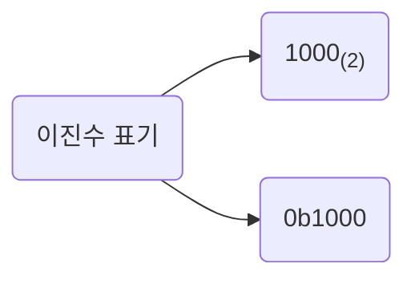

# 02. 0과 1로 숫자를 표현하는 방법 - 2

## 이진법

자, 그럼 본격적으로 0과 1만으로 숫자를 표현하는 방법을 알아보자. 수학에서 0과 1만으로 모든 숫자를 표현하는 방법을 이진법이라고 한다. 이진법을 이용하면 1보다 큰 수도 0과 1만으로 표현할 수 있다. 어떻게 이런 일이 가능할까? 원리는 간단하다. 숫자가 1을 넘어가는 시점에 자리 올림을 하면 된다.

우리가 보통 숫자를 셀 때 9를 넘어가는 시점에 자리 올림을 한다. 9 다음이 10, 19 다음이 20인 것처럼 말이다. 이는 우리가 일상적으로 십진법을 사용하기 때문이다. 십진법은 숫자가 9를 넘어가는 시점에 자리 올림을 하여 0부터 9까지, 열 개의 숫자만으로 모든 수를 표현하는 방법이다.

이와 유사하게 이진법은 아래와 같이 숫자가 1을 넘어가는 시점에 자리 올림을 하여 0과 1, 두 개의 숫자만으로 모든 수를 표현한다.

|십진수 | 이진수 |
|---|---|
|1 | 1|
|1 | 10|
|1 | 11|
|1 | 100|
|1 | 101|
|1 | 110|
|1 | 111|
|1 | 1000|

이진법으로 표현한 수를 이진수, 십진법으로 표현한 수를 십진수라고 한다. 우리는 일상적으로 십진수를 사용하지만, 0과 1밖에 모르는 컴퓨터에 어떤 숫자를 알려 주려면 십진수가 아닌 이진수로 알려 주어야 한다. 가령, 십진수 2를 컴퓨터에 알려 주려면 이진수로 표현한 10('일영'으로 읽는다)을 알려 주면 된다. 그리고 십진수 8을 컴퓨터에 알려 주려면 이진수로 표현한 1000('일영영영'으로 읽는다)을 알려 주면 된다.

그런데 여기서 한 가지 문제가 있다. 숫자 10만 보고 이게 십진수인지 이진수인지 구분할 수 없다. 숫자 10을 십진수로 읽으면 10이지만, 이진수로 읽으면 2이다. 이처럼 숫자만으로는 이 수가 어떤 진법으로 표현된 수인지 알 수 없다. 이런 혼동을 예방하기 위해 이진수 끝에 아래첨자 $_{(2)}$를 붙이거나 이진수 앞에 `0b`를 붙인다. 전자는 주로 이진수를 수학적으로 표기할 때, 후자는 주로 코드 상에서 이진수를 표기할 때 사용한다.

### 이진수의 음수 표현

자, 그럼 이번에는 이진수의 음수 표현 방법을 알아보자. 십진수 음수를 표현할 땐 단순히 숫자 앞에 마이너스 부호를 붙이면 그만이다. -1, -3, -5, ,,, 이런 식으로 말이다. 그렇다면 이진수도 똑같이 마이너스 부호를 붙이면 될까? 그렇지 않다. 컴퓨터는 0과 1만 이해할 수 있기 때문에 마이너스 부호를 사용하지 않고 0과 1만으로 음수를 표현해야 한다.

0과 1만으로 음수를 표현하는 방법 중 가장 널리 사용되는 방법은 2의 보수를 구해 이 값을 음수로 간주하는 방법이다. 2의 보수의 사전적 의미는 '어떤 수를 그보다 큰 $2^n$에서 뺀 값'을 의미한다. 예를 들어 $11_{(2)}$의 2의 보수는 $11_{(2)}$보다 큰 $2^{(n)}$, 즉 $100^{(2)}$에서 $11_{(2)}$을 뺀 $01_{(2)}$이 되는 것이다.

하지만 굳이 이렇게 사전적 의미로 어렵게 이해할 필요는 없다 2의 보수를 매우 쉽게 표현하자면 '모든 0과 1을 뒤집고, 거기에 1을 더한 값'으로 이해하면 된다. 예를 들어 $11_{(2)}$의 모든 0과 1을 뒤집으면 $00_{(2)}$이고, 거기에 1을 더한 값은 $01_{(2)}$이다. 즉, $11_{(2)}$의 2의 보수(음수 표현)은 $01_{(2)}$이 되는 것이다.

$1011_{(2)}$의 음수를 구해보자. $1011_{(2)}$에서 모든 0과 1을 뒤집으면 $0100_{(2)}$이고 여기에 1을 더한 값은 $0101_{(2)}$이 된다. 즉, $0101_{(2)}$은 $1011_{(2)}$의 음수이다. 정말 이 값이 $1011_{(2)}$의 음수인지 확인해 보자. 어떤 수의 음수를 두번 구하면 처음의 그 수가 된다.  $-(-A) = A$인 것처럼 말이다. 2의 보수도 마찬가지이다. 어떤 수의 2의 보수를 두 번 구해 보면 자기 자신이 된다. 마찬가지로 $1011_{(2)}$의 2의 보수를 두 번 구해 보면 자기 자신인 $1011_{(2)}$이 된다.

이때 이런 질문이 나올 수 있다.

"$-1011_{(2)}$을 표현하기 위한 음수로서의 $0101_{(2)}$과 십진수 5를 표현하기 위한 양수로서의 $0101_{(2)}$은 똑같이 생겼는데, 이진수만 보고 이게 음수인지 양수인지 어떻게 구분하나?"

실제로 이진수만 봐서는 이게 음수인지 양수인지 구분하기 어렵다. 그래서 컴퓨터 내부에서 어떤 수를 다룰 때는 이 수가 양수인지 음수인지를 구분하기 위해 플래그를 사용한다. 플래그는 쉽게 말해 부가 정보이다. 컴퓨터 내부에서 어떤 값을 다룰 때 부가 정보가 필요한 경우 플래그를 사용한다. 플래그와 관련한 내용은 04장에서 자세히 다룬다. 지금은 컴퓨터 내부에서 숫자들은 '양수' 혹은 '음수'가 적혀 있는 표시를 들고 다니므로 컴퓨터가 부호를 햇갈릴 일은 없다 정도로만 생각해도 무방하다.

#### 2의 보수 표현의 한계
아진수의 음수를 표현하기 위해 2의 보수를 취하는 방식은 아직까지도 가장 널리 사용되는 방식이지만, 완벽한 방식은 아니다. 0이나 $2^n$ 형태의 이진수에 2의 보수를 취하면 아래와 같이 원하는 음수값을 얻을 수 없다.

- 0을 음수로 표현하기\
$0000_{(2)}$ - 모든 0과 1 뒤집기 -> $1111_{(2)}$ - 1 더하기 -> $10000_{(2)}$

- $2^3$을 음수로 표현하기\
$1000_{(2)}$ - 모든 0과 1 뒤집기 -> $0111_{(2)}$ - 1 더하기 -> $1000_{(2)}$

첫 번째 경우 자리 올림이 발생한 비트의 1을 버린다. 하지만 두 번째 경우와 같이 $2^n$의 보수를 취하면 자기 자신이 되어 버리는 문제는 본질적으로 해결하기 어렵다. 즉, n비트로는 $-2^n$과 $2^n$이라는 수를 동시에 표현할 수 없다.