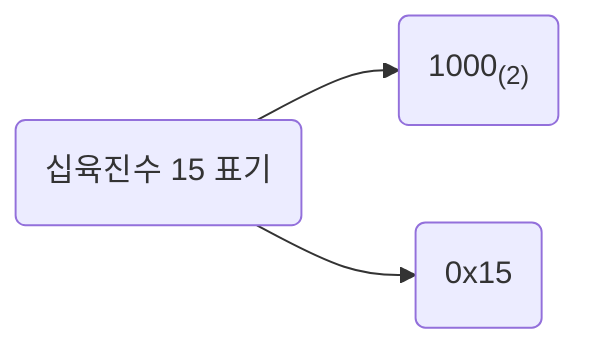

# 0과 1로 숫자를 표현하는 방법 - 3

## 십육진법

이진법을 이용해 0과 1만으로 모든 숫자를 표현할 수 있었다. 하나의 이진수는 하나의 비트로 나타낼 수 있기에 이진법을 이용하면 컴퓨터가 이해하는 숫자 정보를 직접적으로 표현할 수 있다. 하지만 이진법은 0과 1만으로 모든 숫자를 표현하다 보니 숫자의 길이가 너무 길어진다는 단점이 있다. 십진수 32를 이진수로 표현하면 $100000_{(2)}$과 같이 여섯 개의 자릿수가 필요한 것처럼 말이다.

그래서 데이터를 표현할 때 이진법 이외에 십육진법도 자주 사용한다. `십육진법(hexadecimal)` 은 수가 15를 넘어가는 시점에 자리 올림을 하는 숫자 표현 방식이다. 그리고 십진수 10, 11, 12, 13, 14, 15를 십육진법 체계에서는 각각 A, B, C, D, E, F 로 표기한다.

|십진수|0|1|2|3|4|5|6|7|8|9|10|11|12|13|14|15|16|
|---|---|---|---|---|---|---|---|---|---|---|---|---|---|---|---|---|---|
|십육진수|0|1|2|3|4|5|6|7|8|9|A|B|C|D|E|F|10|

십육진수는 한 글자로 열여섯 종류의 숫자 정보를 표현할 수 있다. 그러니 이진수에 비해 더 적은 자릿수로 더 많은 정보를 표현할 수 있다. 십육진수도 이진수와 마찬가지로 숫자 뒤에 아래첨자(16)를 붙이거나 숫자 앞에 `0X`를 붙여 구분한다. 전자는 주로 수학적으로 십육진수를 표현할 때, 후자는 주로 코드상에서 십육진수를 표기할 때 사용되는 방식이다.

그런데 왜 굳이 십육진법을 사용할까? 우리가 편하게 쓰는 십진법도 있는데 말이다. 여러 가지 이유가 있지만, 십육진법을 사용하는 주된 이유 중 하나는 이진수를 십진수로, 십육진수를 이진수로 변환하기 쉽기 때문이다.

### 십육진수를 이진수로 변환하기

십육진수는 한 글자당 열여섯 종류(0~9, A~F)의 숫자를 표현할 수 있다. 그렇다면 십육진수를 이루는 숫자 하나를 이진수로 표현하려면 몇 비트가 필요할까? 4비트가 필요하다. $2^4$ = 16 이기 때문이다.

십육진수를 이진수로 변환하는 간편한 방법은 십육진수 한 글자를 4비트의 이진수로 간주하는 방법이다. 십육진수를 이루고 있는 각 글자를 따로따로 이진수로 변환하고, 변환된 수들을 그대로 이어 붙이면 십육진수가 이진수로 변환된다. 예를 들어 1A2B(16) 라는 십육진수가 있을 때 각 숫자 1(16), A(16), 2(16), B(16) 를 이진수로 표현하면 0001(2), 1010(2), 0010(2), 1011(2) 이 된다. 이 숫자를 그대로 이어 붙인 값, 0001101000101011(2) 이 1A2B(16) 를 이진수로 표현한 값이다.

### 이진수를 십육진수로 변환하기

반대로 이진수를 십육진수로 변환할 때는 이진수 숫자를 네 개씩 끊고, 끊어 준 네 개의 숫자를 하나의 십육진수로 변환한 뒤 그대로 이어 붙이면 된다. 예를 들어 11010101(2) 이라는 이진수를 네개씩 끊으면 1101(2), 0101(2) 이고 이는 각각 D(16), 5(16) 이므로 이를 그대로 이어 붙인 D5(16) 가 11010101(2) 를 십육진수로 변환한 수이다.

이진수를 십진수로 변환할 때는 이렇게 간단하지 않기에 이진수를 십육진수로 묶어 표현하는 것이다.