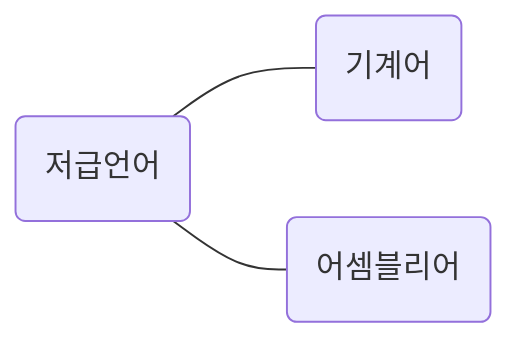
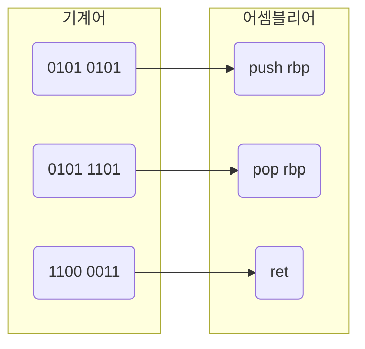

# 소스 코드와 명령어 - 1

01장에서 '컴퓨터는 명령어를 처리하는 기계'라고 했다. 명령어는 컴퓨터를 실질적으로 작동시키는 매우 중요한 정보이다.

그런데 이상하다. 컴퓨터를 작동시키는 정보가 명령어라면 C, C++, Java, Python과 같은 프로그래밍 언어로 만든 소스 코드는 무엇일까? 프로그래밍 언어로 만든 소스 코드, 즉 프로그램을 실행해도 컴퓨터는 잘 작동한다.

결론부터 말하면 모든 소스 코드는 컴퓨터 내부에서 명령어로 변환된다. 이번 절에서는 프로그래밍 언어가 어떻게 명령어가 되어 실행되는지 알아보자.

## 고급 언어와 저급 언어

컴퓨터는 C, C++, Java 같은 프로그래밍 언어를 이해할 수 있을까? 언뜻 들으면 당연히 이해할 수 있을 듯 하다. 개발자는 프로그래밍 언어로 프로그램을 만들고, 컴퓨터는 그렇게 만들어진 프로그램을 실행한다. 하지만 답은 "그렇지 않다"이다.

우리가 프로그램을 만들 때 사용하는 프로그래밍 언어는 컴퓨터가 이해하는 언어가 아닌 사람이 이해하고 작성하기 쉽게 만들어진 언어이다. 컴퓨터는 이 언어를 이해하지 못한다. 이렇게 사람이 이해하는 언어를 `고급언어(high-level programming language)`라고 부른다. 우리가 알고있는 대부분의 프로그래밍 언어가 고급 언어에 속한다.

반대로 컴퓨터가 직접 이해하고 실행할 수 있는 언어를 `저급언어(low-level programming language)` 라고 한다. 저급 언어는 명령어로 이루어져있다. 컴퓨터가 이해하고 실행할 수 있는 언어는 오직 저급 언어뿐이다. 그래서 고급 언어로 작성된 소스 코드가 실행되려면 반드시 저급 언어, 즉 명령어로 변환되어야 한다.

저급 언어에는 두 가지 종류가 있다. `기계어`와 `어셈블리어`이다.

`기계어(machine code)`란 0과 1의 명령어 비트로 이루어진 언어이다. 다시 말해 기계어는 0과 1로 이루어진 명령어 모음이다. 컴퓨터는 0과 1로 이루어진 기계어를 이해하고 실행한다. 다만, 기계어를 이진수로 나열하면 너무 길어지기 때문에 가독성을 위해 십육진수로 표현하기도 한다.

다만 기계어를 직접 본다면 이 기계어가 무엇을 뜻하고, 컴퓨터를 어떻게 작동시키는지 감이 잡히지 않는다. 기계어는 오로지 컴퓨터만을 위해 만들어진 언어이기 때문에 사람이 읽으면 그 의미를 이해하기 어렵다. 그래서 등장한 저급 언어가 `어셈블리어(assembly language)`이다.

기계어는 0과 1의 명령어 비트로 이루어져 있다. 즉 0과 1로 표현된 명령어를 읽기 편한 형태로 번역한 언어가 어셈블리어이다.

기존에 코딩을 배웠다면 어셈블리어는 우리가 아는 C, C++, Java 와는 사뭇 다르게 생겼다는 사실을 알 수 있다. 어셈블리어는 0과 1로 이루어진 기계어를 읽기 편하게 만든 저급 언어일 뿐이므로, 개발자가 어셈블리어를 이용해 복잡한 프로그램을 만들기란 쉽지 않다.

그래서 고급 언어가 필요하다. 고급 언어는 사람이 읽고 쓰기 편한 것은 물론이고, 더 나은 가독성, 변수나 함수 같은 문법을 제공하기 때문에 어떤 복잡한 프로그램도 구현할 수 있다.

"그러면 왜 저급 언어를 알아야 할까? 개발자들이 고급 언어로 소스 코드를 작성하면 알아서 저급 언어로 변환되어 잘 실행되는데, 일부러 저급 언어로 개발할 일은 없지 않은가?" 라는 생각이 들 수 있다.

이는 반만 맞는 말이다. 정확히는 어떤 개발자가 되길 희망하는지에 따라 저급 언어의 중요성이 달라진다. 물론, 어셈블리어를 작성하거나 관찰할 일이 거의 없는 개발자도 있다. 하지만 하드웨어와 밀접하게 맞닿아 있는 프로그램을 개발하는 임베디드 개발자, 게임 개발자, 정보 보안 분야 등의 개발자는 어셈블리어를 많이 이용한다.

그리고 이러한 분야의 개발자들에게 어셈블리어란 '작성의 대상'일 뿐만 아니라 매우 중요한 '관찰의 대상'이기도 하다. 어셈블리어를 읽으면 컴퓨터가 프로그램을 어떤 과정으로 실행하는지, 즉 프로그램이 어떤 절차로 작동하는지를 가장 근본적인 단계에서부터 하나하나 추적하고 관찰할 수 있기 때문이다.

이처럼 어떤 개발자가 되길 희망하는지에 따라 저급 언어의 중요성이 달라진다. 물론 개발 분야를 말론하고 앞서 설명한 고급 언어와 저급 언어의 차이를 이해하는 것은 매우 좋은 교양이다.