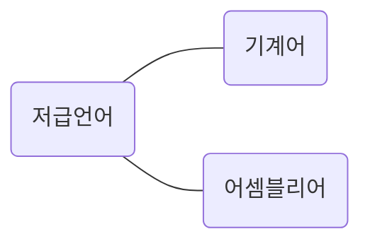
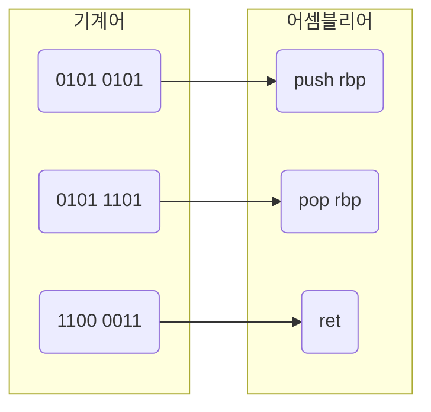
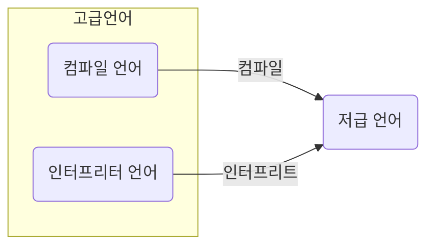

컴퓨터는 명령어를 처리하는 기계이다. 따라서 명령어는 컴퓨터를 실질적으로 작동시키는 매우 중요한 정보이다. 컴퓨터를 작동시키는 정보가 명령어라면 C, C++, Java 같은 프로그래밍 언어로 만든 소스 코드는 무엇일까? 프로그래밍 언어로 만든 소스 코드, 즉 프로그램을 실행해도 컴퓨터는 잘 작동하는데 말이다. 결론부터 말하자면 모든 소스 코드는 컴퓨터 내부에서 명령어로 변환된다.

## 고급 언어와 저급 언어

컴퓨터는 C, C++, Java 같은 프로그래밍 언어를 이해할 수 있을까? 언뜻 들으면 당연히 이해할 수 있을 듯 하다. 개발자는 프로그래밍 언어로 프로그램을 만들고, 컴퓨터는 그렇게 만들어진 프로그램을 실행한다. 하지만 답은 '그렇지 않다' 이다.

우리가 프로그램을 만들 때 사용하는 프로그래밍 언어는 컴퓨터가 이해하는 언어가 아닌 사람이 이해하고 작성하기 쉽게 만들어진 언어이다. 컴퓨터는 이 언어를 이해하지 못한다. 이렇게 사람이 이해하는 언어를 `고급언어(high-level programming language)`라고 부른다. 우리가 알고있는 대부분의 프로그래밍 언어가 고급 언어에 속한다.

반대로 컴퓨터가 직접 이해하고 실행할 수 있는 언어를 `저급언어(low-level programming language)` 라고 한다. 저급 언어는 명령어로 이루어져있다. 컴퓨터가 이해하고 실행할 수 있는 언어는 오직 저급 언어뿐이다. 그래서 고급 언어로 작성된 소스 코드가 실행되려면 반드시 저급 언어, 즉 명령어로 변환되어야 한다.

저급 언어에는 두 가지 종류가 있다. `기계어`와 `어셈블리어`이다.

`기계어(machine code)`란 0과 1의 명령어 비트로 이루어진 언어이다. 다시 말해 기계어는 0과 1로 이루어진 명령어 모음이다. 컴퓨터는 0과 1로 이루어진 기계어를 이해하고 실행한다. 다만, 기계어를 이진수로 나열하면 너무 길어지기 때문에 가독성을 위해 십육진수로 표현하기도 한다.

다만 기계어를 직접 본다면 이 기계어가 무엇을 뜻하고, 컴퓨터를 어떻게 작동시키는지 감이 잡히지 않는다. 기계어는 오로지 컴퓨터만을 위해 만들어진 언어이기 때문에 사람이 읽으면 그 의미를 이해하기 어렵다. 그래서 등장한 저급 언어가 `어셈블리어(assembly language)`이다.

기계어는 0과 1의 명령어 비트로 이루어져 있다. 즉 0과 1로 표현된 명령어를 읽기 편한 형태로 번역한 언어가 어셈블리어이다.

기존에 코딩을 배웠다면 어셈블리어는 우리가 아는 C, C++, Java 와는 사뭇 다르게 생겼다는 사실을 알 수 있다. 어셈블리어는 0과 1로 이루어진 기계어를 읽기 편하게 만든 저급 언어일 뿐이므로, 개발자가 어셈블리어를 이용해 복잡한 프로그램을 만들기란 쉽지 않다.

그래서 고급 언어가 필요하다. 고급 언어는 사람이 읽고 쓰기 편한 것은 물론이고, 더 나은 가독성, 변수나 함수 같은 문법을 제공하기 때문에 어떤 복잡한 프로그램도 구현할 수 있다.

## 컴파일 언어와 인터프리터 언어

개발자들이 고급 언어로 작성한 소스 코드는 결국 저급 언어로 변환되어 실행된다. 그렇다면 고급 언어는 어떻게 저급 언어로 변환될까? 여기에는 크게 두 가지, `컴파일`방식과 `인터프리트` 방식이 있다. 컴파일 방식으로 작동하는 프로그래밍 언어를 `컴파일 언어`, 인터프리트 방식으로 작동하는 프로그래밍 언어를 `인터프리터 언어` 라고 한다.

### 컴파일 언어

컴파일 언어는 컴파일러에 의해 소스 코드 전체가 저급 언어로 변환되어 실행되는 고급 언어이다. 대표적인 컴파일 언어로는 C가 있다. 컴퓨터는 개발자가 만든 소스 코드를 이해하지 못한다. 그렇기에 컴파일 언어로 작성된 소스 코드는 코드 전체가 저급 언어로 변환되는 과정을 거친다. 이 과정을 `컴파일(compile)` 이라고 한다. 그리고 컴파일을 수행해 주는 도구를 `컴파일러(compiler)` 라고 한다. 컴파일러는 개발자가 작성한 소스 코드 전체를 쭉 훑어보며 소스 코드에 문법적인 오류는 없는지, 실행 가능한 코드인지, 실행하는 데 불필요한 코드는 없는지 등을 따지며 소스 코드를 처음 부터 끝까지 저급 언어로 컴파일한다. 이때 컴파일러가 소스 코드 내에서 오류를 하나라도 발견하면 해당 소스 코드는 컴파일에 실패한다.

컴파일이 성공적으로 실행되면 개발자가 작성한 소스 코드는 컴퓨터가 이해할 수 있는 저급 언어로 변환된다. 이렇게 컴파일러를 통해 저급 언어로 변환된 코드를 `목적 코드(object code)` 라고 한다.

### 인터프리터 언어

인터프리터 언어는 인터프리터에 의해 소스 코드가 한 줄씩 실행되는 고급 언어이다. 대표적인 인터프리터 언어로 python이 있다.

소스 코드 전체가 저급 언어로 변환되는 컴파일 언어와는 달리, 인터프리터 언어는 소스 코드를 한 줄씩 차례로 실행한다. 그리고 소스 코드를 한 줄씩 저급 언어로 변환하여 실행해 주는 도구를 `인터프리터(interpreter)` 라고 부른다. 인터프리터 언어는 컴퓨터와 대화하듯 소스 코드를 한 줄씩 실행하기 때문에 소스 코드 전체를 저급 언어로 변환하는 시간을 기다릴 필요가 없다. 그리고 소스 코드 내에 오류가 하나라도 있으면 컴파일이 불가능했던 컴파일 언어와는 달리, 인터프리터 언어는 소스 코드를 한 줄씩 실행하기 때문에 소스 코드 N번째 줄에 문법 오류가 있더라도 N-1 번째 줄까지는 올바르게 수행된다.

인터프리터 언어가 컴파일 언어보다 빠르다고 생각할 수도 있지만, 일반적으로 인터프리터 언어는 컴파일 언어보다 느리다. 컴파일을 통해 나온 결과물, 즉 목적 코드는 컴퓨터가 이해하고 실행할 수 있는 저급 언어인 반면, 인터프리터 언어는 소스 코드 마지막에 이를 때까지 한 줄 한 줄씩 저급 언어로 해석하며 실행해야 하기 때문이다.

## 목적 파일 vs. 실행 파일

이미지로 이루어진 파일을 이미지 파일이라고 부르고, 텍스트로 이루어진 파일을 텍스트 파일이라고 부르듯이 목적 코드로 이루어진 파일을 `목적 파일` 이라고 부른다. 마찬가지로 실행 코드로 이루어진 파일을 실행 파일이라고 부른다 윈도우의 `.exe` 확장자를 가진 파일이 대표적인 실행 파일이다.

목적 코드는 컴퓨터가 이해하는 저급 언어이다. 그렇다면 목적 파일과 실행 파일은 같은 의미일까? 그렇지 않다. 목적 코드가 실행 파일이 되기 위해서는 `링킹` 이라는 작업을 거쳐야 한다.

### 링킹

예를 들어 컴파일 언어로 helper.c 와 main.c. 라는 두 개의 소스 코드를 작성했다고 가정해보자.

- helper.c : 'HELPER_더하기' 라는 기능 구현
- main.c : helper.c 에 구현된 기능과 프로그래밍 언어가 기본으로 제공하는 '화면_출력' 이라는 기능 구현

이들을 컴파일 하면 각각의 소스 코드로부터 목적 코드가 생성된다. helper.c 와 main.c 의 목적 파일은 각각 helper.o, main.o 라고 부르도록 한다.

main.o 는 저급 언어니까 바로 실행할 수 있을까? 실행할 수 없다. main.o 는 main.c 내용이 그대로 저급 언어로 변환된 파일일 뿐, main.c에 없는 'HELPER_더하기' 나 '화면_출력' 은 어떻게 실행하는지 알지 못하기 때문이다. 따라서 main.o 가 실행되면 main.o 에 없는 외부 기능들, 즉 'HELPER_더하기' 기능과 '화면_출력' 기능을 main.o 와 연결 짓는 작업이 필요하다. 이러한 연결 작업이 `링킹(linking)` 이다. 링킹 작업까지 거치면 비로소 하나의 실행 파일이 만들어진다.