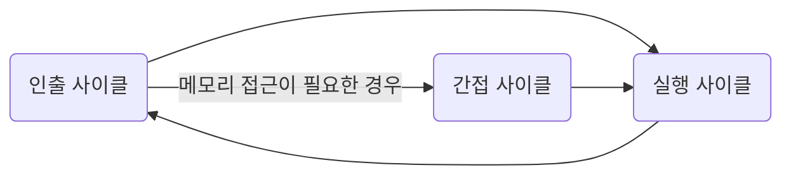

# 명령어 사이클과 인터럽트 - 1

CPU가 하나의 명령어를 처리하는 과정에는 어떤 정해진 흐름이 있고, CPU는 그 흐름을 반복하며 명령어들을 처리한다. 이렇게 하나의 명령어를 처리하는 정형화된 흐름을 `명령어 사이클` 이라고 한다.

CPU는 정해진 흐름에 따라 명령어를 처리해 나가지만, 간혹 이 흐름이 끊어지는 상황이 발생한다. 이를 `인터럽트` 라고 한다.

## 명령어 사이클

실행되는 프로그램은 수많은 명령어로 이루어져 있고, CPU는 이 명령어들을 하나씩 실행한다. 이때 프로그램 속 각각의 명령어들은 일정한 주기가 반복되며 실행되는데, 이 주기를 `명령어 사이클(instruction cycle)` 이라고 한다. 프로그램 속 각각의 명령어들은 명령어 사이클이 반복되며 실행된다.

메모리에 저장된 명령어 하나를 실행한다고 가정한다. 가장 먼저 뭘 하게될까? 명령어를 메모리에서 CPU로 가져와야한다. 이게 명령어 사이클의 첫 번째 과정이다. 메모리에 있는 명령어를 CPU로 가지고 오는 단계를 `인출 사이클(fetch cycle)` 이라고 한다.

CPU로 명령어를 인출했다면 이제 명령어를 실행한다. 이것이 명령어 사이클의 두 번째 과정이다. CPU로 가져온 명령어를 실행하는 단계를 `실행 사이클(execution cycle)` 이라고 한다. 제어장치가 명령어 레지스터에 담긴 값을 해석하고, 제어 신호를 발생시키는 단계가 실행 사이클이다.

프로그램을 이루는 수많은 명령어는 일반적으로 인출과 실행 사이클을 반복하며 실행된다. 즉, CPU는 프로그램 속 명령어를 가져오고 실행하고, 또 가져오고 실행하고를 반복한다. 도식화 하면 아래와 같다.

하지만 모든 명령어가 이렇게 간단히 실행되는 건 아니다. 명령어를 인출하여 CPU로 가져왔다 하더라도 곧바로 실행할 수 없는 경우도 있기 때문이다. 예를 들어 간접 주소 지정 방식을 생각해보자. 간접 주소 지정 방식은 오퍼랜드 필드에 유효 주소의 주소를 명시한다. 이 경우 명령어를 인출하여 CPU로 가져왔다 하더라도 바로 실행 사이클에 돌입할 수 없다. 명령어를 실행하기 위해서는 메모리 접근을 한 번 더 해야 하기 때문이다. 이 단계를 `간접 사이클(indirect cycle)` 이라고 한다. 간접 사이클까지 추가한 명령어 사이클 도식은 아래와 같다.

하지만 명령어 사이클은 이게 끝이 아니다. 아직 고려해야 할 것이 하나 더 남아있다. 바로 인터럽트이다.