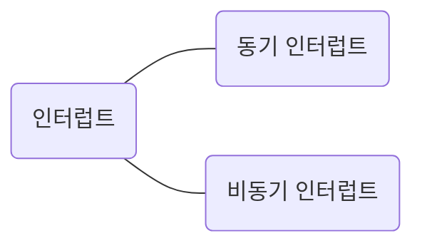
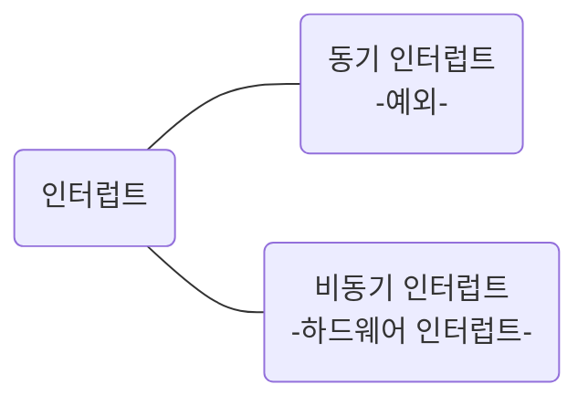
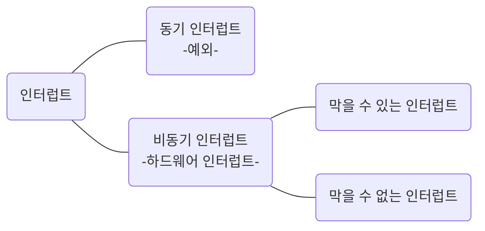
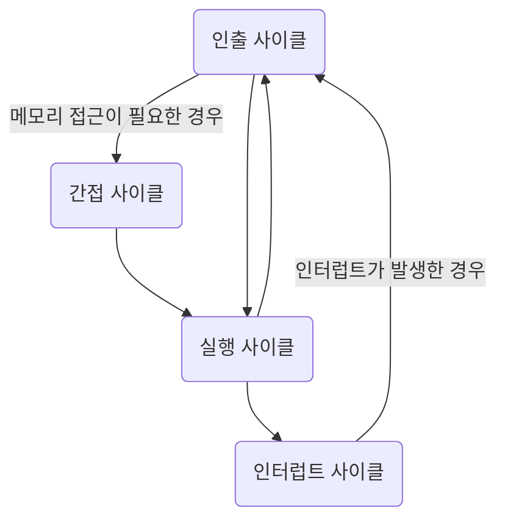

# 명령어 사이클과 인터럽트 - 2

## 인터럽트

프로그램을 개발하다 보면 인터럽트라는 단어를 쉽게 접할 수 있다. 인터럽트는 뭘까? 인터럽트는 영어로 interrupt이며, '방해하다, 중단시키다'를 의미한다. 즉, CPU가 수행 중인 작업은 방해를 받아 잠시 중단 될 수 있는데, 이렇게 CPU의 작업을 방해하는 신호를 `인터럽트(interrupt)` 라고 한다.

CPU가 작업을 잠시 중단해야 할 정도라면 인터럽트는 'CPU가 꼭 주목해야 할 때' 혹은 'CPU가 처리해야 할 다른 작업이 생겼을 때' 발생한다.

인터럽트의 종류는 크게 동기 인터럽트와 비동기 인터럽트가 있다.

### 동기 인터럽트

`동기 인터럽트(synchronous interrupts)` 는 CPU에 의해 발생하는 인터럽트이다. CPU가 명령어들을 수행하다가 예상치 못한 상황에 마주쳤을 때, 가령 CPU가 실행하는 프로그래밍상의 오류와 같은 예외적인 상황에 마주쳤을 때 발생하는 인터럽트가 동기 인터럽트이다. 이런 점에서 동기 인터럽트는 `예외(exception)`라고 부른다.

### 비동기 인터럽트

`비동기 인터럽트(asynchronous interrupt)` 는 주로 입출력장치에 의해 발생하는 인터럽트이다. 입출력장치에 의한 비동기 인터럽트는 세탁기 완료 알림, 전자레인지 조리 완료 알림과 같은 알림 역할을 한다.

- CPU가 프린터와 같은 입출력장치에 입출력 작업을 부탁하면 작업을 끝낸 입출력장치가 CPU에 완료 알림(인터럽트)을 보낸다.
    
- 키보드, 마우스와 같은 입출력장치가 어떤 입력을 받았을 때 이를 처리하기 위해 CPU에 입력 알림(인터럽트)을 보낸다.
    

일반적으로 비동기 인터럽트를 인터럽트라 칭하기도 한다. 또는 하드웨어 인터럽트라고 부르기도 한다.

## 하드웨어 인터럽트

하드웨어 인터럽트는 알림과 같은 인터럽트이다. CPU는 입출력 작업 도중에도 효율적으로 명령어를 처리하기 위해 이런 알림과 같은 하드웨어 인터럽트를 사용한다. 명령어를 효율적으로 처리하는 것과 하드웨어 인터럽트가 무슨 상관일까?

가령 CPU가 프린터에 출력을 명령했다고 가정한다. 입출력장치는 CPU보다 속도가 현저히 느리기 때문에 CPU는입출력 작업의 결과를 바로 받아볼 수 없다. 이때 만약 하드웨어 인터럽트를 사용하지 않는다면 CPU는 프린터가 언제 프린트를 끝낼지 모르기 때문에 주기적으로 프린터의 완료 여부를 확인해야 한다. 이로 인해 CPU는 다른 생산적인 일을 할 수 없으니 CPU 사이클 낭비이다. 이는 마치 알림이 없는 전자레인지가 언제 조리를 끝낼지 모르기에 무작정 전자레인지 앞에서 서성이는 상황과 같다.

하지만 하드웨어 인터럽트를 이용하면 CPU는 주기적으로 프린트 완료 여부를 확인할 필요가 없다. CPU는 프린터로부터 프린트 오나료 인터럽트를 받을 때까지 다른 작업을 처리할 수 있다. 이렇듯 하드웨어 인터럽트는 입출력 작업 중에도 CPU로 하여금 효율적으로 명령어를 처리할 수 있게 한다.

### 하드웨어 인터럽트 처리 순서

이제 CPU가 하드웨어 인터럽트를 어떻게 처리하는지 구체적으로 알아보자.

1. 입출력장치는 CPU에 `인터럽트 요청 신호`를 보낸다.
    
2. CPU는 실행 사이클이 끝나고 명령어를 인출하기 전 항상 인터럽트 여부를 확인한다.
    
3. CPU는 인터럽트 요청을 확인하고 `인터럽트 플래그` 를 통해 현재 인터럽트를 받아들일 수 있는지 여부를 확인한다.
    
4. 인터럽트를 받아들일 수 있다면 CPU는 지금까지의 작업을 백업한다.
    
5. CPU는 `인터럽트 벡터`를 참조하여 `인터럽트 서비스 루틴`을 실행한다.
    
6. 인터럽트 서비스 루틴 실행이 끝나면 4에서 백업해 둔 작업을 복구하여 실행을 재개한다.
    

순서에서 나온 중요한 단어 리스트이다.

- 인터럽트 요청 신호
    
- 인터럽트 플래그
    
- 인터럽트 벡터
    
- 인터럽트 서비스 루틴
    

인터럽트는 CPU의 정상적인 실행 흐름을 끊는 것이기에 다른 누군가가 인터럽트하기 전에는 지금 끼어들어도 되는지 CPU에 물어봐야한다. 이를 `인터럽트 요청 신호`라고 한다.

이때, CPU가 인터럽트 요청을 수용하기 위해서는 플래그 레지스터의 `인터럽트 플래그(interrupt flag)`가 활성화되어 있어야 한다. 인터럽트 플래그는 말 그대로 하드웨어 인터럽트를 받아들일지, 무시할지를 결정하는 플래그이다. CPU가 중요한 작업을 처리해야 하거나 어떤 방해도 받지 않아야 할때 인터럽트 플래그는 불가능으로 설정된다. 만약 인터럽트 플래그가 '불가능'으로 설정되어 있다면 CPU는 인터럽트 요청이 오더라도 해당 요청을 무시한다. 반대로 인터럽트 플래그가 '가능'으로 설정되어 있다면 CPU는 인터럽트 요청 신호를 받아들이고 인터럽트를 처리한다.

다만, 모든 하드웨어 인터럽트를 인터럽트 플래그로 막을 수는 없다. 인터럽트 플래그가 불가능으로 설정되어 있을지라도 무시할 수 없는 인터럽트 요청도 있다. 무시할 수 없는 하드웨어 인터럽트는 가장 우선순위가 높은, 다시 말해 반드시 가장 먼저 처리해야 하는 인터럽트이다. 정전이나 하드웨어 고장으로 인한 인터럽트가 이에 해당한다.

CPU가 인터럽트 요청을 받아들이기로 했다면 CPU는 인터럽트 서비스 루틴이라는 프로그램을 실행한다. `인터럽트 서비스 루틴(ISR : interrupt service routine)` 은 인터럽트를 처리하기 위한 프로그램이다. `인터럽트 핸들러(interrupt handler)` 라고도 부른다. 인터럽트 서비스 루틴은 '키보드가 어떤 인터럽트 요청을 보냈을 때는 어떻게 작동한다', '마우스가 어떤 인터럽트 요청을 보냈을 때는 어떻게 작동한다', '프로그램에 어떤 문제가 생겼을 때는 어떻게 작동한다' 와 같이 어떤 인터럽트가 발생했을 때 해당 인터럽트를 어떻게 처리하고 작동해야 할지에 대한 정보로 이루어진 프로그램이다.

'CPU가 인터럽트를 처리한다'는 말은 '인터럽트 서비스 루틴을 실행하고, 본래 수행하던 작업으로 다시 되돌아온다'라는 말과 같다.

인터럽트를 처리하는 방법은 입출력장치마다 다르므로 각기 다른 인터럽트 서비스 루틴을 가지고 있다. 메모리에는 여러개의 인터럽트 서비스 루틴이 저장되어 있다. 이들 하나하나가 '인터럽트가 발생하면 어떻게 행동해야 할지를 알려주는 프로그램'이라고 보면 된다.

그렇다면 CPU는 각기 다른 인터럽트 서비스 루틴을 구분할 수 있어야 한다. CPU는 수많은 인터럽트 서비스 루틴을 구분하기 위해 인터럽트 벡터를 이용한다. `인터럽스 벡터(interrupt vector)` 는 인터럽트 서비스 루틴을 식별하기 위한 정보이다. 인터럽트 벡터를 알면 인터럽트 서비스 루틴의 시작 주소를 알 수 있기 때문에 CPU는 인터럽트 벡터를 통해 특정 인터럽트 서비스 루틴을 처음부터 실행할 수 있다. CPU는 하드웨어 인터럽트 요청을 보낸 대상으로부터 데이터 버스를 통해 인터럽트 벡터를 전달받는다.

가령, CPU가 작업을 수행하는 도중 키보드 인터럽트가 발생한 경우라면 CPU는 인터럽트 벡터를 참조하여 키보드 인터럽트 서비스 루틴의 시작 주소를 알아내고, 이 시작 주소부터 실행해 나가며 키보드 인터럽트 서비스 루틴을 실행한다.

'CPU가 인터럽트를 처리한다'는 말은 '인터럽트 서비스 루틴을 실행하고, 본래 수행하던 작업으로 다시 되돌아온다' 는 말과 같다. 그리고 CPU가 인터럽트 서비스 루틴을 실행하려면 인터럽트 서비스 루틴의 시작 주소를 알아야한다. 이는 인터럽트 벡터를 통해 알 수 있다.

인터럽트 서비스 루틴은 여느 프로그램과 마찬가지로 명령어와 데이터로 이루어져 있다. 그렇기에 인터럽트 서비스 루틴도 프로그램 카운터를 비롯한 레지스터들을 사용하며 실행된다.

그럼, 인터럽트가 발생하기 전까지 레지스터에 저장되어 있던 값들은 어떻게 될까? CPU의 프로그램 카운터에는 1500이 저장되어 있다고 해보자. 이 CPU에 하드웨어 인터럽트가 발생하여 10번지에 있는 인터럽트 서비스 루틴을 실행해야 한다고 가정했을 때, 기존에 프로그램 카운터에 저장되어 있던 1500은 그냥 10으로 덮어써 버리면 될까?

그렇지 않다. 인터럽트 요청을 받기 전까지 CPU가 수행하고 있었던 일은 인터럽트 서비스 루틴이 끝나면 되돌아와서 마저 수행을 해야 하기 때문에 지금까지의 작업 내역들은 어딘가에 백업을 해둬야 한다. 그렇기에 CPU는 인터럽트 서비스 루틴을 실행하기 전에 프로그램 카운터 값 등 현재 프로그램을 재개하기 위해 필요한 모든 내용을 스택(메모리에 위치)에 백업한다. 그러고 나서 인터럽트 서비스 루틴의 시작 주소가 위치한 곳으로 프로그램 카운터 값을 갱신하고 인터럽트 서비스 루틴을 실행한다. 인터럽트 서비스 루틴을 모두 실행하면, 다시 말해 인터럽트를 처리하고 나면 스택에 저장해 둔 값을 다시 불러온 뒤 이전까지 수행하던 작업을 재개한다.

다시 한번 정리해보자.

- 인터럽트 요청 신호 : CPU의 작업을 방해하는 인터럽트에 대한 요청
    
- 인터럽트 플래그 : 인터럽트 요청 신호를 받아들일지 무시할지를 결정하는 비트
    
- 인터럽트 벡터 : 인터럽트 서비스 루틴의 시작 주소를 포함하는 인터럽트 서비스 루틴의 식별 정보
    
- 인터럽트 서비스 루틴 : 인터럽트를 처리하는 프로그램
    

CPU가 항상 명령어를 순차적으로만 실행하는 것은 아니며, 인터럽트를 처리하는 과정까지 알아봤다. 결국 CPU는 이와 같은 과정을 반복해 나가며 프로그램을 실행한다고 이해할 수 있다.

