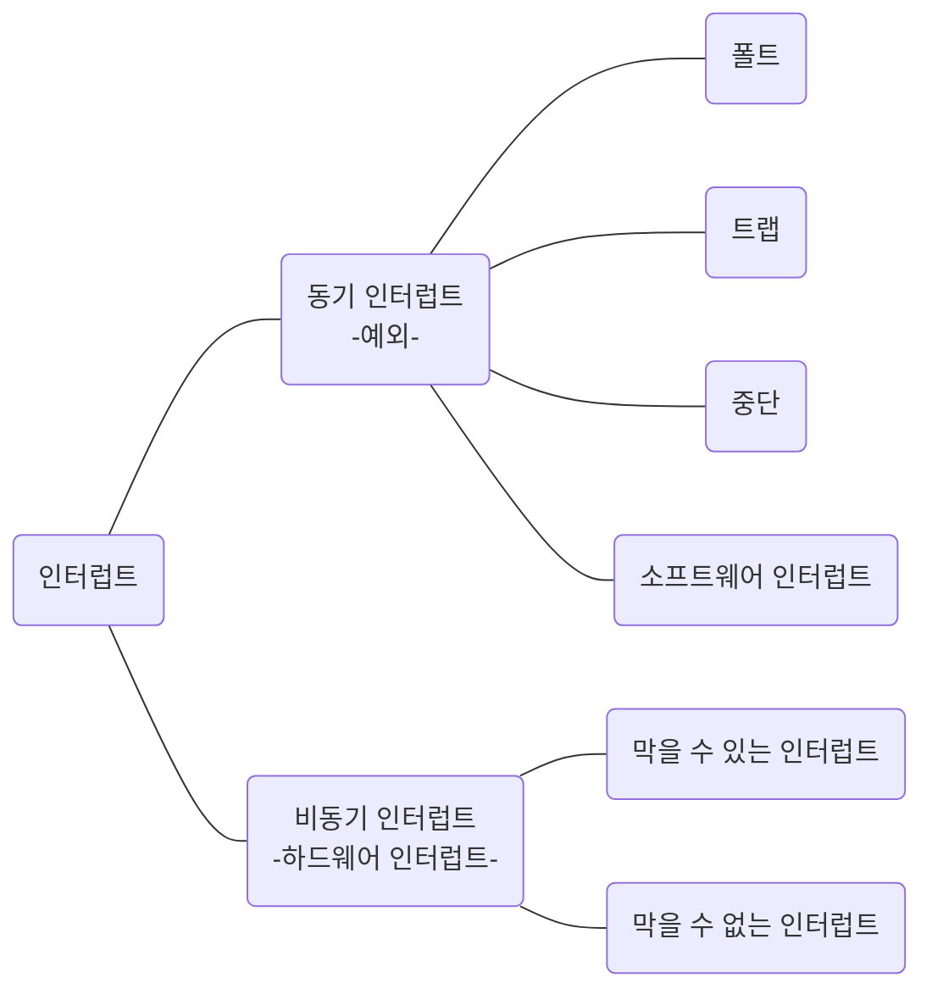

# 예외의 종류 - 1

예외의 종류에는 폴트, 트랩, 중단, 소프트웨어 인터럽트가 있다.

`예외`가 발생하면 CPU는 하던 일을 중단하고 해당 예외를 처리한다. 예외를 처리하고 나면 CPU는 다시 본래 하던 작업으로 되돌아와 실행을 재개한다. 여기서 CPU가 본래 하던 작업으로 되돌아왔을 때 예외가 발생한 명령어부터 실행하느냐, 예외가 발생한 명령어의 다음 명령어부터 실행하느냐에 따라 폴트와 트랩으로 나뉜다.

`폴트(fault)` 는 예외를 처리한 직후 예외가 발생한 명령어부터 실행을 재개하는 예외이다. 가령 CPU가 한 명령어를 실행하려 하는데, 이 명령어를 실행하기 위해 꼭 필요한 데이터가 메모리가 아닌 보조기억장치에 있다고 가정해보자. 프로그램이 실행되려면 반드시 메모리에 저장되어 있어야 하기에 CPU는 폴트를 발생시키고 보조기억장치로부터 필요한 데이터를 메모리로 가져와 저장한다.

보조기억장치로부터 필요한 데이터를 메모리로 가지고 왔으면 CPU는 다시 실행을 재개한다. 이때 CPU는 폴트가 발생한 그 명령어부터 실행한다. 이렇게 예외 발생 직후 예외가 발생한 명령어부터 실행해 나가는 예외를 폴트라고 한다.

`트랩(trap)` 은 예외를 처리한 직후 예외가 발생한 명령어의 다음 명령어부터 실행을 재개하는 예외이다. 주로 디버깅할 때 사용한다. 디버깅을 할 때 특정 코드가 실행되는 순간 프로그램의 실행을 멈추게 할 수 있다. 트랩을 처리하고 나면, 다시 말해 프로그램을 중단시키고 디버깅이 끝나면 프로그램은 다음 명령어부터 실행을 이어 나간다. 이처럼 트랩은 예외가 발생한 명령어의 다음 명령어부터 실행을 재개하는 예외이다.

`중단(abort)` 은 CPU가 실행 중인 프로그램을 강제로 중간시킬 수밖에 없는 심각한 오류를 발견했을 때 발생하는 예외이다.

`소프트웨어 인터럽트(software interrupt)` 는 시스템 호출이 발생했을 때 나타난다. 시스템 호출은 이후 알아보도록 하자.