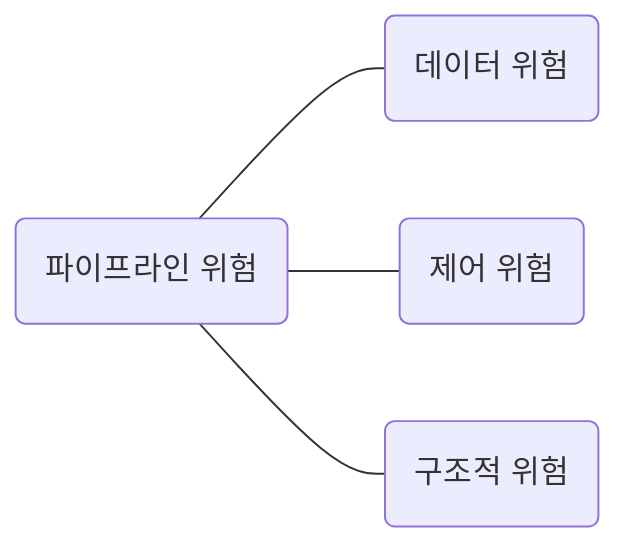

빠른 CPU를 만들려면 높은 클럭 속도에 멀티코어, 멀티스레드를 지원하는 CPU를 만드는 것도 중요하지만, CPU가 놀지 않고 시간을 알뜰하게 쓰며 작동하게 만드는 것도 중요하다.

명령어를 동시에 처리하여 CPU를 한시도 쉬지 않고 작동시키는 기법인 `명령어 병렬 처리 기법(ILP: Instruction-level Parallelism)`을 알아본다. 대표적인 명령어 병렬 처리 기법에는 `명령어 파이프라이닝`, `슈퍼스칼라`, `비순차적 명령어 처리` 가 있다. 하나씩 알아보자.

### 명령어 파이프라인
명령어 파이프라인을 이해하려면 하나의 명령어가 처리되는 전체 과정을 비슷한 시간 간격으로 나누어 보아야 한다. 명령어 처리 과정을 클럭 단위로 나누어 보면 일반적으로 다음과 같다.

1. 명령어 인출(Instruction Fetch)
2. 명령어 해석(Instruction Decode)
3. 명령어 실행(Execute Instruction)
4. 결과 저장(Write Back)

여기서 중요한 점은 같은 단계가 겹치지만 않는다면 CPU는 '각 단계를 동시에 실행할 수 있다'는 것이다. 예를 들어 CPU는 한 명령어를 '인출'하는 동안에 다른 명령어를 '실행'할 수 있고, 한 명령어가 '실행'되는 동안에 연산 결과를 '저장'할 수 있다.

이를 그림으로 표현하면 다음과 같다. t1에는 명령어 1, 2를 동시에 처리할 수 있고, t2에는 명령어 1, 2, 3을 동시에 처리할 수 있다. 이처럼 명령어를 겹쳐서 수행하면 명령어를 하나하나 실행하는 것보다 훨씬 효율적으로 처리할 수 있다.

![[‎명령어 파이프라인.‎001.jpeg]]

이처럼 마치 공장 생산 라인과 같이 명령어들을 `명령어 파이프라인(Instruction pipeline)`에 넣고 동시에 처리하는 기법을 `명령어 파이프라이닝(Instruction pipelining)`이라고 한다.

명령어 파이프라인을 사용하지 않고 모든 명령어를 순차적으로만 처리한다면 아래와 같이 처리했을 것이다. 한눈에 봐도 명령어 파이프라이닝을 이용하는 것이 더 효율적임을 알 수 있다.

![[‎명령어 파이프라인.‎002.jpeg]]

파이프라이닝이 높은 성능을 가져오기는 하지만, 특정 상황에서는 성능 향상에 실패하는 경우도 있다. 이러한 상황을 `파이프라인 위험(pipeline hazard)`이라고 부른다. 파이프라인 위험에는 크게 `데이터 위험`, `제어 위험`, `구조적 위험`이 있다.



#### 데이터 위험
`데이터 위험(data hazard)`은 명령어 간 '데이터 의존성'에 의해 발생한다. 모든 명령어를 동시에 처리할 수는 없다. 어떤 명령어는 이전 명령어를 끝까지 실행해야만 비로소 실행할 수 있는 경우가 있다. 예를 들어 아래 두 명령어를 보자. 편의상 레지스터 이름을 R1, R2, R3, R4, R5라 하고 '왼쪽 레지스터에 오른쪽 결과를 저장하라'는 <- 기호로 표기한다.

```
명령어 1 : R1 <- R2 + R3 // R2 레지스터 값과 R3 레지스터 값을 더한 값을 R1 레지스터에 저장
명령어 2 : R4 <- R1 + R5 // R1 레지스터 값과 R5 레지스터 값을 더한 값을 R4 레지스터에 저장
```

위의 경우 명령어 1을 수행해야만 명령어 2를 수행할 수 있다. 즉, R1에 R2+R3 결과값이 저장되어야 명령어 2를 수행할 수 있다. 만약 명령어 1 실행이 끝나기 전에 명령어 2를 인출하면 R1에 R2+R3 결과값이 저장되기 전에 R1 값을 읽어 들이므로 원치 않은 R1 값으로 명령어 2를 수행한다. 따라서 명령어 2는 명령어 1의 데이터에 의존적이다. 이처럼 데이터 의존적인 두 명령어를 무작정 동시에 실행하려고 하면 파이프라인이 제대로 작동하지 않는 것을 '데이터 위험'이라고 한다.

#### 제어 위험
`제어 위험(control hazard)`은 주로 분기 등으로 인한 '프로그램 카운터의 갑작스러운 변화'에 의해 발생한다. 기본적으로 프로그램 카운터는 '현재 실행 중인 명령어의 다음 주소'로 갱신된다. 하지만 프로그램 실행 흐름이 바뀌어 명령어가 실행되면서 프로그램 카운터 값에 갑작스러운 변화가 생긴다면 명령어 파이프라인에 미리 가지고 와서 처리 중이었던 명령어들은 아무 쓸모가 없어진다. 이를 '제어 위험'이라고 한다.

![[‎명령어 파이프라인.‎003.jpeg]]

참고로 이를 위해 사용하는 기술 중 하나가 `분기 예측(branch prediction)`이다. 분기 예측은 프로그램이 어디로 분기할지 미리 에측한 후 그 주소를 인출하는 기술이다.

#### 구조적 위험
`구조적 위험(structural hazard)`은 명령어들을 겹쳐 실행하는 과정에서 서로 다른 명령어가 동시에 ALU, 레지스터 등과 같은 CPU 부품을 사용하려고 할 때 발생한다. 구조적 위험은 `자원 위험(resource hazard)`이라고도 부른다.

