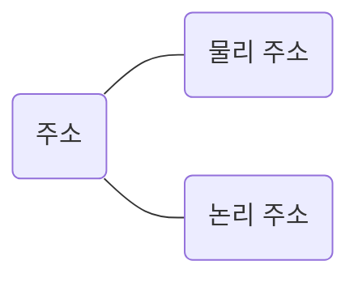

지금까지 '메모리에 저장된 정보의 위치는 주소로 나타낼 수 있다' 정도로만 설명했지만, 사실 주소에는 두 종류가 있다. 바로 물리 주소와 논리 주소이다. `물리 주소`는 메모리 하드웨어가 사용하는 주소이고, `논리 주소`는 CPU와 실행 중인 프로그램이 사용하는 주소이다.

이렇게 두 종류의 주소로 나뉘게 된 배경과 각 주소의 개념, 그리고 논리 주소를 물리 주소로 변환하는 방법에 대해 알아보자.

### 물리 주소와 논리 주소
> CPU와 실행 중인 프로그램은 현재 메모리 몇 번지에 무엇이 저장되어 있는지 다 알고 있을까?

언뜻 생각하면 당연히 그럴 것 같지만, 실제로는 그렇지 않다. CPU와 메모리에 저장되어 실행 중인 프로그램은 메모리 몇 번지에 무엇이 저장되어 있는지 다 알지 못한다.

그 이유는 메모리에 저장된 정보는 시시각각 변하기 때문이다. 메모리에는 새롭게 실행되는 프로그램이 시시때때로 적재되고, 실행이 끝난 프로그램은 삭제된다. 게다가 같은 프로그램을 실행하더라도 실행할 때마다 적재되는 주소가 달라질 수 있다. 1500번지에 적재되었던 프로그램을 다시 실행하면 3000번지, 또 다시 실행하면 2700 번지에 적재될 수 있다. 이런 상황에서 CPU와 실행 중인 프로그램이 현재 메모리 몇 번지에 무엇이 저장되어 있는지 모조리 알고 있기란 어렵다. 

그렇다면 CPU와 실행 중인 프로그램이 이해하는 주소는 무엇일까?

주소에는 메모리가 사용하는 물리 주소가 있고, CPU와 실행 중인 프로그램이 사용하는 논리 주소가 있다.

메모리가 사용하는 `물리 주소 (physical address)`는 말 그대로 정보가 실제로 저장된 하드웨어상의 주소를 의미한다. 반면 CPU와 실행 중인 프로그램이 사용하는 `논리 주소 (logical address)`는 실행 중인 프로그램 각각에게 부여된 0번지부터 시작되는 주소를 의미한다.

예를 들어 현재 메모리에 메모장, 게임, 인터넷 브라우저 프로그램이 적재되어 있다고 가정한다. 메모장, 게임, 인터넷 브라우저 프로그램은 현재 다른 프로그램들이 메모리 몇 번지에 저장되어 있는지, 다시 말해 다른 프로그램들의 물리 주소가 무엇인지 굳이 알 필요가 없다. 새로운 프로그램이 언제든 적재될 수 있고, 실행되지 않는 프로그램은 언제든 메모리에서 사라질 수 있기 때문이다.

그래서 메모장, 게임, 인터넷 브라우저는 모두 물리 주소가 아닌 0번지부터 시작하는 자신만을 위한 주소인 논리 주소를 갖고있다. 에를 들어 '10번지'라는 주소는 메모장에도, 게임에도, 인터넷 브라우저에도 논리 주소로서 존재할 수 있다. 프로그램마다 같은 논리 주소가 얼마든지 있을 수 있다는 뜻이다. 그리고 CPU는 이 논리 주소를 받아들이고, 해석하고, 연산한다.

정리하면, 메모리가 사용하는 주소는 하드웨어상의 실제 주소인 물리 주소이고, CPU와 실행 중인 프로그램이 사용하는 주소는 각각의 프로그램에 부여된 논리 주소이다.

그런데 CPU가 이해하는 주소가 논리 주소라고는 해도 CPU가 메모리와 상호작용하려면 논리 주소와 물리 주소 간의 변환이 이루어져야 한다. 논리 주소와 물리 주소 간에 어떠한 변환도 이루어지지 않는다면 CPU와 메모리는 서로 이해할 수 없는 주소 체계를 가지고 각자 다른 이야기만 할 뿐 결코 상호작용할 수 없을 테니 말이다.

그러면 논리 주소는 어떻게 물리 주소로 변환될까?

논리 주소와 물리 주소 간의 변환은 CPU와 주소 버스 사이에 위치한 `메모리 관리 장치 (MMU : Memory Management Unit)` 라는 하드웨어에 의해 수행된다.

MMU는 CPU가 발생시킨 논리 주소에 베이스 레지스터 값을 더하여 논리 주소를 물리 주소로 변환한다. 예를 들어 현재 베이스 레지스터에 15000이 저장되어 있고 CPU가 발생시킨 논리 주소가 100번지라면 이 논리 주소는 물리 주소 15100번지 (100 + 15000)로 변환된다. 물리 주소 15000번지부터 적재된 프로그램 A의 논리 주소 100번지에는 이렇게 접근이 가능하다.

만약 베이스 레지스터에 45000이 저장되어 있고 CPU가 발생시킨 논리 주소가 100번지라면 이 논리 주소는 물리 주소 45100(100 + 45000) 번지로 변환된다. 물리 주소 45000번지부터 적재된 프로그램 C의 논리 주소 100번지에는 이렇게 접근이 가능하다.

`베이스 레지스터`는 프로그램의 가장 작은 물리 주소, 즉 프로그램의 첫 물리 주소를 저장하는 셈이고, `논리 주소`는 프로그램의 시작점으로부터 떨어진 거리인 셈이다.