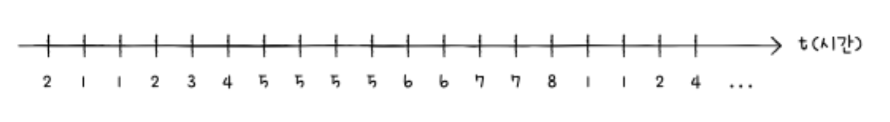
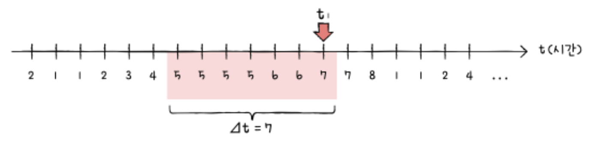
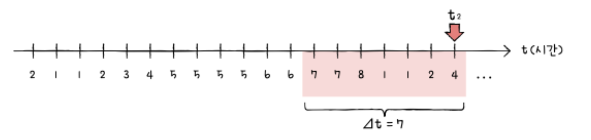

### 작업 집합 구하기
작업 집합을 직접 구해보자. 작업 집합은 `실행 중인 프로세스가 일정 시간 동안 참조한 페이지의 집합`이다. 그렇기에 작업 집합을 구하려면 아래 두 가지가 필요하다.

1. 프로세스가 참조한 페이지
2. 일정 시간 간격

가령 프로세스가 참조한 페이지가 아래와 같고, 시간 간격(△t)은 7이었다고 가정한다.

이 경우 시간 t1에서의 작업 집합은 아래와 같이 {5, 6, 7}이 된다. 이는 달리 말해 이 프로세스는 시간 t1에 최소 세 개의 프레임이 필요하다고 볼 수 있다.

t = t1일 때 작업집합 = {5, 6, 7}

시간 t2에서의 작업 집합은 {1, 2, 4, 7, 8}이다. t1에 비해 작업 집합이 늘었다. 이 경우 더 많은 프레임(최소 다섯 개의 프레임)이 필요하다고 볼 수 있다.

t = t2일 때 작업 집합 = {1, 2, 4, 7, 8}