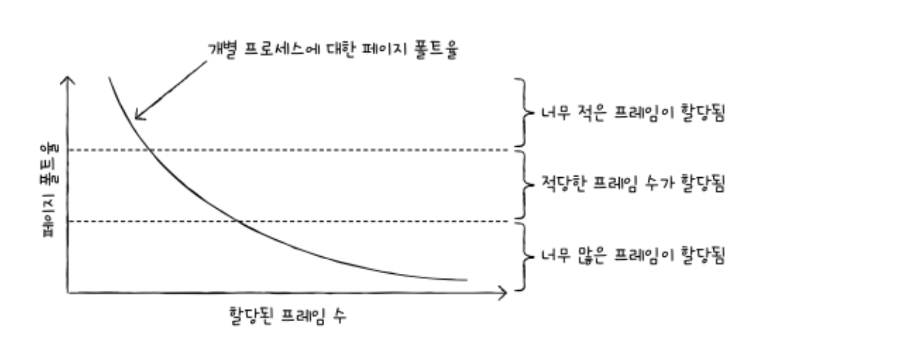
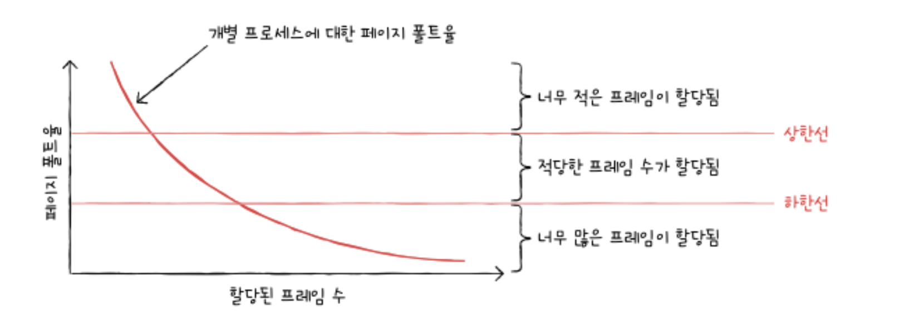

### 스래싱과 프레임 할당-2
다음으로 페이지 폴트 빈도를 기반으로 한 프레임 할당도 알아보자. 이는 아래의 두 개의 가정에서 생겨난 아이디어이다. 어찌 보면 당연하다.

1. 페이지 폴트율이 너무 높으면 그 프로세스는 너무 적은 프레임을 갖고 있다.
2. 페이지 폴트율이 너무 낮으면 그 프로세스가 너무 많은 프레임을 갖고 있다.

이를 그래프로 표현하는 아래와 같다. 가로축은 한 프로세스에 할당된 프레임 수, 세로축은 페이지 폴트 비율을 나타낸다. 이는 아래와 같이 반비례 관계를 보이는 것을 알 수 있다.

여기서 임의로 페이지 폴트율의 상한선과 하한선을 그어 보자.

만일 페이지 폴트율이 상한선보다 더 높아지면 그 프로세스는 너무 적은 프레임을 갖고 있다고 볼 수 있다. 이 경우 프레임을 더 할당해 주면 된다. 반대로 페이지 폴트율이 하한선보다 더 낮아지면 그 프로세스는 너무 많은 프레임을 갖고 있다고 볼 수 있다. 따라서 이 경우 다른 프로세스에 할당하기 위해 프레임을 회수한다. 즉, 페이지 폴트 빈도 기반 프레임 할당 방식은 페이지 폴트율에 상한선과 하한선을 정하고, 이 범위 한에서만 프레임을 할당하는 방식이다.