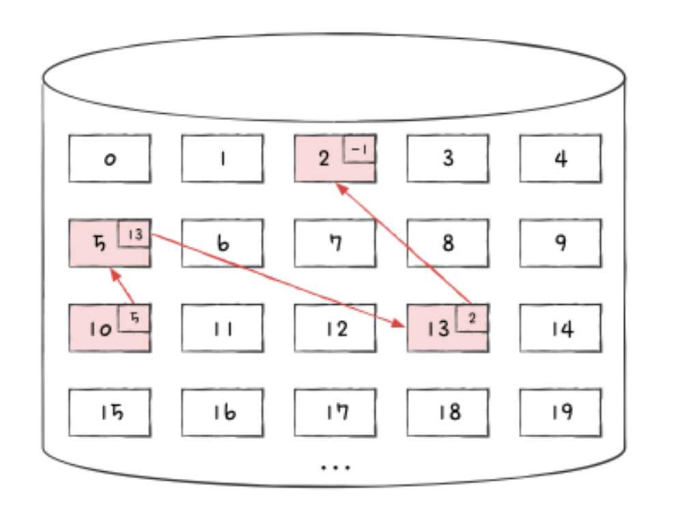

## 파일 할당 방법
하드 디스크의 포매팅까지 끝냈다고 가정한다. 이제 이 저장 장치에 사용할 파일을 저장한다. 운영체제는 파일과 디렉터리를 `블록 (Block)`단위로 읽고 쓴다. 즉, 하나의 파일이 보조기억장치에 저장될 때는 하나 이상의 블록에 걸쳐 저장된다. 하드 디스크의 가장 작은 저장 단위는 섹터이지만, 운영체제는 하나 이상의 섹터를 블록이라는 단위로 묶은 뒤 블록 단위로 파일과 디렉터리를 관리한다. 파일 시스템이 모든 섹터를 관리하기에는 개수가 너무 많고 크기도 작기 때문이다.

다음과 같이 하드 디스크 내에 여러 블록이 있다고 하자. 블록 안에 적힌 번호는 블록의 위치를 식별하는 주소이다. 이 블록에 사용하는 파일을 할당해야 한다. 크기가 작은 파일은 적은 수의 블록에 걸쳐 저장될 것이고, 크기가 큰 파일은 여러 블록에 걸쳐 저장된다.

이런 상황에서 파일을 보조기억장치에 할당하는 방법에는 크게 두 가지가 있다. `연속 할당`과 `불연속 할당`이다. 그리고 불연속 할당에는 크게 `연결 할당`, `색인 할당`이 있다. 하나씩 살펴보자.

(연속 할당과 불연속 할당 중 오늘날까지 사용되는 방식은 불연속 할당이다.)

### 연속 할당
`연속 할당 (contiguous allocation)`은 가장 단순한 방식이다. 이름 그대로 보조기억장치 내 연속적인 블록에 파일을 할당하는 방식이다. 가령 블록을 세 개, 두 개, 다섯 개 차지하는 정보의 크기를 가진 파일 a, b, c가 있을 때 이 파일들은 다음과 같이 연속적으로 할당된다.

연속으로 할당된 파일에 접근하기 위해서는 파일의 첫 번째 블록 주소와 블록 단위의 길이만 알면 된다. 그렇기에 연속 할당을 사용하는 파일 시스템에서는 다음과 같이 디렉터리 엔트리에 파일 이름과 더불어 첫 번째 블록 주소와 블록 단위의 길이를 명시한다.

연속 할당 방식은 파일을 그저 연속적으로 저장하는 방식이기에 구현이 단순하다는 장점이 있지만, `외부 단편화`를 야기한다는 치명적인 문제가 있다. 다음 그림을 보자. 하드 디스크의 블록들을 일렬로 쭉 나열한 후 파일들을 연속 할당한 그림이다.

여기서 파일 D와 F가 삭제되면 다음과 같이 할당할 수 있는 블록은 총 열한 개가 남지만, 불행히도 크기가 블록 일곱 개 이상을 사용하는 파일은 할당할 수 없다. 이것이 연속할당에서의 외부 단편화이다.

### 연결 할당
연속 할당의 문제를 해결할 수 있는 방식이 `연결 할당 (linked allocation)`이다. 연결 할당은 각 블록 일부에 다음 블록의 주소를 저장하여 각 블록이 다음 블록을 가리키는 형태로 할당하는 방식이다. 즉, 파일을 이루는 데이터를 연결 리스트로 관리한다. 연결 할당은 불연속 할당의 일종이기에 파일이 여러 블록에 흩어져 저장되어도 무방하다.

'어떤 블록의 주소를 저장한다'는 말은 '그 블록을 가리킨다'는 말과 같다. 어떤 블록의 주소를 알면 해당 블록에 얼마든지 접근할 수 있기 때문이다. 이는 C언어의 포인터와 같은 개념이다.

다음 그림을 보자. 가령 네 개의 블록으로 구성된 a라는 파일이 있고 10번, 5번, 13번, 2번 블록에 저장되었다고 가정한다. 연결 할당 방식에서는 10번 블록 끝에 5번 블록 주소를, 5번 블록 끝에 13번 블록 주소를, 13번 블록 끝에 2번 블록 주소를 기록한다. 마지막 블록(2번 블록)에는 다음 블록이 없다는 특별한 표시자를 기록한다. 다음 예시에서는 -1을 이용했다.

즉, 10번 블록은 5번 블록을, 5번 블록은 13번 블록을, 13번 블록은 2번 블록을 가리키고 있는 셈이다. 연결 할당을 사용하는 파일 시스템에서는 디렉터리 엔트리에 연속 할당과 마찬가지로 파일 이름과 함께 첫 번째 블록 주소와 블록 단위의 길이를 명시한다. 디렉터리 엔트리만 보아도 어떤 파일이 어디에 저장되어 있는지 알 수 있다. 디렉터리 엔트리에 첫 번째 블록 주소와 마지막 블록 주소를 기록할 수도 있다.

연결 할당은 외부 단편화 문제를 해결하지만 이 또한 단점이 있다.

#### **첫째, 반드시 첫 번째 블록부터 하나씩 차례대로 읽어야 한다.**
첫 번째 단점은 파일의 중간 부분부터 접근하고 싶어도 반드시 파일의 첫 번째 블록부터 접근하여 하나씩 차례대로 읽어야 한다는 점이다. 다시 말해 파일 내 임의의 위치에 접근하는 속도, 즉 `임의 접근(random access)`속도가 매우 느리다. 위 예시에서는 네 개의 블록만을 사용하는 작은 파일을 예로 들었으나, 실제로는 크기가 큰 파일들도 얼마든지 많다. 영화 파일 같은 것들이다. 이런 파일의 i번째 블록에 접근하기 위해서는 반드시 첫 번째 블록부터 i번째 블록까지 일일이 순서대로 접근해야만 한다. 이는 성능 면에서 상당히 비효울적이다.

#### **둘째, 하드웨어 고장이나 오류 발생 시 해당 블록 이후 블록은 접근할 수 없다.**
두 번째 단점은 하나의 블록 안에 파일 데이터와 다음 블록 주소가 모두 포함되어 있다 보니, 하드웨어 고장이나 오류로 인해 파일을 이루는 블록에 하나라도 문제가 발생하면 그 블록 이후의 블록에 접근할 수 없다는 것이다. 하드 디스크는 굉장히 정교하고 고장에 예민한 장치다. 하드 디스크 헤드는 플래터 위에 대단히 미세한 간격으로 떨어져 있는 만큼 충격을 받으면 자칫 헤드가 플래터에 충동하여 데이터를 손상시킬 수 있다.

#### 
그래서 오늘날에는 위 내용을 그대로 구현하기보다는 이를 조금 변형하여 사용한다. 연결 할당을 변형한 대표적인 파일 시스템이 오늘날까지도 많이 사용하는 FAT 파일 시스템이다. FAT가 무엇이며 어떻게 위 문제를 해결하는지는 색인 할당을 살펴본 뒤에 알아보자.

### 색인 할당
연결 할당은 블록 일부에 다음 블록 주소를 표현하는 방식이다. 반면 `색인 할당 (indexed allocation)`은 파일의 모든 블록 주소를 `색인 블록 (index block)`이라는 하나의 블록에 모아 관리하는 방식이다. 예를 들어 파일 a의 색인 블록은 4번 블록이고, 파일 a의 데이터는 7번, 13번, 11번 블록에 저장되어 있다고 가정한다. 4번 블록 안에는 파일 a를 구성하는 블록들의 주소인 7, 13, 11이 적혀있다. 파일 a에 순차적으로 접근하고 싶다면 색인 블록에 저장된 주소에 차례대로 접근하면 된다.

색인 할당은 연결 할당과는 달리 파일 내 임의의 위치에 접근하기 쉽다. 파일의 i번째 데이터 블록에 접근하고 싶다면 색인 블록의 i번째 항목이 가리키는 블록에 접근하면 되기 때문이다.

색인 블록 안에 파일을 구성하는 데이터 블록 주소가 있으므로 색인 블록만 알면 해당 파일 데이터에 접근할 수 있다. 그렇기에 색인 할당을 사용하는 파일 시스템에서는 디렉터리 엔트리에 파일 이름과 더불어 `색인 블록 주소`를 명시한다.

색인 할당을 기반으로 만든 파일 시스템이 유닉스 파일 시스템이다. 유닉스 파일 시스템에 대해는 FAT 파일 시스템을 살펴본 뒤 알아보자.
