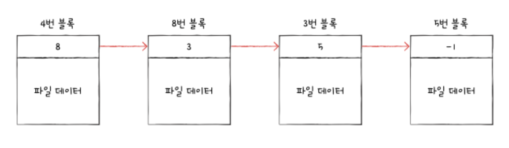
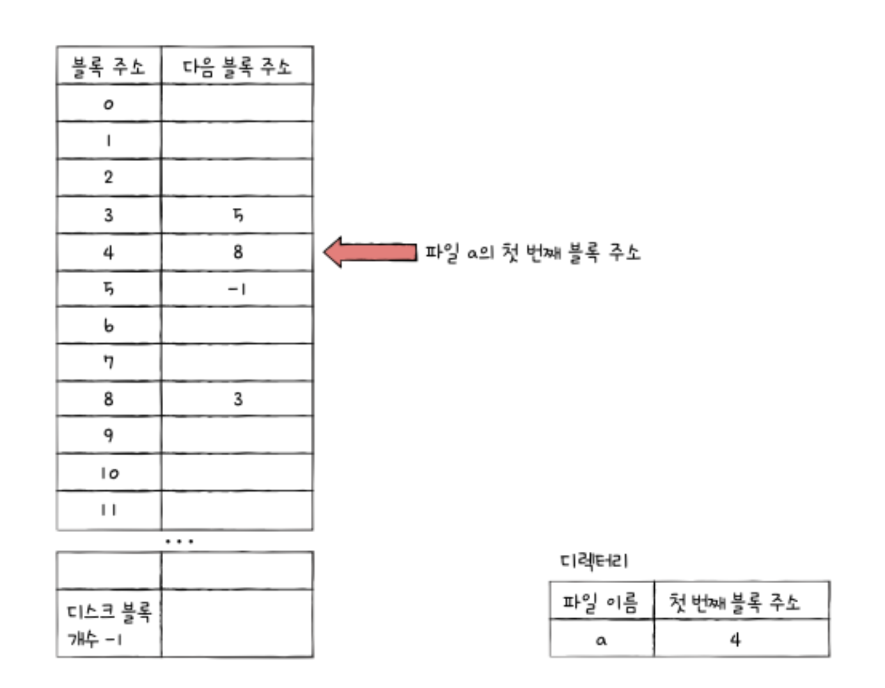
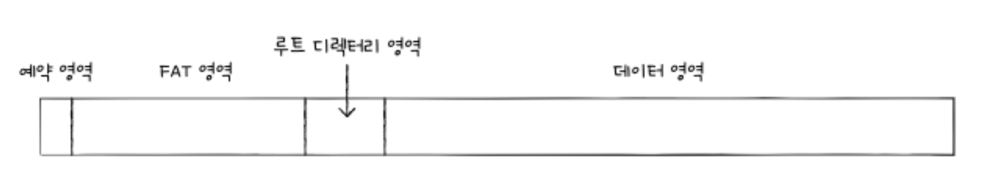
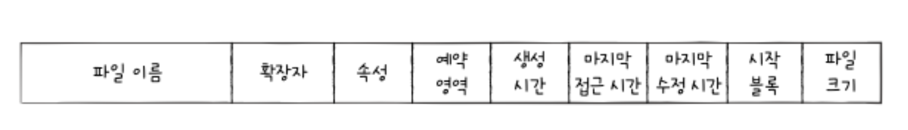
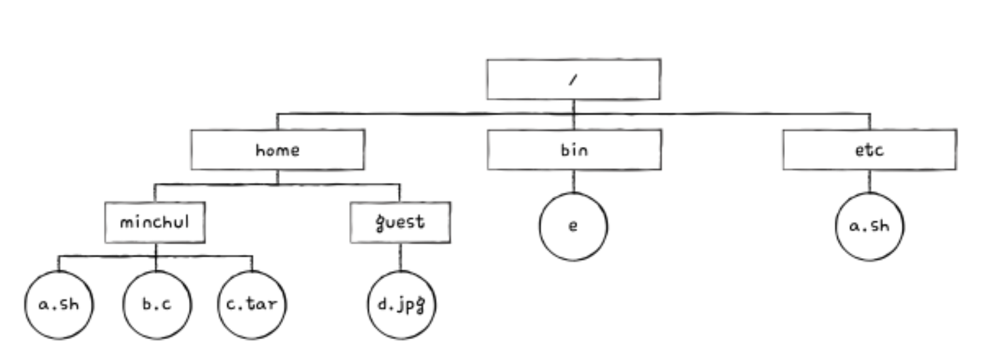
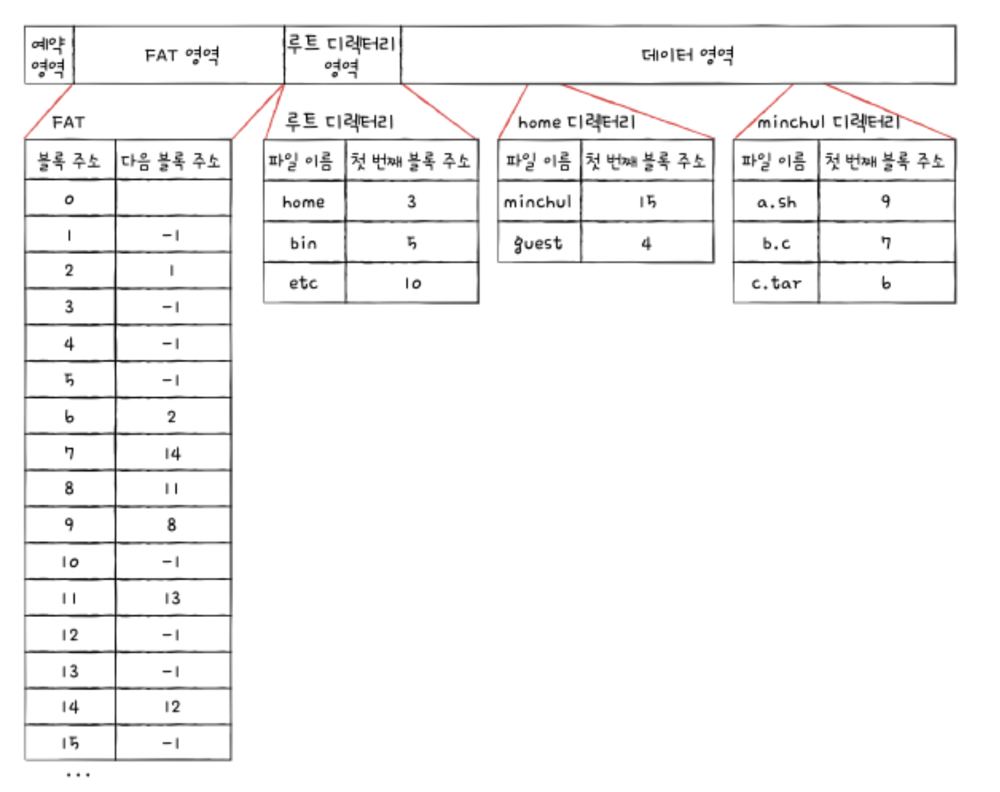
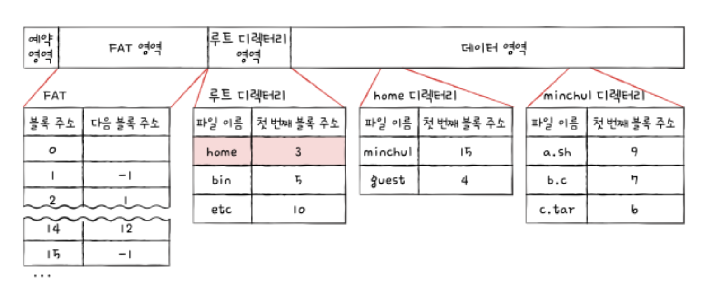
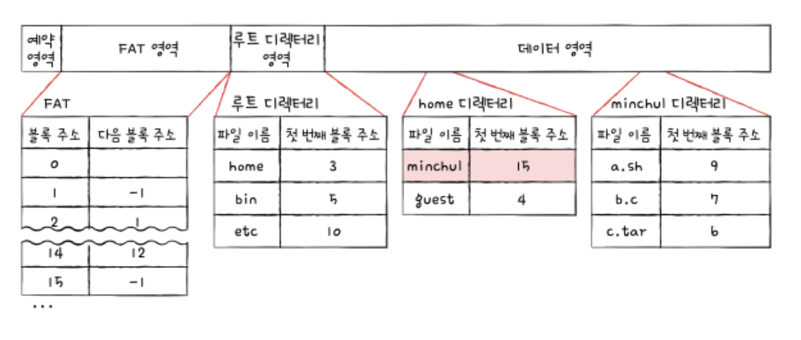
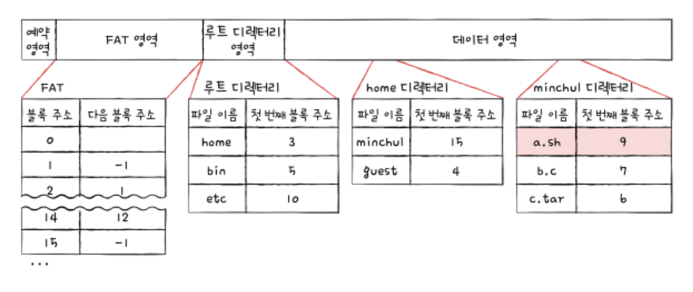
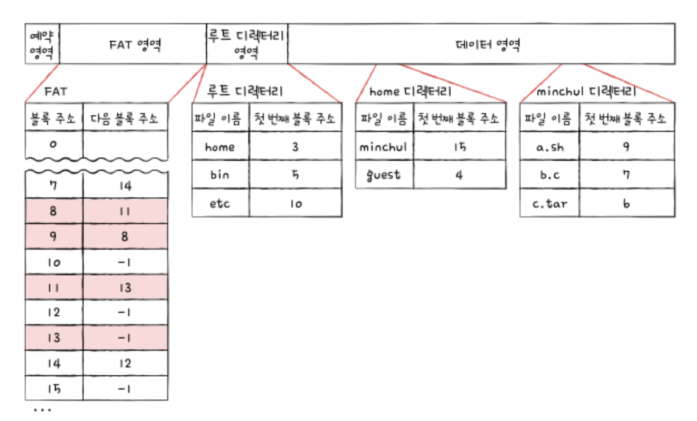

## 파일 시스템 살펴보기
파일 시스템의 모습을 살펴보자. 다양한 파일 시스템이 있지만 여러 전공서에서 공통으로 소개하는 파일 시스템은 크게 두 가지이다. 하나는 USB 메모리, SD 카드 등의 저용량 저장 장치에서 사용되는 `FAT 파일 시스템`이고, 다른 하나는 유닉스 계열 운영체제에서 사용되는 `유닉스 파일 시스템`이다.

### FAT 파일 시스템
연결 할당의 단점을 보완한 파일 시스템이 FAT 파일 시스템이다. 앞서 설명한 연결 할당 방식에는 몇 가지 단점이 있었는데 근본적인 원인은 블록 안에 다음 블록의 주소를 저장하였기 때문이다.

다음 그림은 앞에서 설명한 연결 할당을 단순화한 그림이다. 가령 a가 네 개의 블록으로 이루어져 있고 a를 구성하는 데이터는 4, 8, 3, 5번 블록에 걸쳐 저장되었다고 하자. 4번 블록이 8번 블록을 가리키고 있고, 8번 블록은 3번 블록을, 3번 블록은 5번 블록을 가리키고 있다. 이런 방식은 임의 접근의 성능이 좋지 못하고, 이 블록들 중 하나라도 문제가 발생하면 그 이후의 블록에는 접근할 수 없다.

하지만 각 블록에 포함된 다음 블록의 주소들을 한데 모아 테이블 형태로 관리하면 앞서 언급한 단점들을 상당 부분 해소할 수 있다. 이러한 테이블을 `파일 할당 테이블 (FAT : File Allocation Table)`이라고 부른다.

다음 FAT를 보자. 파일의 첫 번째 블록 주소(4번 블록)만 알면 파일의 데이터가 담긴 모든 블록에 접근할 수 있다. 그래서 디렉터리 엔트리에는 파일 이름과 더불어 파일의 첫 번째 블록 주소가 명시된다.

더 이상 다음 블록이 없으면 특별한 표시자를 표기한다(여기서는 -1). 빈 공간은 아직 할당되지 않았음을 의미한다.

이렇게 FAT를 이용하는 파일 시스템이 바로 `FAT 파일 시스템`이다. 옛날 마이크로소프트의 운영 체제인 MS-DOS에서 사용되었고 최근까지 USB 메모리, SD 카드와 같은 저용량 저장 장치용 파일 시스템으로 많이 이용되고 있다. FAT 파일 시스템은 버전에 따라 FAT12, FAT16, FAT32가 있으며, FAT 뒤에 오는 숫자는 블록을 표현하는 비트 수를 의미한다. 참고로 윈도우에서는 '블록'이라는 용어 대신 `클러스터`라는 용어를 사용한다. 즉, FAT 뒤에 오는 숫자는 클러스터를 표현하기 위한 비트이다.

FAT 파일 시스템에서 FAT는 파티션의 앞부분에 만들어진다. 다음 그림은 FAT(FAT12) 파일 시스템을 사용하는 파티션을 간략화한 도식도이다. 하드 디스크의 한 파티션을 FAT 파일 시스템으로 포맷하면 해당 파티션이 다음과 같이 구성된다고 이해하면 된다. FAT 영역에 FAT가 저장되고, 뒤이어 루트 디렉터리가 저장되는 영역이 있으며, 그 뒤에 서브 디렉터리와 파일들을 위한 영역이 있다.

FAT는 하드 디스크 파티션의 시작 부분에 있지만, 실행하는 도중 FAT가 메모리에 캐시될 수 있다. FAT가 메모리에 적재된 채 실행되면 기존 연결 할당보다 다음 블록을 찾는 속도가 매우 빨리지고, 결과적으로 앞서 설명한 연결 할당 방식보다 임의 접근에도 유리해진다. 즉, FAT가 메모리에 적재된 채 실행되면 임의 접근의 성능이 개선된다.

이번에는 FAT 파일 시스템의 디렉터리 엔트리를 조금 더 자세히 살펴보자. 앞서 FAT 파일 시스템의 디렉터리 엔트리에는 파일 이름과 더불어 파일의 첫 번째 블록 주소가 명시된다고 했다. 이외에도 FAT 파일 시스템의 디렉터리 엔트리에는 파일 속성과 관련한 다양한 정보들이 있다.

다음 그림을 보자. 이처럼 FAT 파일 시스템에서의 디렉터리들은 다음과 같은 형식으로 블록에 저장된다고 보면 된다.

속성(File Attribute) 항목은 해당 파일이 읽기 전용 파일인지, 숨김 파일인지, 시스템 파일인지, 일반 파일인지, 디렉터리인지 등을 식별하기 위한 항목이다.

자, 그렇다면 마지막으로 다음과 같은 디렉터리 구조를 이루는 FAT 파일 시스템에서 `/home/minchul/a.sh` 파일을 읽는 과정을 살펴보자.

위 디렉터리 구조는 파티션 내에 다음 그림과 같이 저장된다고 가정한다. FAT 영역에 FAT가 있고, 루트 디렉터리 영역에 루트 디렉터리가 있으며, 데이터 영역에 기타 서브 디렉터리와 파일들이 있다. 디렉터리는 하나의 블록에 저장된다고 가정하며, FAT 상에서 더 이상의 블록이 없음을 표시하기 위한 표시자로 -1을 사용했다.

이제 `/home/minchul/a.sh`에 접근해보자. a.sh는 루트 디렉터리 아래, home 디렉터리 아래, minchul 디렉터리 아래에 있다. 따라서 a.sh에 접근하려면 루트 디렉터리부터 봐야 한다.

1. 루트 디렉터리를 보자. home 디렉터리는 몇 번 블록에 있는지 살펴보자. home 디렉터리는 3번 블록에 있다.

2. 3번 블록을 읽어 home 디렉터리 내용을 살펴본다. 이번에는 minchul 디렉터리가 몇 번 블록에 있는지 살펴본다. minchul 디렉터리는 15번 블록에 있다.

3. 15번 블록을 읽어 minchul 디렉터리 내용을 살펴본다. 접근하려는 a.sh 파일의 첫 번째 블록 주소가 9번 블록이라는 것을 알 수 있다.

4. FAT를 보면 a.sh 파일은 9번, 8번, 11번, 13번 블록 순서로 저장되어 있다는 것을 알 수 있다. 따라서 파일 시스템은 `/home/minchul/a.sh` 을 읽기 위해 9번, 8번, 11번, 13번 블록에 접근한다.

