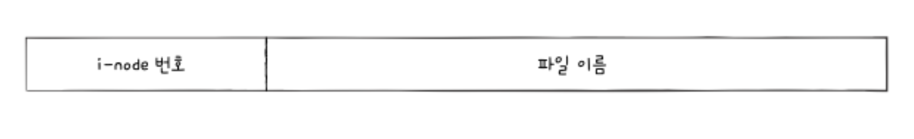
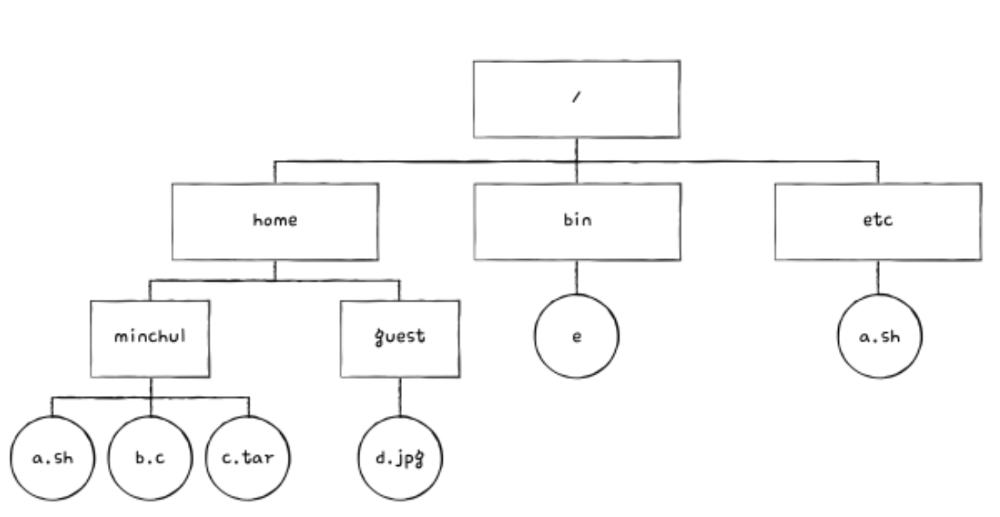
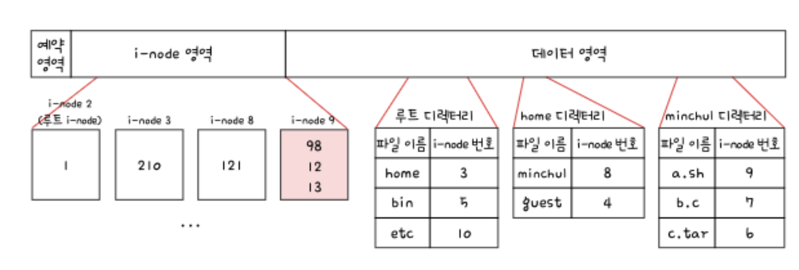

### 유닉스 파일 시스템
다음으로 살펴볼 파일 시스템은 색인 할당 기반의 `유닉스 파일 시스템`이다. 색인 할당은 색인 블록을 기반으로 파일의 데이터 블록들을 찾는 방식이라고 소개했다. 유닉스 파일 시스템에서는 이 색인 블록을 `i-node (index-node)`라고 부른다.

i-node에는 파일 속성 정보와 열다섯 개의 블록 주소가 저장될 수 있다. 앞서 FAT 파일 시스템에서는 파일 속성 정보가 디렉터리 엔트리에 표현되었다. 유닉스 파일 시스템에서 파일 속성 정보는 i-node에 표현된다.

유닉스 파일 시스템에는 파일마다 이러한 i-node 가 있고, i-node 마다 번호가 부여되어 있다. 그리고 i-node 들은 다음과 같이 파티션 내 특정 영역에 모여 있다. i-node 영역에 i-node들이 있고, 데이터 영역에 디렉터리와 파일들이 있다.

그런데 여기서 한 가지 문제가 있다. i-node의 크기는 유한하다. i-node 하나는 기본적으로 열다섯 개의 블록 주소를 저장할 수 있기 때문에 i-node 하나는 열다섯 개의 블록을 차지하는 파일까지 가리킬 수 있다. 하지만 블록을 20개, 30개, 그 이상 차지하는 큰 파일도 있을 것이다. 이 경우 i-node 하나만으로는 파일의 데이터 블록을 모두 가리킬 수 없다.

유닉스 파일 시스템은 이러한 문제를 다음과 같이 해결한다.

#### **첫째, 블록 주소 중 열두 개에는 직접 블록 주소를 저장한다.**
i-node가 가리킬 수 있는 열다섯 개의 블록 주소 중 처음 열두 개에는 파일 데이터가 저장된 블록 주소가 직접적으로 명시된다. 파일 데이터가 저장된 블록을 `직접 블록 (direct block)`이라고 한다. 즉, i-node의 열두 개 주소는 직접 블록 주소를 저장한다. 이것만으로 파일 데이터 블록을 모두 가리킬 수 있다면 여기서 추가적인 작업이 필요하지 않다.

#### **둘째, '첫째' 내용으로 충분하지 않다면 열세 번째 주소에 단일 간접 블록 주소를 저장한다.**
열두 개의 블록 주소로 파일의 모든 블록을 가리킬 수 없다면 i-node의 열세 번째 블록 주소를 이용한다. 열세 번째 블록 주소는 단일 간접 블록의 주소를 저장한다. `단일 간접 블록 (single indirect block)`이란 파일 데이터가 저장된 블록이 아닌 파일 데이터를 저장한 블록 주소가 저장된 블록을 의미한다. 말보다는 다음 그림으로 이해하자.

#### **셋째, '둘째' 내용으로 충분하지 않다면 열네 번째 주소에 이중 간접 블록 주소를 저장한다.**
열세 개의 블록 주소로 파일의 모든 블록을 가리킬 수 없다면 i-node의 열네 번째 블록 주소를 이용한다. 열네 번째 블록 주소는 이중 간접 블록 주소를 저장한다. `이중 간접 블록 (double indirect block)`이란 데이터 블록 주소를 저장하는 블록 주소가 저장된 블록을 의미한다. 즉, 단일 간접 블록들의 주소를 저장하는 블록이 이중 간접 블록이다.

#### **넷째, '셋째' 내용으로 충분하지 않다면 열다섯 번째 주소에 삼중 간접 블록 주소를 저장한다.**
열네 개의 블록 주소로 파일 블록을 가리킬 수 없다면 i-node의 열다섯 번째 블록 주소를 이용한다. 열다섯 번째 블록 주소는 삼중 간접 블록 주소를 저장한다. `삼중 간접 블록 (triple indirect block)`이란 이중 간접 블록 주소가 저장된 블록이다. 그림으로 이해하자. 삼중 간접 블록까지 이용하면 웬만한 크기의 파일은 모두 표현할 수 있다.

이로써 i-node만 알면 파일 속성뿐만 아니라 파일 크기가 크더라도 파일 데이터를 모두 가리킬 수 있다. i-node가 파일의 모든 것을 담고 있다고 해도 과언이 아니다. 그래서 유닉스 파일 시스템의 디렉터리 엔트리도 다음 그림과 같이 파일 이름과 i-node 번호로 구성된다.

마지막으로 다음 그림과 같은 디렉터리 구조를 이루는 유닉스 파일 시스템에서 `/home/minchul/a.sh` 파일을 읽는 과정을 살펴보자.

위 디렉터리 구조는 파티션 내에 다음 그림과 같이 저장된다고 가정한다. 다음 그림은 이해를 돕기 위해 간략화한 그림으로, 각 i-node에는 파일 속성은 제외하고 블록 주소만을 명시한다.

파일에 접근하기 위해 파일 시스템은 우선 루트 디렉터리 위치부터 찾는다. 루트 디렉터리 위치는 루트 디렉터리의 i-node를 보면 알 수 있다. 유닉스 파일 시스템은 루트 디렉터리의 i-node를 항상 기억하고 있다. 다음 그림에서는 2번 i-node가 루트 디렉터리의 i-node라고 가정한다.

이제 `/home/minchul/a.sh`에 접근하자. 읽고자 하는 파일인 a.sh 는 루트 디렉터리 아래, home 디렉터리 아래, minchul 디렉터리 아래에 있다.

#### 01. 2번 i-node에 접근하여 루트 디렉터리의 위치를 파악한다. 루트 디렉터리는 1번 블록에 있다.

#### 02. 1번 블록을 읽으면 루트 디렉터리의 내용을 알 수 있다. 루트 디렉터를 보자. home 디렉터리의 i-node는 3번 i-node이다.

#### 03. 3번 i-node에 접근하여 home 디렉터리 위치를 파악한다. home 디렉터리는 210번 블록에 있다.

#### 04. 210 블록을 읽으면 home 디렉터리 내용을 알 수 있다. home 디렉터리 내용을 보자. minchul 디렉터리의 i-node는 8번 이다.

#### 05. 8번 i-node에 접근하여 minchul 디렉터리의 위치를 파악한다. minchul 디렉터리는 121번 블록에 있다.

#### 06. 121 번 블록을 읽으면 minchul 디렉터리 내용을 알 수 있다. 파일 a.sh의 i-node 번호는 9번이다.

#### 07. 9번 i-node에 접근하여 파일 a.sh의 위치를 파악한다. a.sh 파일은 98번, 12번, 13번 블록에 있다.

###

따라서 파일 시스템은 `/home/minchul/a.sh`를 읽기 위해 98번, 12번, 13번 블록에 접근하면 된다.

이로써 파일 시스템의 이론적인 내용과 더불어 실제 파일 시스템 모습까지 살펴보았다. 파일 시스템을 아우르는 개념은 방대하다. 파일 시스템만을 다루는 전공서도 많다. 그래서 이 책에서는 분량상 세상에 존재하는 다양한 파일 시스템 모두를 다루지는 않았고, 대표적인 파일 시스템 몇개만을 다루었다. 이외에도 알면 좋은 흥미로운 파일 시스템이 많다. 대표적으로 윈도우 운영체제에서 사용되는 `NT 파일 시스템 (NTFS)`, 리눅스 운영체제에서 사용되는 `ext 파일 시스템` 등이 있다. 지금까지 설명한 개념들을 제대로 이해했다면 이러한 파일 시스템을 이해하는데에 큰 무리는없을 것이다.