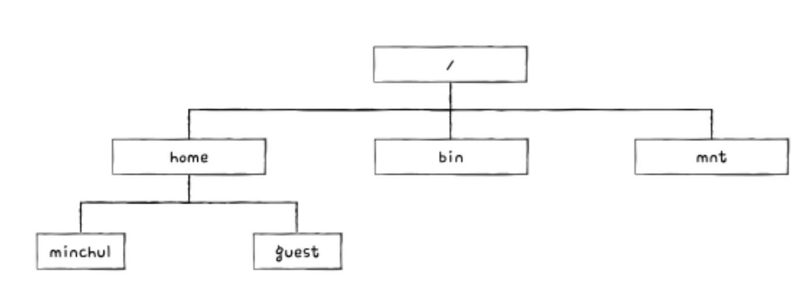
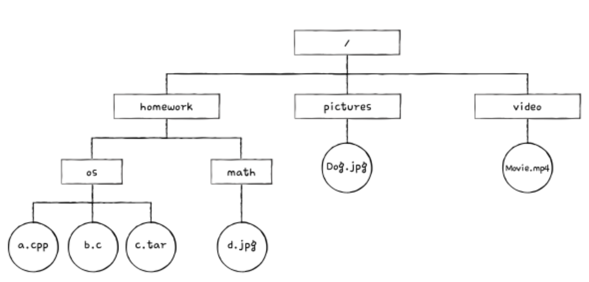
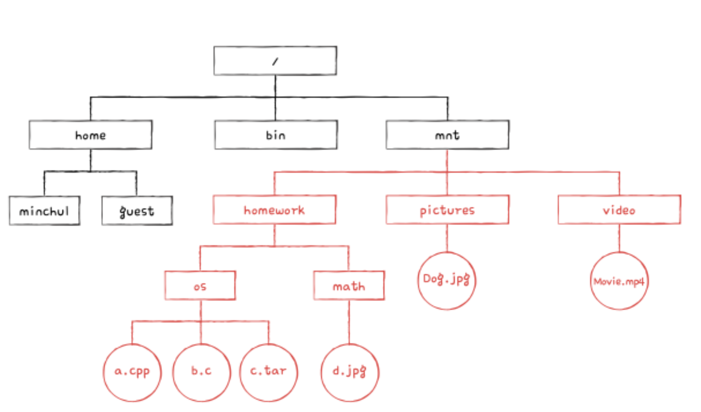

## 마운트
유닉스, 리눅스 등의 운영체제에서 '저장 장치를 마운트한다'라는 표현을 자주 사용한다. 이는 한 저장 장치의 파일 시스템에서 다른 저장 장치의 파일 시스템에 접근할 수 있도록 파일 시스템을 편입시키는 작업을 의미한다. 이는 말보다 예시로 이해하는 것이 좋다. 예를 들어 다음과 같은 디렉터리 구조를 가진 컴퓨터가 있다고 가정한다.

그리고 다음과 같은 디렉터리 구조를 가진 USB 메모리가 있다고 가정한다.

USB 메모리의 파일 시스템을 컴퓨터의 `/mnt` 경로에 마운트하면 `/mnt` 경로에 USB 메모리의 파일 시스템이 다음 그림과 같이 연결된다. 즉, `/mnt` 경로를 통해 USB 메모리에 접근할 수 있다. `/mnt/homework/os/a.cpp` 경로를 통해 a.cpp 파일에 접근할 수 있고, `/mnt/pictures/Dog.jpg` 경로를 통해 Dog.jpg 파일에 접근할 수 있다.

유닉스, 리눅스와 같은 운영체제에서 다양한 저장장치를 컴퓨터에 연결할 때 mount 명령어로 빈번하게 마운트 한다.