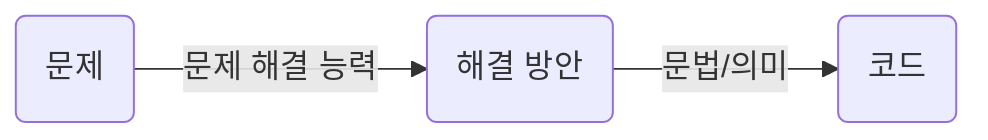

프로그래밍 학습은 일반적으로 프로그래밍 언어의 문법을 배우는 것부터 시작한다. 이는 외국어 학습과 유사하다. 그러나 이미 경험을 통해 알고 있겠지만 문법을 잘 안다고 해서 외국어를 잘한다고 말할 수는 없다. 

외국어를 잘하려면 외국어 화자의 말이나 문장을 정확히 이해한 후, 문맥에 따른 적절한 어휘 선택, 그리고 순차적으로 결론을 향해 나아가는 문장 구성이 필요하다. 즉, 문법에 맞는 문장을 구성하는 것은 물론 `의미(semantics)`를 가지고 있어야 언어의 역할을 충실히 수행할 수 있다.

> Colorless green ideas sleep furiously. - Noam Chomsky

MIT의 저명한 언어학자인 노엄 촘스키는 위 문장을 통해 언어의 의미는 문맥에 있는 것이지 문법에 있는 것이 아니라는 점을 지적했다. 위 문장은 문법(Syntax)적으로 전혀 문제가 없지만 의미(Semantics)는 없다. 프로그래밍도 마찬가지다. 다음 예제를 보자.

```js
const number = 'string';
console.log(number * number); // NaN
```

자바스크립트의 변수에는 어떠한 타입의 값도 할당할 수 있다. 따라서 위 예제는 문법적으로 전혀 문제가 없다. 하지만 의미적으로는 옳지 않다. number라는 이름의 변수에 문자열이 할당되어 있기 때문이다. number라는 이름의 변수에는 숫자를 할당하는 것이 의미적으로 옳다. 

결국 문제 해결 능력을 통해 만들어낸 해결 방안은 프로그래밍 언어의 문법을 사용해 표현한다. 즉, 작성된 코드는 해결 방안의 구체적 구현물이다. 그리고 이것은 프로그래밍 언어의 문법에 부합하는 것은 물론이고 수행하고자 하는 바를 정확히 수행하는 것, 즉 `요구사항이 실현(문제가 해결)`되어야 의미가 있다.



대부분의 프로그래밍 언어는 "변수와 값", "키워드", "연산자", "표현식과 문", "조건문"과 "반복문"에 의한 "흐름제어(control flow)", "함수" 그리고 자료구조인 "객체", "배열" 등과 같은 문법을 제공한다.

프로그래밍 언어가 제공하는 문법을 적절히 사용하여 변수를 통해 값을 저장하고 참조하며 연산자로 값을 연산, 평가하고 조건문과 반복문에 의한 흐름제어로 코드의 실행 순서를 제어하고 함수로 재사용 가능한 문의 집합을 만들며 객체, 배열 등으로 자료를 구조화한다.

`결국 프로그래밍은 요구사항의 집합을 분석해서 적절한 자료구조와 함수의 집합으로 변환한 후, 그 흐름을 제어하는 것이다.`