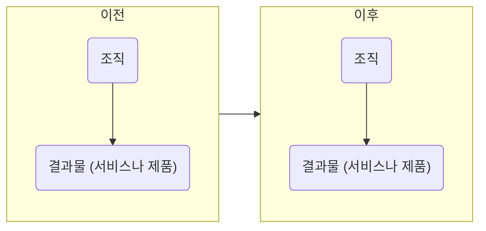
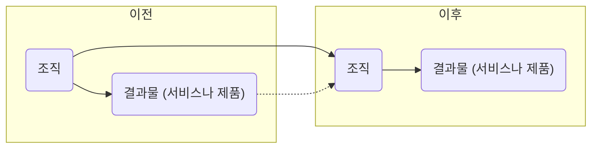

## 복리의 비밀
이번에는 자기계발과 복리의 관계에 대해 좀 더 상세하게 설명해 보겠습니다. 이 내용은 개인뿐 아니라 조직에도 적용할 수 있습니다.

먼저 더글러스 엥겔바트라는 사람이 했던 작업 구분에 대한 이야기를 해야겠습니다. 더글러스는 작업을 세 가지 수준으로 구분합니다. A, B, C 작업입니다.

A 작업은 원래 그 조직이 하기로 되어 있는 일을 하는 걸 말합니다. 자동차 공장이면 자동차를 만드는 것이 A 작업이 되겠죠.

B 작업은 A 작업을 개선하는 걸 말합니다. 제품을 만드는 사이클에서 시간과 품질을 개선하는 것이죠. 제품을 만드는 시스템을 잘 설계하는 것도 포함되겠죠.

C 작업은 B 작업을 개선하는 것입니다. 개선 사이클 자체의 시간과 품질을 개선하는 것입니다. 예컨대 개선하는 인프라를 설계하는 것이 포함될 것입니다. 한마디로 개선하는 능력을 개선하는 걸 말합니다. 더글러스는 "우리가 더 잘하는 것을 더 잘하게 될수록 우리는 더 잘하는 걸 더 잘 그리고 더 빨리 하게 될 것이다" 라고 표현하기도 합니다.

학습 조직의 개념을 퍼뜨린 경영학의 대가 피터 센게는 더글러의 말을 인용했던 것을 재인용했습니다.

> "조직에는 세 가지 차원의 작업이 있다"고 컴퓨터 선구자이자 마우스 발명가인 더글라스 엥겔바트가 말했다.
> A 작업은 겉으로 가장 잘 드러나는 수준으로, 한 회사의 제품과 서비스의 개발, 생산, 판매와 관련이 있다. 그 회사의 사람과 자원의 대부분은 이 수준에 초점이 맞춰져 있다.
> 하지만 다음 수준인 B 작업 없이는 효과적인 A 작업은 불가능할 것이다.
> B 작업은 회사가 자신의 제품과 서비스를 개발, 생산, 판매하는 걸 가능케 해주는 시스템과 프로세스를 설계하는 것과 관련이 있다.
> 하지만 가장 미묘하고 또 잠재적으로 가장 영향력이 큰 것은 C 작업으로, 이는 우리의 사고방식과 상호 작용 방식을 개선한다. 궁극적으로는 C 작업의 품질이 우리가 설계하는 시스템과 프로세스의 품질을 결정짓고, 나아가 우리가 제공하는 제품과 서비스의 품질을 결정짓는다.

이렇게 C 작업이 중요하다면 어떻게 접근해야 할까요? 이게 복리와 관련이 깊습니다. 다음 '일반 조직이 일하는 구조' 그림을 보시죠.

일반적인 조직의 예입니다. 보시다시피 조직은 그대로이고 결과물을 주기마다 찍어냅니다. 매달 결과물을 만들어낸다고 치면, 저번 달의 조직과 이번 달의 조직은 차이가 없다는 겁니다. 동일한 조직에서 동일한 제품을 반복적으로 찍어내는 공장의 비유가 딱 들어맞습니다.

`일반적 조직이 일하는 구조`

다음 '복리 조직이 일하는 구조' 그림과 비교해 보시죠.

조금 다릅니다. 어떤 부분이 눈에 들어오나요? 조직이 첫 주기에 만들어낸 결과물을 계단 삼아서 다음 주기에는 조금 더 높은(더 똑똑한) 위치에서 다음 결과물을 만들어냅니다. 내가 만든 결과물을 나의 일부로 만들어서 다음 단계에 보탬이 됙도록 이용해먹는 것이죠. 결과물이 다음 단계의 도구가 됩니다. 성장이라는 비유가 떠오르지요? '자기'의 개념이 점점 더 커지는 것이죠. 마치 사람이 나이가 들면서 자아가 확장되고 내 안에 다양성을 수용하게 되는 것처럼요. (먼저 봤던 그림은 기계적이고 뒤에 본 그림은 유기적입니다. 조직을 뜻하는 영단어 organization은 유기체라는 의미도 있습니다.)

`복리 조직이 일하는 구조`

직전 단계의 결과물을 통해 내가 더 성장하게 되는 것은 더글러스 엥겔바트의 예를 들면 좋겠네요. 엥겔바트의 삶의 목표는 인류가 해결하기 어려운 문제를 풀 수 있게 도와주는 것이었습니다. 정말 거창하지요. 이 사람이 처음 했던 작업은 사람들이 모여서 협업하기 좋은 환경과 도구를 만드는 것이었습니다. 당시에 없던 그래픽 사용자 인터페이스라든가 화상 통신 등의 온라인 협업 도구를 만들었습니다. 더글러스의 그룹은 이 도구를 사용해 점점 더 작업의 효율을 높일 수 있었고, 더 똑똑해질 수 있었습니다.

> 뭔가를 뒤로 남겨두고 앞으로 나아간다는 뜻의 진보라고 하는 치명적 메타포는 성장이라는 진짜 아이디어를 완전히 가려버렸는데, 성장은 우리 안에 뭔가를 남겨두고 커진다는 뜻이다. - G. K. 체스터톤

이런 기술을 부트스트래핑이라고 합니다. 자기가 신은 신발에 달린 끈을 들어 올려 자신의 몸을 공중에 띄운다는 뜻에서 생긴 단언입니다. 외력의 도움 없이 스스로 상황을 개선하는 걸 뜻합니다.

이렇게 작업할 때 어떤 효과가 날까요? 매일 내가 더 나은 내가 되어 갑니다. 앞에서 이야기한 복리의 효과로 성장하게 됩니다. 원금에 동일한 이자가 붙는 단리가 더하기라면 복리는 매번 이자가 증가하는 곱하기 입니다.

이런 증가를 지수적 증가라고 부릅니다. 앞에서 말했듯이 기하급수적이라고도 하죠. 더글러스 엥겔바트는 어떻게 하면 인간 조직이 지수적으로 발전할 수 있을지 고민했습니다. 그가 했던 인간 증대 프로젝트가 그 일환이죠. 그는 C 작업을 여러 조직이 공유하는 방안을 고민했습니다. 그 스스로 부트스트래핑을 해왔죠. 좀 더 자세한 내용은 커티스 카슨 박사의 지수적 팀에 대한 발표 내용을 참고하세요.

지수적 팀은 자기 자신을 곱해나가는 팀입니다. 보통 경영학에서는 더하는 조직을 작업 그룹이라고 하고 곱하는 조직을 팀이라고 구분합니다. 작업 그룹은 주어진 일을 사람 숫자에 맞게 나눠주고 각자 정해진 일을 하는 형태를말합니다. 서로 교류할 필요가 없습니다. 반면에 팀은 일을 상호 협력적으로 진행합니다. 거기에서 소위 시너지 효과라는 게 나오지요. 부분의 합보다 전체가 더 크다는 말은 이걸 두고 하는 말입니다. 그렇다면 어떻게 해야 우리가 더하기보다 곱하기를 더 많이 할 수 있을까요. 기용시간을 늘리고, 쓸데없이 낭비되는 시간을 줄이고, 잠자는 시간을 줄이는 것이 더하기적 사고하면, 집단의 지능을 높이는 것은 곱하기적 사고입니다. 집단의 지능을 높이면 모든 지적 활동의 효율이 좋아지기 때문에 전반적인 개선(B 작업)이 일어나고, 특히나 개선 작업을 더 잘하게(C 작업) 되겠지요. 지금보다 속도가 더 날 수 있다는 겁니다. 그냥 일하는 시간을 늘리는 것은 작업량을 늘리는 것에 지나지 않습니다.

자신이 평소 투자하는 비용을 한번 살펴보세요. A 작업, B 작업, C 작업이 각각 어느 정도 비율인지. 만약 B나 C가 거의 없다면 "이상한 나라의 앨리스"에 나오는 붉은 여왕의 말대로, 후퇴하느 셈이 될 겁니다. 

마지막으로 정리를 해보죠. 나의 A 작업을 개선하려면 다음 두 가지 질문을 해 봐야 합니다. 첫 번째는 어떻게 하면 더하기보다 곱하기를 할 수 있을 것인가입니다. 두 번째는 어떻게 해야 곱하는 비율(이자율)을 높일 수 있는가 혹은 이자 적용 주기(예컨대 1년에 한 번 대신에 1달에 한번)를 짧게 할 수 있는가입니다.

이 질문들은 제 평생의 화두이기도 한데 제가 이제까지 깨달은 몇가지 힌트를 드리곘습니다.

### 자신이 이미 갖고 있는 것들을 잘 활용하라.
- 새로운 것을 유입시키는 데에만 집중하다 보면 새로 들어온 것들이 이미 있는 것들을 덮어버릴 수 있다. 자신이 올해 몇 권을 읽었다고 자랑하지 말고 (서가에 몇 권 있다고 자랑하는 것과 비슷할지도 모르겠다), 내가 그 지식을 얼마나 어떻게 활용하는지 반성하라.
- 이미 갖고 있는 것들을 하이퍼링크로 서로 촘촘히 연결하라. 노드 간 이동 속도가 빨라질 수 있도록 고속도로를 놔라. 즉, 이미 습득한 지식, 기술, 경험 등을 서로 연결 지어서 시너지 효과가 나게 하고 하나의 영역에서 다른 영역으로 왔다갔다하는 것을 자주 해서 다른 영역 간을 넘나들기가 수월해지도록 하라.
- 새로운 것이 들어오면 이미 갖고 있는 것들과 충돌을 시도하라.
- 현재 내가 하는 일이 차후에 밑거름이 될 수 있도록 하라.

### 외부 물질을 체화하라.
- 계속 내부 순환만 하다가는 일정 수준에 수렴ㅇ할 위험이 있다. 주기적인 외부 자극을 받으면 좋다. 단, 외부 자극을 받으면 그걸 재빨리 자기화해야 한다. 마치 인체가 음식을 먹어 자기 몸의 일부로 만들듯이, 외부 물질을 받아들이면 소화해서 자신의 일부로 체화해야 한다.
- 외부 물질 유입 이후 생긴 내부의 갈등을 해결하려는 데에 노력을 기울여야 한다. 무시하고 덮어두지 말라. 내가 가진 것들의 상생적 관계를 끌어내도록 하라.

### 자신을 개선하는 프로세스에 대해 생각해 보라.
- 예컨대 나의 A 작업을 되돌아보는 회고/반성 활동을 주기적으로 하는 프로세스를 만들어라(C 작업).
- 나를 개선하는 과정(B 작업)을 어떻게 하면 개선할 수 있을지 고민하라.

### 피드백을 자주 받아라.
- 사이클 타임을 줄여라. 새로운 정보를 억었다면 1년 후에 크고 완벽한 실험을 하려고 준비하기보다는 1달, 혹은 1주 후에 작게라도 실험해 보는 것이 좋다. 순환율을 높여라.
- 일찍, 그리고 자주 실패하라. 실패에서 학습하라.

### 자신의 능력을 높여주는 도구와 환경을 점진적으로만들어라.
- 일레로, 전설적 프로그래머 워드 커닝햄은 자기의 수족을 마음대로 놀릴 수 없는 불편한 언어에서 프로그래밍을 하는 경우 점차적으로 자신을 도와주는 환경을 만들어 나간다. 나의 속도를 늦추는 것들을 중력에 비유한다면, 워드는 중력을 점점 줄여나간다고 할 수 있다. 중력을 요만큼 줄였기 때문에 그 덕으로 몸이 더 가벼워지고, 또 그 때문에 중력을 줄이는 작업을 좀 더 쉽게 할 수 있다. 이런 식으로 되먹임을 해서 결국은 거의 무중력의 공간을 만들어낸다. 결국 그는 어셈블리 언어에서도 우아한 춤을 출 수 있다.
- 완벽한 도구와 환경을 갖추는 데에 집착해선 안 된다. 그런 식으로는 무엇도 영원히 얻을 수 없다. "방이 조용해지고 배도 안 고프고 온도도 적절해지기만 하면 공부 시작해야지"라고 생각하느 사람들 중에 1등은 없다. 또한 실제로 그런 환경이 되어도 몸에 배어든 습관 때문에 결국은 공부하지 못할 것이다.