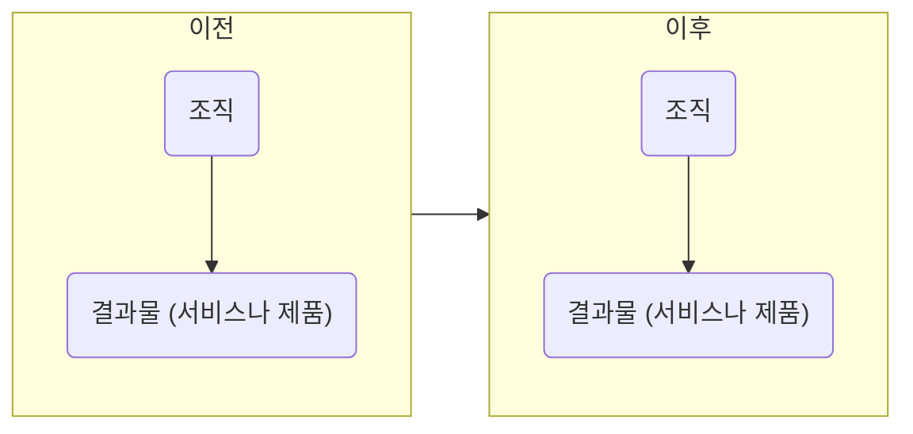

## 복리의 비밀
이번에는 자기계발과 복리의 관계에 대해 좀 더 상세하게 설명해 보겠습니다. 이 내용은 개인뿐 아니라 조직에도 적용할 수 있습니다.

먼저 더글러스 엥겔바트라는 사람이 했던 작업 구분에 대한 이야기를 해야겠습니다. 더글러스는 작업을 세 가지 수준으로 구분합니다. A, B, C 작업입니다.

A 작업은 원래 그 조직이 하기로 되어 있는 일을 하는 걸 말합니다. 자동차 공장이면 자동차를 만드는 것이 A 작업이 되겠죠.

B 작업은 A 작업을 개선하는 걸 말합니다. 제품을 만드는 사이클에서 시간과 품질을 개선하는 것이죠. 제품을 만드는 시스템을 잘 설계하는 것도 포함되겠죠.

C 작업은 B 작업을 개선하는 것입니다. 개선 사이클 자체의 시간과 품질을 개선하는 것입니다. 예컨대 개선하는 인프라를 설계하는 것이 포함될 것입니다. 한마디로 개선하는 능력을 개선하는 걸 말합니다. 더글러스는 "우리가 더 잘하는 것을 더 잘하게 될수록 우리는 더 잘하는 걸 더 잘 그리고 더 빨리 하게 될 것이다" 라고 표현하기도 합니다.

학습 조직의 개념을 퍼뜨린 경영학의 대가 피터 센게는 더글러의 말을 인용했던 것을 재인용했습니다.

> "조직에는 세 가지 차원의 작업이 있다"고 컴퓨터 선구자이자 마우스 발명가인 더글라스 엥겔바트가 말했다.
> A 작업은 겉으로 가장 잘 드러나는 수준으로, 한 회사의 제품과 서비스의 개발, 생산, 판매와 관련이 있다. 그 회사의 사람과 자원의 대부분은 이 수준에 초점이 맞춰져 있다.
> 하지만 다음 수준인 B 작업 없이는 효과적인 A 작업은 불가능할 것이다.
> B 작업은 회사가 자신의 제품과 서비스를 개발, 생산, 판매하는 걸 가능케 해주는 시스템과 프로세스를 설계하는 것과 관련이 있다.
> 하지만 가장 미묘하고 또 잠재적으로 가장 영향력이 큰 것은 C 작업으로, 이는 우리의 사고방식과 상호 작용 방식을 개선한다. 궁극적으로는 C 작업의 품질이 우리가 설계하는 시스템과 프로세스의 품질을 결정짓고, 나아가 우리가 제공하는 제품과 서비스의 품질을 결정짓는다.

이렇게 C 작업이 중요하다면 어떻게 접근해야 할까요? 이게 복리와 관련이 깊습니다. 다음 '일반 조직이 일하는 구조' 그림을 보시죠.

일반적인 조직의 예입니다. 보시다시피 조직은 그대로이고 결과물을 주기마다 찍어냅니다. 매달 결과물을 만들어낸다고 치면, 저번 달의 조직과 이번 달의 조직은 차이가 없다는 겁니다. 동일한 조직에서 동일한 제품을 반복적으로 찍어내는 공장의 비유가 딱 들어맞습니다.

`일반적 조직이 일하는 구조`

다음 '복리 조직이 일하는 구조' 그림과 비교해 보시죠.

조금 다릅니다. 어떤 부분이 눈에 들어오나요? 조직이 첫 주기에 만들어낸 결과물을 계단 삼아서 다음 주기에는 조금 더 높은(더 똑똑한) 위치에서 다음 결과물을 만들어냅니다. 내가 만든 결과물을 나의 일부로 만들어서 다음 단계에 보탬이 됙도록 이용해먹는 것이죠. 결과물이 다음 단계의 도구가 됩니다. 성장이라는 비유가 떠오르지요? '자기'의 개념이 점점 더 커지는 것이죠. 마치 사람이 나이가 들면서 자아가 확장되고 내 안에 다양성을 수용하게 되는 것처럼요. (먼저 봤던 그림은 기계적이고 뒤에 본 그림은 유기적입니다. 조직을 뜻하는 영단어 organization은 유기체라는 의미도 있습니다.)

