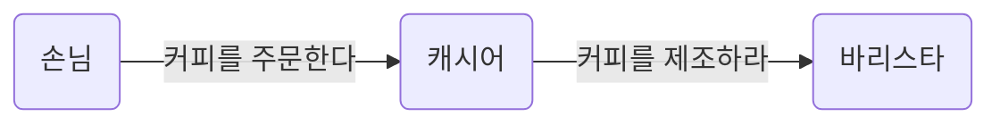
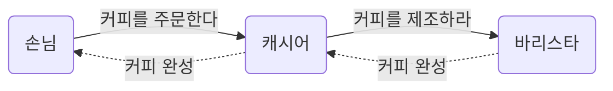

## 요청과 응답으로 구성된 협력
일상에서 발생하는 대부분의 문제는 개인 혼자만의 힘으로 해결하기 버거울 정도로 복잡하기 때문에 사람들은 혼자서 문제를 해결하기보다는 다른 사람들의 도움을 받아 문제를 해결하는 것을 선호한다. 사람들은 스스로 해결하지 못하는 문제와 마주치면 문제 해결에 필요한 지식을 알고 있거나 서비스를 제공해줄 수 있는 사람에게 도움을 **요청(request)**한다.

일반적으로 하나의 문제를 해결하기 위해 다수의 사람 혹은 역할이 필요하기 때문에 한사람에 대한 요청이 또 다른 사람에 대한 요청을 유발하는 것이 일반적이다. 따라서 요청은 연쇄적으로 발생한다.

- 커피 주문이라는 협력은 손님이 캐시어에게 원하는 커피를 주문하면서 시작된다. 손님이 캐시어에게 주문하는 것은 커피를 제공해 줄 것을 캐시어에게 요청하는 것이다.
- 주문을 받은 캐시어는 주문 내역이 기록된 컵을 전달함으로써 바리스타에게 주문된 커피를 제조해줄 것을 요청한다.

요청을 받은 사람은 주어진 책임을 다하면서 필요한 지식이나 서비스를 제공한다. 즉, 다른 사람의 요청에 **응답(response)**한다. 요청이 연이어 발생하기 때문에 응답 역시 요청의 방향과 반대 방향으로 연쇄적으로 전달된다.

- 바리스타는 커피를 제조한 후 제조가 완료됐음을 캐시어에게 알려 주는 것으로 캐시어의 요청에 응답한다.
- 캐시어는 진동벨을 울려 손님에게 주문된 커피가 준비됐음을 알림으로써 손님의 주문에 응답한다.

요청과 응답을 통해 다른 사람과 **협력(collaboration)**할 수 있는 능력은 인간으로 하여금 거대하고 복잡한 문제를 해결할 수 있는 공동체를 형성할 수 있게 만든다. 협력의 성공은 특정한 역할을 맡은 각 개인이 얼마나 요청을 성실히 이행하는가에 달려 있다.