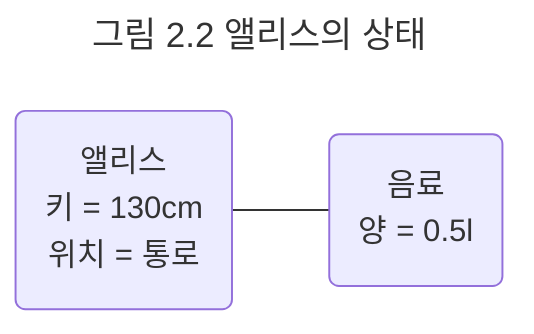
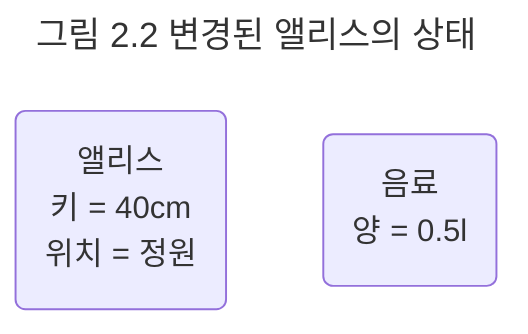

## 상태
### 왜 상태가 필요한가
객체가 주변 환경과의 상호작용에 어떻게 반응하는가는 그 시점까지 객체에 어떤 일이 발생했느냐에 좌우된다. 여행을 위해 비행기를 이용하려면 탑승 전에 항공권을 발권해야 한다. 항공권을 발권해 놓았다면 아늑한 비행기 좌석에 앉을 수 잇겠지만 발권하지 않았다면 떠나는 비행기의 모습을 하릴없이 쳐다볼 수밖에 없을 것이다. 비행기 탑승 여부는 과거에 항공권을 발권하는 행동이 발생했는지 여부에 따라 달라지는 것이다. 

일상생활 속에서 좀 더 다양한 예를 찾아볼 수 있다. 자판기에 충분한 금액을 투입하기 전에는 원하는 음료를 선택할 수 없다. 엘리베이터가 움직이기 위해서는 먼저 원하는 층의 버튼을 눌러야 한다. 텔레비전 전원을 켜지 않는 한 채널을 변경할 수 없다. 여자친구와 드라이브를 하려면 먼저 자동차의 시동을 걸어야 한다. 예로 든 모든 일들의 공통점은 어떤 행동의 결과는 과거에 어던 행동들이 일어났었느냐에 의존한다는 것이다.

이상한 나라의 앨리스가 문을 통과하기 위해서는 부채질을 하거나 버섯의 한쪽을 먹어 문을 통과하기에 충분할 정도로 자신의 키를 작게 줄여야만 한다. 따라서 문을 통과한다는 행동의 결과를 예상할 수 있는 한 가지 방법은 앨리스가 과거에 케이크나 버섯을 먹었던 적이 있는지 살펴보는 것이다. 그러나 이 방법은 앨리스가 과거에 했던 모든 행동을 기억해야만 가능하기 때문에 행동의 결과를 설명하는 것을 매우 어렵게 만든다. 

일반적으로 과거에 발생한 행동의 이력을 통해 현재 발생한 행동의 결과를 판단하는 방식은 복잡하고 번거로우며 이해하기 어렵다. 따라서 인간은 행동의 과정과 결과를 단순하게 기술하기 위해 상태라는 개념을 고안했다. 비행기 탑승 가능 여부는 항공권의 발권 상태를 보고 예측할 수 있다. 자판기는 현재까지 투입된 금액의 상태를 기억한다. 텔레비전 전원이 들어온 상태여야만 채널을 변경할 수 있다. 여자 친구와 함께 즐거운 데이트를 즐기려면 자동차의 시동이 걸려 있는 상태여야만 한다.

상태를 이용하면 과거의 모든 행동 이력을 설명하지 않고도 행동의 결과를 쉽게 예측하고 설명할 수 있다. 앨리스가 과거에 어떤 행동을 했었는지 모르더라도 앨리스의 키만 알면 문을 통과할 수 있는지 여부를 쉽게 판단할 수 있다. 즉, 앨리스의 키와 문의 높이라는 두 가지 상태만 알면 문을 통과하는 행동의 결과를 쉽게 예측할 수 있는 것이다. 

상태를 이용하면 과거에 얽매이지 않고 현재를 기반으로 객체의행동 방식을 이해할 수 있다. 상태는 근본적으로 세상의 복잡성을 완화하고 인지 과부하를 줄일 수 있는 중요한 개념이다.

### 상태와 프로퍼티
앨리스가 문을 통과하면서 겪게 되는 소동 속에는 객체라고 부를 수 있는 다양한 사물들이 출현한다. 앨리스의 키를 줄이거나 늘리기 위해 사용하는 음료, 케이크, 부채, 버섯 모두 객체다. 토끼는 객체이며 문 역시 객체다. 이들은 뚜렷한 경계를 가지며 식별 가능하고 상태와 행동을 지니고 있다.

그러나 세상에 존재하는 모든 것들이 객체인 것은 아니다. 분명하게 인식할 수 있음에도 객체의 영역에 포함시킬 수 없는 것들도 존재한다. 앨리스의 '키'와 '위치'는 객체가 아니다. 음료와 케이크의 '양'은 객체가 아니다. 문이 열려있는지 '여부'는 객체가 아니다. 토끼가 달려가는 '속도' 역시 객체가 아니다.

숫자, 문자열, 양, 속도, 시간, 날짜, 참/거짓과 같은 단순한 값들은 객체가 아니다. 단순한 값들은 그 자체로 독립적인 의미를 가지기보다는 다른 객체의 특성을 표현하는 데 사용된다. 다시 말해 다른 객체의 상태를 표현하기 위해 사용된다. 앨리스의 상태를 구성하는 키는 단순한 숫자 값으로 표현할 수 있다. 앨리스의 위치는 문자열로 표현할 수 있다. 음료와 케이크의 양은 숫자로, 문이 열려있는지 여부는 참/거짓으로 표현할 수 있을 것이다. 비록 단순한 값은 객체가 아니지만 객체의 상태를 표현하기 위한 중요한 수단이다.

때로는 단순한 값이 아니라 객체를 사용해 다른 객체의 상태를 표현해야 할 때가 있다. 앨리스가 현재 음료를 들고 있는 상태인지를 표현하고 싶다면 어떻게 할 것인가? 가장 간단하고 직관적인 방법은 앨리스의 상태 일부를 음료라는 객체를 이용해 표현하는 것이다. 앨리스가 음료를 들고 있는지 여부는 앨리스라는 객체가 음료라는 객체와 연결돼 있는지 여부로 표현할 수 있다.

객체지향 관점에서 앨리스는 음료에 관해 알고 있는 상태이며, 앨리스의 객체와 음료 객체는 서로 연결되어 있다. 

앨리스와 음료는 객체다. 그러나 앨리스의 키와 위치, 음료의 양은 객체가 아닌 단순한 값이다. 따라서 앨리스의 상태는 키와 위치라는 단순한 값과 음료라는 객체의 조합으로 표현할 수 있다. 앨리스는 키가 130 센티미터이고 통로에 위치하고 있으며 0.5리터 크기의 음료를 가지고 있다.

결론적으로 모든 객체의 상태는 단순한 값과 객체의 조합으로 표현할 수 있다. 이때 객체의 상태를 구성하는 모든 특징을 통틀어 객체의 프로퍼티라고 한다. 앨리스의 경우 키, 위치, 음료가 앨리스의 프로퍼티가 된다. 일반적으로 프로퍼티는 변경되지 않고 고정되기 때문에 '정적'이다. 반면 프로퍼티 값은 시간이 흐름에 따라 변경되기 때문에 '동적'이다. 앨리스의 키는 음료를 마시면 작아질 것이고, 문을 통과하면 위치가 정원으로 바뀔 것이며, 음료를 다 마신 후에는 현재 가지고 있는 음료를 버리게 될 것이다.

앨리스의 키는 40센티미터로 줄어있으며 위치는 정원으로 바뀌어 있다. 또한 더는 음료를 가지고 있지 않은 것으로 보아 음료를 마시고 난 후 어딘가 음료를 버린 것으로 보인다.

객체와 객체 사이의 의미 있는 연결을 링크라고 한다. 객체와 객체 사이에는 링크가 존재해야만 요청을 보내고 받을 수 있다. 즉, 객체의 링크를 통해서만 메시지를 주고받을 수 있다. 

따라서 음료를 가진 앨리스의 경우 앨리스와 음료 간의 협력이 가능하지만 다른 경우에는 링크가 존재하지 않기 때문에 협력이 불가능하다. 링크는 객체가 다른 객체를 참조할 수 있다는 것을 의미하며, 이것은 일반적으로 한 객체가 다른 객체의 식별자를 알고 있는 것으로 표현된다.

객체 간의 선으로 표현되는 링크와 달리 객체를 구성하는 단순한 값은 속성이라고 한다. 앨리스의 키와 위치는 단순한 값으로 표현되기 때문에 속성이다. 객체의 프로퍼티는 단순한 값인 속성과 다른 객체를 가리키는 링크라는 두 가지 종류의 조합으로 표현할 수 있다. 

이 책에서는 객체의 상태를 다음과 같이 정의하기로 한다.

> 상태는 특정 시점에 객체가 가지고 있는 정보의 집합으로 객체의 구조적 특징을 표현한다. 객체의 상태는 객체에 존재하는 정적인 프로퍼티와 동적인 프로퍼티 값으로 구성된다. 객체의 프로퍼티는 단순한 값과 다른 객체를 참조하는 링크로 구분할 수 있다.

객체는 자율적인 존재라는 점을 명심하라. 객체지향의 세계에서 객체는 다른 객체의 상태에 직접적으로 접근할 수도, 상태를 변경할 수도 없다. 자율적인 객체는 스스로 자신의 상태를 책임져야 한다. 외부의 객체가 직접적으로 객체의 상태를 주무를 수 없다면 간접적으로 객체의 상태를 변경하거나 조회할 수 있는 방법이 필요하다.

이 시점에 행동이 무대 위로 등장한다. 행동은 다른 객체로 하여금 간접적으로 객체의 상태를 변경하는 것을 가능하게 한다. 객체지향의 기본 사상은 상태와 상태를 조작하기 위한 행동을 하나의 단위로 묶는 것이라는 점을 기억하라. 객체는 스스로의 행동에 의해서만 상태가 변경되는 것을 보장함으로써 객체의 자율성을 유지한다.