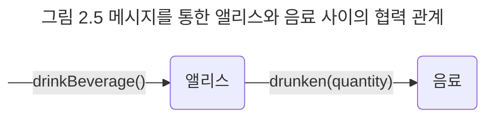

## 행동
### 상태와 행동
객체의 상태는 저절로 변경되지 않는다. 객체의 상태를 변경하는 것은 객체의 자발적인 행동뿐이다. 앨리스의 키가 작아진 이유는 앨리스가 음료를 마셨기 때문이다. 앨리스의 위치가 통로에서 정원으로 바뀐 이유는 앨리스가 문을 통과했기 때문이다. 앨리스가 특정한 행동을 취할 때마다 앨리스의 키와 위치는 변경된다.

객체가 취하는 행동은 객체 자신의 상태를 변경시킨다. 객체의 행동에 의해 객체의 상태가 변경된다는 것은 행동이 부수 효과를 초래한다는 것을 의미한다. 부수 효과의 개념을 이용하면 객체의 행동을 상태 변경의 관점에서 쉽게 기술할 수 있다. 앨리스가 케이크를 먹는 행위는 앨리스의 키를 작게 변화시키고 케이크의 양을 줄이는 부수 효과를 야기한다. 앨리스가 문을 통과하는 행동은 앨리스의 위치를 변화시키는 부수 효과를 초래한다.

앞에서 설명한 것처럼 객체의 행동은 객체의 상태를 변경시키지만 행동의 결과는 객체의 상태에 의존적이다. 음료를 마신 후의 앨리스의 키는 음료를 마시기 전의 앨리스의 키보다 작아져야 한다. 이것은 음료를 마시는 행동의 결과가 앨리스의 키에 의존한다는 것을 의미한다. 앨리스가 문을 통과할 수 있는지는 앨리스의 키가 현재 몇 센티미터인지에 달려 있다. 앨리스의 키가 문보다 크다면 문을 통과할 수 없을 것이다.

따라서 상태와 행동 사이에는 다음과 같은 관계가 있음을 알 수 있다.

- 객체의 행동은 상태에 영향을 받는다.
- 객체의 행동은 상태를 변경시킨다.

이것은 상태라는 개념을 이용해 행동을 다음의 두 가지 관점에서 서술할 수 있음을 의미한다.

- 상호작용이 현재의 상태에 어떤 방식으로 의존하는가
- 상호작용이 어떻게 현재의 상태를 변경시키는가

가여운 앨리스의 이야기로 돌아가 앨리스가 문을 통과하는 행동을 상태 관점에서 설명해 보자. 앨리스가 통과해야 하는 문의 크기가 40센티미터라고 가정하면 문을 통과하는 행동은 과거의 행동을 돌아볼 필요 없이 앨리스의 '키'와 '위치'라는 두 가지 상태를 이용해 간단하게 서술할 수 있다.

- 앨리스의 키가 40센티미터 이하라면 문을 통과할 수 있다.
- 문을 통과한 후에 앨리스의 위치는 아름다운 정원으로 바뀌어야 한다.

상태를 이용해 객체의 행동을 얼마나 쉽고 우아하게 표현했는지 잘 살펴보기 바란다. 상태를 이용하면 복잡한 객체의 행동을 쉽게 이해할 수 있다.

### 협력과 행동
어떤 객체도 섬이 아니다. 객체는 자신에게 주어진 책임을 완수하기 위해 다른 객체를 이용하고 다른 객체에게 서비스를 제공한다. 객체는 다른 객체와 적극적으로 상호작용하며 '협력하는 객체들의 공동체'에 참여하기 위해 노력한다.

객체가 다른 객체와 협력하는 유일한 방법은 다른 객체에게 요청을 보내는 것이다. 요청을 수신한 객체는 요청을 처리학 위해 적절한 방법에 따라 행동한다. 따라서 객체의 행동은 객체가 협력에 참여할 수 있는 유일한 방법이다.

객체가 다른 객체와 메시지를 통해서만 의사소통할 수 있다는 것을 기억하라. 객체가 어떤 행동을 하도록 만드는 것은 객체가 외부로부터 수신한 메시지다. 객체는 수신된 메시지에 따라 적절히 행동하면서 협력에 참여하고 그 결과로 자신의 상태를 변경한다.

객체는 협력에 참여하는 과정에서 자기 자신의 상태뿐만 아니라 다른 객체의 상태 변경을 유발할 수도 있다. 앨리스가 음료를 마시면 앨리스 자신의 키가 작아지는 동시에 앨리스가 먹은 양만큼 음료의 양이 줄어야 한다. 따라서 음료를 마시는 앨리스의 행동은 자기 자신뿐만 아니라 음료의 상태 변경도 유발한다.

정리하면 객체의 행동으로 인해 발생하는 결과는 두 가지 관점에서 설명할 수 있다. 객체의 행동은 이 두 가지 관점의 부수효과를 명확하게 서술해야 한다.

- 객체 자신의 상태 변경
- 행동 내에서 협력하는 다른 객체에 대한 메시지 전송

이 책에서는 행동을 다음과 같이 정의한다.

> 행동이란 외부의 요청 또는 수신된 메시지에 응답하기 위해 동작하고 반응하는 활동이다. 행동의 결과로 객체는 자신의 상태를 변경하거나 다른 객체에게 메시지를 전달할 수 있다. 객체는 행동을 통해 다른 객체와의 협력에 참여하므로 행동은 외부에 가시적이어야 한다.

### 상태 캡슐화
현실 세계의 객체와 객체지향 세계의 객체 사이에는 중요한 차이점이 있다. 현실 속에서 앨리스는 스스로 음료를 마시는 능동적인 존재지만 음료는 스스로는 아무것도 할 수 없는 수동적인 존재다. 현실 세계라면 음료의 양을 줄여 상태를 변경시키는 주체는 음료를 목 안으로 밀어 넣은 앨리스가 될 것이다.

그러나 객체지향의 세계에서 모든 객체는 자신의 상태를 스스로 관리하는 자율적인 존재다. 앨리스 객체의 키를 작게 만드는 것이 앨리스 자신인 것처럼 음료 객체의 양을 줄이는 것은 음료 자신이어야 한다. 따라서 앨리스는 직접적으로 음료의 상태를 변경할 수 없다. 단지 음료에게 자신이 음료를 마셨다는 메시지를 전달할 수 있을 뿐이다. 적절한 정도로 음료의 양을 줄이는 것은 메시지를 전달받은 음료 스스로의 몫이다.

앨리스가 음료를 마시는 행동은 앨리스 자신의키를 작게 만든다. 따라서 앨리스 자신의 상태를 변경한다. 이 과정에서 앨리스는 자신이 먹은 양만큼 음료의 양을 줄여달라고 메시지를 전송한다. 이것이 앨리스가 음료를 마신다는 행동에 대한 모든 것이다. 음료의 양이 줄어들 것인지는 메시지를 수신한 음료가 결정할 사항이며, 앨리스와는 무관하다. 단지 앨리스는 음료의 양이 줄어들 것이라는 것을 믿고 요청을 전달할 뿐이다.

그림 2.5는 앨리스가 음료를 마시는 과정에서 이뤄지는 앨리스와 음료 사이의 협력 관계를 그림으로 표현한 것이다.

이 그림에서 앨리스와 음료에게 전송되는 메시지 이름에 주목하라. 앨리스에게 전달되는 메시지는 `drinkBeverage()`이고 음료에게 전달되는 메시지는 `drunken(quantity)`다. 두 메시지를 보고 앨리스의 키가 줄어든다거나 음료의 양이 줄어든다는 상태 변경을 예상할 수 있겠는가? 메시지를 앨리스에게 전송하는 객체이건 음료에게 메시지를 전송하는 앨리스 객체이건 메시지 송신자는 메시지 수신자의 상태 변경에 대해서는 전혀 알지 못한다.

이것이 캡슐화가 의미하는 것이다. 객체는 상태를 캡슐 안에 감춰둔 채 외부로 노출하지 않는다. 객체가 외부에 노출하는 것은 행동뿐이며, 외부에서 객체에 접근할 수 있는 유일한 방법 역시 행동뿐이다.

객체의 행동을 유발하는 것은 외부로부터 전달된 메시지지만 객체의 상태를 변경할지 여부는 객체 스스로 결정한다. 사실 객체에게 메시지를 전달하는 외부의 객체는 메시지를 수신하는 객체의 상태가 변경된다는 사실조차 알지 못한다. 메시지 송신자는 단지 자신의 요구를 메시지로 포장해서 전달할 뿐이다. 메시지를 해석하고 그에 반응해서 상태를 변경할지 여부는 전적으로 메시지 수신자의 자율적인 판단에 따른다. 송신자가 상태 변경을 기대하더라도 수신자가 자신의 상태를 변경하지 않는다면 송신자가 간섭할 수 있는 어떤 여지도 없다.

상태를 외부에 노출시키지 않고 행동을 경계로 캡슐화하는 것은 결과적으로 객체의 자율성을 높인다. 자율적인 객체는 스스로 판단하고 스스로 결정하기 때문에 객체의 자율성이 높아질수록 객체의 지능도 높아진다. 협력에 참여하는 객체들의 지능이 높아질수록 협력은 유연하고 간결해진다.

결론적으로 상태를 잘 정의된 행동 집합 뒤로 캡슐화하는 것은 객체의 자율성을 높이고 협력을 단순하고 유연하게 만든다. 이것이 상태를 캡슐화해야 하는 이유다.