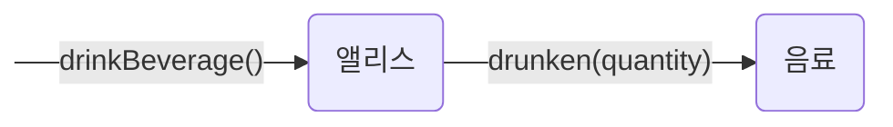

### 상태 캡슐화
현실 세계의 객체와 객체지향 세계의 객체 사이에는 중요한 차이점이 있다. 현실 속에서 앨리스는 스스로 음료를 마시는 능동적인 존재지만 음료는 스스로는 아무것도 할 수 없는 수동적인 존재다. 현실 세계라면 음료의 양을 줄여 상태를 변경시키는 주체는 음료를 목 안으로 밀어 넣은 앨리스가 될 것이다.

그러나 객체지향의 세계에서 모든 객체는 자신의 상태를 스스로 관리하는 자율적인 존재다. 앨리스 객체의 키를 작게 만드는 것이 앨리스 자신인 것처럼 음료 객체의 양을 줄이는 것은 음료 자신이어야 한다. 따라서 앨리스는 직접적으로 음료의 상태를 변경할 수 없다. 단지 음료에게 자신이 음료를 마셨다는 메시지를 전달할 수 있을 뿐이다. 적절한 정도로 음료의 양을 줄이는 것은 메시지를 전달받은 음료 스스로의 몫이다.

앨리스가 음료를 마시는 행동은 앨리스 자신의키를 작게 만든다. 따라서 앨리스 자신의 상태를 변경한다. 이 과정에서 앨리스는 자신이 먹은 양만큼 음료의 양을 줄여달라고 메시지를 전송한다. 이것이 앨리스가 음료를 마신다는 행도엥 대한 모든 것이다. 음료의 양이 줄어들 것인지는 메시지를 수신한 음료가 결정할 사항이며, 앨리스와는 무관하다. 단지 앨리스는 음료의 양이 줄어들 것이라는 것을 믿고 요청을 전달할 뿐이다.

그림 2.5는 앨리스가 음료를 마시는 과정에서 이뤄지는 앨리스와 음료 사이의 협력 관계를 그림으로 표현한 것이다.

이 그림에서 앨리스와 음료에게 전송되는 메시지 이름에 주목하라. 앨리스에게 전달되는 메시지는 drinkBeverage()이고 음료에게 전달되는 메시지는 drunken(quantity)다. 두 메시지를 보고 앨리스의 키가 줄어든다거나 음료의 양이 줄어든다는 상태 변경을 예상할 수 있겠는가? 메시지를 앨리스에게 전송하는 객체이건 음료에게 메시지를 전송하는 앨리스 객체이건 메시지 송시