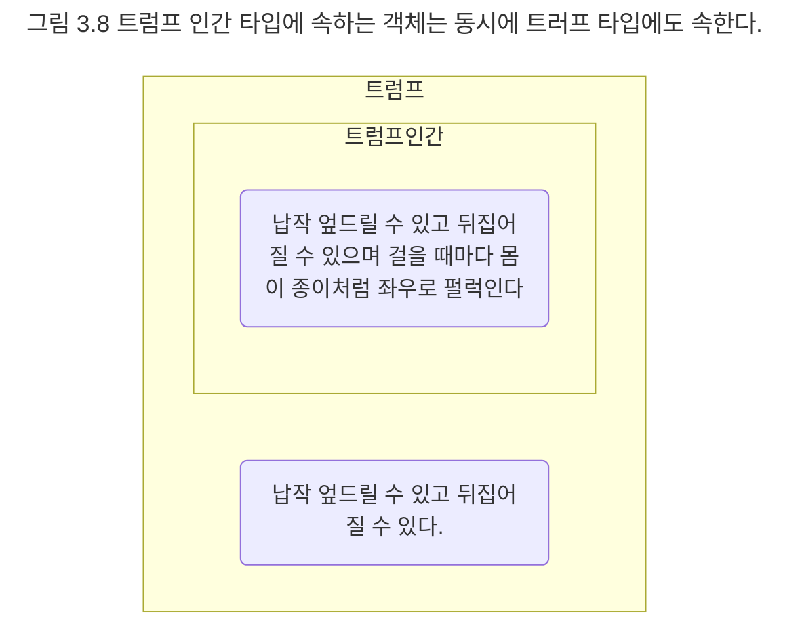

## 트럼프 계층
이제 흥미로운 질문 하나를 던져 보자. 정원사, 병사, 신하, 왕자와 공주, 하객으로 참석한 왕과 왕비들, 하트 잭, 하트 왕과 하트 여왕은 정말로 트럼프인가? 앨리스는 정말 그들을 우리가 카드 게임을 할 때 사용하는 트럼프와 같다고 생각한 것일까? 물론 그렇지 않다. 앨리스가 그들을 정말 트럼프 카드라고 생각한 적은 단 한 번도 없다. 단지 트럼프와 몇 가지 특징을 공유하기 때문에 트럼프라고 불렀을 뿐이다. 더 정확히게 말하면 앨리스는 등장인물들을 트럼프가 아니라 '트럼프 인간'으로 봤던 것이다.

왜 정원사, 병사, 신하, 왕자와 공주, 하객으로 참석한 왕과 왕비들, 하트 잭, 하트 왕과 하트 여왕이 트럼프가 아닌가? 어쨌든 그들의 외양은 트럼프와 비슷하지 않은가? 잠시 흥분을 가라앉히고 타입의 정의를 다시 한번 떠올려 보자. 객체가 동일한 타입으로 분류되기 위해서는 공통의 행동을 가져야만 한다. 안타깝게도 등장인물들의 외양은 트럼프와 유사하지만 행동 자체는 트럼프와 완벽하게 동일하지 않다.

앞에서 우리는 트럼프 타입의 정의, 즉 내연을 납작 엎드릴 수 있고 뒤집어질 수 있으며 걸을 때마다 몸이 종이처럼 좌우로 펄럭이는 존재로 정의했다. 일반적으로 트럼프 카드는 납작 엎드릴 수 있고 뒤집어질 수는 있지만 걸어다닐 수는 없다. 따라서 우리는 트럼프 타입으로 불렸던 객체들을 좀 더 정확하게 트럼프 인간이라는 타입으로 분류하는 것이 옳다.

자, 정리해 보자. 트럼프 타입의 객체는 '납작 엎드릴 수 잇고 뒤집어질 수 있다'. 트럼프 인간 타입의 객체는 '납작 엎드릴 수 있고 뒤집어질 수 있으며 걸을 대마다 몸이 종이처럼 좌우로 펄럭일 수 있다'. 뭔가 실마리가 잡히는가? 트럼프 인간 타입의 객체는 트럼프 타입의 객체가 할 수 있는 모든 행동을 할 수 있을 뿐만 아니라 추가적으로 걸어다니는 행동을 더 할 수 있다.

다시 말하면 트럼프 인간은 트럼프가 할 수 있는 모든 것을 할 수 있지만 트럼프보다 좀 더 특화된 행동을 할 수 있다. 따라서 트럼프 인간은 '납작 엎드릴 수 있고 뒤집어질 수 있기' 때문에 트럼프가 될 수 있지만 트럼프는 '걸을 때마다 몸이 종이처럼 좌우로 펄럭일 수는 없기' 때문에 트럼프 인간이 될 수는 없다. 다시 말해 트럼프 인간은 트럼프의 일종이지만 일반적인 트럼프 카드보다 좀 더 특화된 행동을 하는 트럼프인 것이다.

이제 외연이라는 객체 집합의 관점에서 트럼프와 트럼프 인간 타입을 살펴보자. 트럼프 인간은 트럼프다. 따라서 모든 트럼프 인간은 동시에 트럼프 이기도 하다. 이것은 트럼프 인간 타입에 속한 객체는 트럼프 타입의 객체에도 함께 속해야 한다는 것을 의미한다. 따라서 그림 3.8처럼 트럼프 인간 타입의 외연은 트럼프 타입의 외연의 부분 집합으로 표현할 수 있다.

이 관점에서 트럼프는 트럼프 인간을 포괄하는 좀 더 일반적인 개념이다. 트럼프 인간은 트럼프보다 좀 더 특화된 행동을 하는 특수한 개념이다. 이 두 개념 사이의 관계를 일반화/특수화 관계라고 한다.