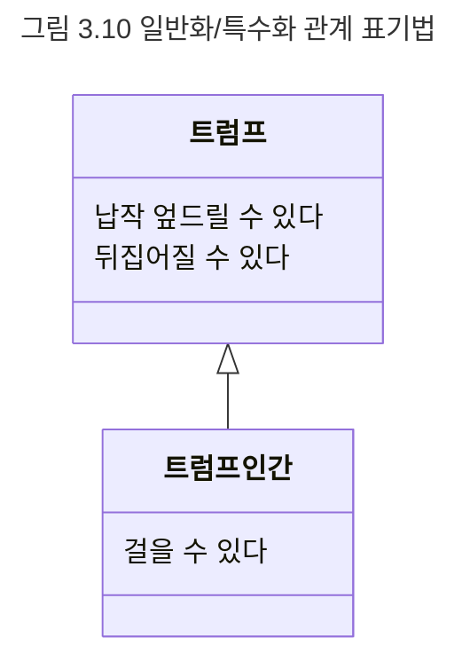

## 슈퍼타입과 서브타입
일반화/특수화 관계는 좀 더 일반적인 한 타입과 좀 더 특수한 한 타입 간의 관계다. 이때 좀 더 일반적인 타입을 슈퍼타입이라고 하고 좀 더 특수한 타입을 서브타입이라고 한다.

다시 한 번 강조하지만 슈퍼타입과 서브타입에서 중요한 것은 두 타입 간의 관계가 행동에 의해 결정된다는 점이다. 즉, 어떤 타입이 다른 타입의 서브타입이 되기 위해서는 행위적 호환성을 만족시켜야 한다. 일반적으로 서브타입은 슈퍼타입의 행위와 호환되기 때문에 서브타입은 슈퍼타입을 대체할 수 있어야 한다. 결국 트럼프 인간은 트럼프이므로 납작 엎드리거나 뒤집어지기만 하는 경우에는 트럼프를 대체하더라도 무방할 것이다. 따라서 어떤 타입을 다른 타입의 서브타입이라고 말할 수 있으려면 다른 타입을 대체할 수 있어야 한다.

마지막으로 일반화/특수화 관계를 표기하는 방법을 소개하겠다. 일반화/특수화 관계는 그림 3.10과 같이 좀 더 일반적인 타입인 슈퍼타입을 상단에, 좀 더 특수한 타입인 서브타입을 하단에 위치시키고 속이 빈 삼각형으로 연결해서 표현한다. 이때 서브타입에서는 슈퍼타입과 중복된 행위를 생략할 수 있다. 서브타입은 슈퍼타입의 행위에 추가적으로 특수한 자신만의 행동을 추가하는 것이므로 슈퍼타입의 행동은 서브타입에게 자동으로 상속된다.

