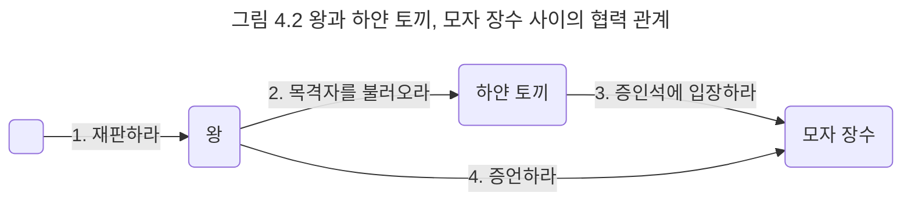

## 재판 속의 협력
이제 하트 잭을 재판하기 위해 등장인물들이 어떤 방식으로 협력하고 있는지 살펴보자. 모든 협력이 그런 것처럼 하트 잭의 재판 과정 역시 재판에 참여하는 많은 사람들이 요청하고 응답하는 과정 속에서 이뤄진다.

앨리스의 이야기에서 왕이 모자 장수로부터 증언을 듣는 과정을 요청과 응답이라는 관점에서 살펴보자.

- 누군가가 왕에게 재판을 요청함으로써 재판이 시작된다.
- 왕이 하얀 토끼에게 증인을 부를 것을 요청한다.
- 왕의 요청을 받은 토끼는 모자 장수에게 증인석으로 입장할 것을 요청한다.
- 모자 장수는 증인석에 입장함으로써 토끼의 요청에 응답한다.
- 모자 장수의 입장은 왕이 토끼에게 요청했던 증인 호출에 대한 응답이기도 하다.
- 이제 왕은 모자 장수에게 증언할 것을 요청한다.
- 모자 장수는 자신이 알고 있는 내용을 증언함으로써 왕의 요청에 응답한다.

그림 4.2는 재판에 참여하는 왕과 하얀 토끼, 모자 장수 사이의 협력 관계를 그림으로 표현한 것이다.

그림에서 화살표는 특정 인물에게 보내지는 요청을 의미한다. 요청의 내용은 화살표 위에 '재판하라'와 같은 문장으로 표현했다. 각 문장 앞의 번호는 요청이 발생하는 순서를 나타낸다. 이 협력 관계는 누군가가 왕에게 재판하라고 요청하는 것으로 시작된다. 요청을 받은 왕은 하얀 토끼에게 목격자를 불러오도록 요청하고, 하얀 토끼는 모자 장수에게 입장할 것을 요청하며, 왕이 다시 모자 장수에게 증언할 것을 요청하는 과정을 통해 협력이 이뤄진다.

이제 협력 안의 요청과 응답에 초점을 맞춰 보자. 누군가 왕에게 재판을 해달하는 요청을 보냈다는 말은 왕이 재판을 수행할 의무가 있으며, 재판에 필요한 지식을 가지고 있음을 의미한다. 왕이 하얀 토끼에게 목격자를 불러오라고 요청한 이유는 토끼가 목격자에 대해 알고 있으며 동시에 목격자를 부를 의무가 있기 때문이다. 왕이 모자 장수에게 증언하라고 요청한 이유는 모자 장수가 재판에 도움이 될 만한 사건의 내용에 대해 조금이라도 알고 있으며 증언할 의무가 있기 때문이다. 결국 어떤 등장인물들이 특정한 요청을 받아들일 수 있는 있는 그 요청에 대해 적절한 방식으로 응답하는 데 필요한 지식과 행동 방식을 가지고 있기 때문이다. 그리고 요청과 응답은 협력에 참여하는 객체가 수행할 책임을 정의한다.