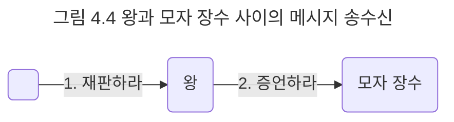

## 책임과 메시지
협력 안에서 객체는 다른 객체로부터 요청이 전송됐을 경우에만 자신에게 주어진 책임을 수행한다. 하얀 토끼가 모자 장수를 증인석으로 불러들이는 때는 왕으로부터 목격자를 부르라는 요청을 받았을 때뿐이다. 모자 장수가 자신의 책임을 완수하기 위해 증언을 하는 이유는 왕으로부터 요청이 수신됐기 때문이다.

결국 한 객체가 다른 객체에게 전송한 요청은 그 요청을 수신한 객체의 책임이 수행되게 한다. 이처럼 객체가 다른 객체에게 주어진 책임을 수행하도록 요청을 보내는 것을 메시지 전송이라고 한다. 따라서 두 객체 간의 협력은 메시지를 통해 이뤄진다. 메시지를 전송함으로써 협력을 요청하는 객체를 송신자라고 하고 메시지를 받아 요청을 처리하는 객체를 수진자라고 한다. 메시지는 협력을 위해 한 객체가 다른 객체로 접근할 수 있는 유일한 방법이다.

책임이 협력이라는 문맥 속에서 요청을 수신하는 한 쪽의 객체 관점에서 무엇을 할 수 있는지를 나열하는 것이라면 메시지는 협력에 참여하는 두 객체 사이의 관계를 강조한 것이다. 책임의 관점에서 모자 장수는 증언을 해야 할 책임이 있다. 이것은 다른 객체의 존재 여부와 상관없이 모자 장수가 외부에 제공할 수 있는 행위의 일부다. 반면에 메시지라고 이야기할 때는 항상 메시지를 전송하는 객체와 메시지를 수신하는 객체가 상호 협력하는 문맥을 강조한다. 왕은 '증언하라'는 메시지를 전송할 수 있고 모자 장수는 '증언하라'는 메시지를 수신할 수 있다. 왕과 모자 장수가 협력할 수 있는 이유는 왕이 모자 장수가 이해할 수 있는 메시지를 전송할 수 있고 모자 장수는 왕이 전송하는 메시지에 대해 적절한 책임을 수행할 수 있기 때문이다.

그림 4.4에서 모자 장수는 '증언하라'라는 책임을 수행한다. 이것은 곧 모자 장수가 증언하도록 유발하는 요청, 즉 '증언하라'하는 메시지를 모자 장수가 수신할 수 있다는 사실을 암시한다. 왕은 '증언하라'라는 메시지를 전송할 수 있기 때문에 메시지를 기반으로 왕과 모자 장수 사이의 상호협력이 가능해진다.

한 가지 주의할 점은 책임과 메시지의 수준이 같지는 않다는 점이다. 책임은 객체가 협력에 참여하기 위해 수행해야 하는 행위를 상위 수준에서 개략적으로 서술한 것이다. 책임을 결정한 후 실제로 협력을 정제하면서 이를 메시지로 변환할 때는 하나의 책임이 여러 메시지로 분할되는 것이 일반적이다.

설계를 시작하는 초반에는 어떤 객체가 어떤 책임을 가지고 어떤 방식으로 서로 협력해야 하는지에 대한 개요를 아는 것만으로도 충분하다. 책임과 협력의 구조가 자리를 잡기 전까지는 책임을 구현하는 방법에 대한 고민은 잠시 뒤로 미루는 것이 좋다. 물론 언젠가는 모자 장수가 어떻게 증언할 것인지를 고민해야 하겠지만 재판이라는 협력에 참여하기 위해 왕과 모자 장수가 상호 협력해야 하고, 이를 위해 '증언하라'라는 메시지를 송신하고 수신할 수 있다는 것을 결정하는 것이 더 중요하다.

객체지향 설계는 협력에 참여하기 위해 어떤 객체가 어떤 책임을 수행해야 하고 어떤 객체로부터 메시지를 수신할 것인지를 결정하는 것으로부터 시작된다. 어떤 클래스가 필요하고 어떤 메서들 포함해야 하는지를 결정하는 것은 책임과 메시지에 대한 대략적인 윤곽을 잡은 후에 시작해도 늦지 않다.